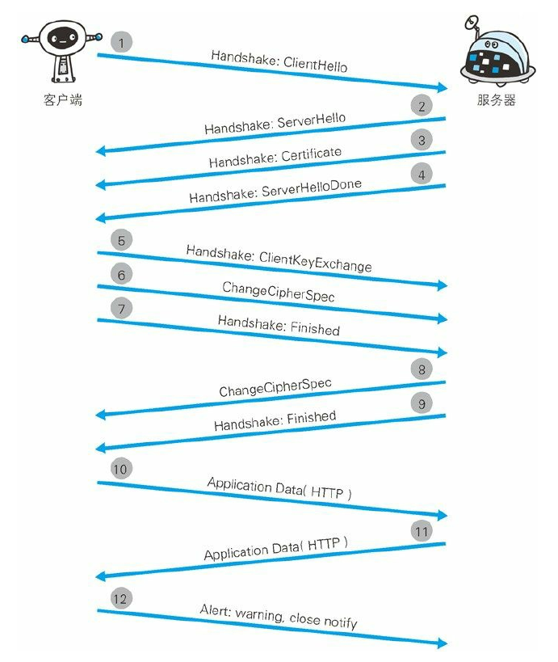

步骤 1: 客户端通过发送 Client Hello 报文开始 SSL 通信。报文中包
含客户端支持的 SSL 的指定版本、加密组件(Cipher Suite)列表(所
使用的加密算法及密钥长度等)。
步骤 2: 服务器可进行 SSL 通信时,会以 Server Hello 报文作为应
答。和客户端一样,在报文中包含 SSL 版本以及加密组件。服务器的
加密组件内容是从接收到的客户端加密组件内筛选出来的。
步骤 3: 之后服务器发送 Certificate 报文。报文中包含公开密钥证
书。
步骤 4: 最后服务器发送 Server Hello Done 报文通知客户端,最初阶
段的 SSL 握手协商部分结束。

步骤 5: SSL 第一次握手结束之后,客户端以 Client Key Exchange 报
文作为回应。报文中包含通信加密中使用的一种被称为 Pre-master
secret 的随机密码串。该报文已用步骤 3 中的公开密钥进行加密。
步骤 6: 接着客户端继续发送 Change Cipher Spec 报文。该报文会提
示服务器,在此报文之后的通信会采用 Pre-master secret 密钥加密。
步骤 7: 客户端发送 Finished 报文。该报文包含连接至今全部报文的
整体校验值。这次握手协商是否能够成功,要以服务器是否能够正确
解密该报文作为判定标准。
步骤 8: 服务器同样发送 Change Cipher Spec 报文。
步骤 9: 服务器同样发送 Finished 报文。
步骤 10: 服务器和客户端的 Finished 报文交换完毕之后,SSL 连接
就算建立完成。当然,通信会受到 SSL 的保护。从此处开始进行应用
层协议的通信,即发送 HTTP 请求。
步骤 11: 应用层协议通信,即发送 HTTP 响应。
步骤 12: 最后由客户端断开连接。断开连接时,发送 close_notify 报
文。上图做了一些省略,这步之后再发送 TCP FIN 报文来关闭与 TCP
的通信。

## 认证

### BASIC 认证

basic认证从http/1.0就有了. 其实现方式仅仅将帐号密码用 `:` 拼接后进行base64编码, 放到header中authorization字段发给服务器

> 用户身份, 报文内容都很容易被中间人获取

### DIGEST 认证

步骤:

1. 客户端向服务器发起请求
2. 服务器向客户端发送一串随机数(nonce)
3. 客户端用收到的随机数(nonce)对密码进行加密, 然后将随机数(nonce), 用户名(username), 加密后的密码(response)传回给服务器
4. 服务器在数据库里找对应用户名的明文密码, 然后通过nonce对明文密码加密后和客户端发送的加密后的密码(response)做对比

> 1. 用户身份可能在注册阶段就被盗取, 仅保护了注册之后的用户身份
> 2. 报文内容都很容易被中间人获取

###  SSL 客户端认证