## OSI参考模型

| 层级   | 功能                                           |
| ------ | ---------------------------------------------- |
| 应用层 | 针对特定应用制定的协议(如文件传输, 电子邮件等) |
| 表示层 | 数据格式与通用格式转换                         |
| 会话层 | 管理连接(建立, 断开等)                         |
| 传输层 | 管理传输, 保证数据传输的可靠性                 |
| 网络层 | 负责点对点的地址和路由路由                     |
| 链路层 | 负责网卡对网卡的地址数据帧与比特流转换         |
| 物理层 | 比特流与电信号转化                             |

## 网络设备

| 设备                     | 作用                                   |
| ------------------------ | -------------------------------------- |
| 网卡                     | 使计算联网的设备                       |
| 中继器(Repeater)         | 从勿理上延长网络的设备                 |
| 网桥(Bridge)/2层交换机   | 从数据链路层上延长网络的设备           |
| 路由器(Router)/3层交换机 | 通过网络层转发分组数据的设备           |
| 4-7层交换机              | 负载均衡, 带宽控制, 网络加速, 防火墙等 |
| 网关                     | 转发和转换数据                         |

> 交换机转发方式有两种
>
> 1. 存储转发: 存储后检查FCS位, 避免出错的包继续发出去
>
> 2. 直接转发: 直接把包继续发出去

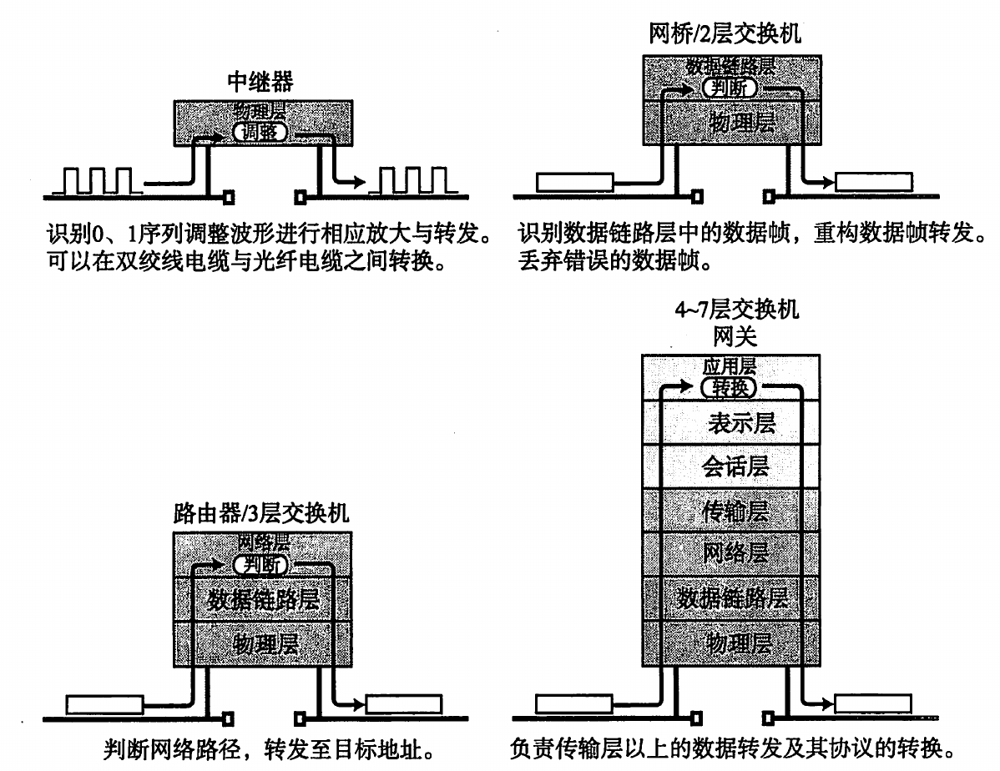

网络设备

## TCP/IP

osi模型与tcp/ip模型对比

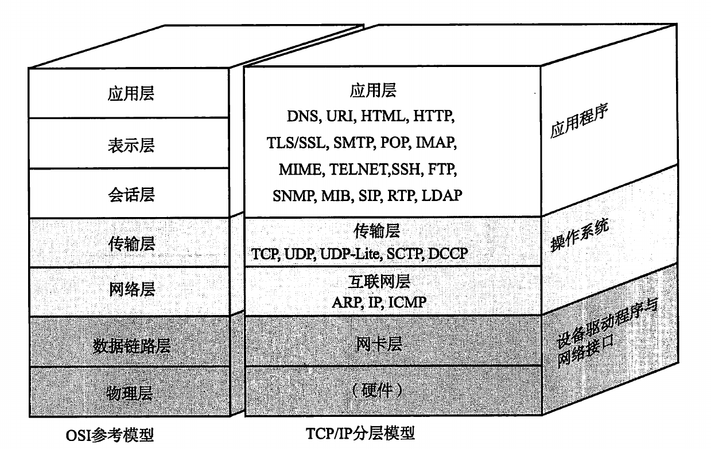

### TCP/IP模型

| 名称       | 功能         | 协议        |
| ---------- | ------------ | ----------- |
| 应用层     |              |             |
| 传输层     |              |             |
| 网际层     | 端到端的传输 | ARP,IP,ICMP |
| 网络访问层 | 负责物理传输 |             |

### 应用层

#### HTTP

HyperText Transfer  Protocol

主要用于浏览器与服务器端通信

#### SMTP

Simple Mail Transfer Protocol

#### MIME

Multipurpose Internet Mail Extensions

用于网络邮件扩展. 其处在表示层, 即可以让HTTP和SMTP发送各种内容

#### FTP

File Transfer Protocol

#### TELNET & SSH

TELetypewriter NETwork

#### SNMP & MIB

Simple Network Management Protocal

Management Information Base

使用SNMP来管理的主机, 路由器, 交换机称作SNMP代理, 管理SNMP代理的主机称作管理器.

SNMP代理保存着各种网络信息, 通过MIB来进行访问

### 传输层

#### TCP

**介绍**

有连接的传输协议

* 优点: 保证数据可达, 可以对流量进行控制, 可以防止网络堵塞
* 缺点: 复杂, 定制能力弱. 3次握手, 4次挥手会浪费网络资源

**TCP首部**

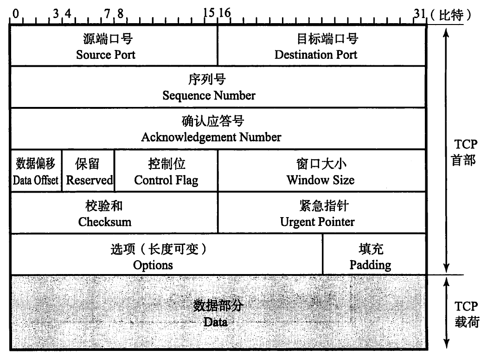

* 序列号: TCP包的编号, 不是从0开始而是在握手阶段随机生成的, 每次发包都会在这个随机数上加上包的字节数
* 确认应答号: 标明下次要接收的包的序列号
* 数据偏移: 单位为4byte, 表示TCP首部的长度
* 控制位: 用来标识一些连接状态和网络状态, 以及连接建立和断开的请求
* 窗口大小: 告诉对方应该使用的窗口大小
* 校验和: 通过计算TCP的伪首部得到

**MSS**: Message Segment Size, TCP以段为单位发送数据, 段的长度在握手的时候确定.

**窗口**: 通常来说发送端只有接收到上一个包的确认信息才会发下一个包, 但这样的话网络性能将会受到RTT的严重影响, 所以我们规定一个窗口, 在这个窗口内连续发送. 窗口大小即是段的个数, 如我们指定窗口大小为4, 就会连续发送4个段, 当接收到第一个段的确认信息就发送4+1也就是第5个段, 然后以此类推. 但需要知道窗口的使用会要求源主机和目标主机有更大的缓存空间.

#### UDP

**UDP介绍**

无连接的传输协议, 不保证数据可达

* 优点: 简单, 定制能力强

* 缺点: 不保证数据可达. 容易滥用网络资源

**UDP首部**

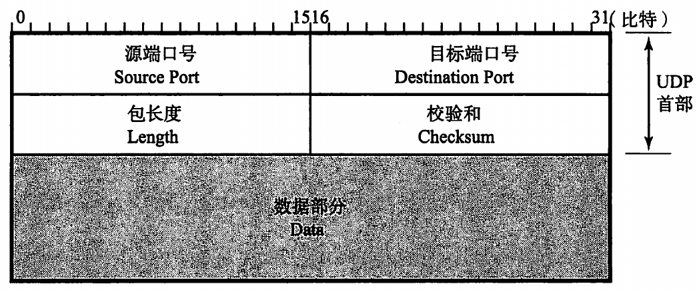

* 源端口号: 16位, 可以填0表示没有源端口号
* 目标端口: 16位
* 包长度: 包含了首部和Data的长度, 以byte为单位
* 校验和: 通过伪首部[^1] 计算得到

### 网络层

网络层用于实现终端节点到终端节点的通信

> 配有IP地址但不进行路由控制的设备称为**主机**
>
> 配有IP地址又进行路由控制的设备称为**路由器**
>
> **节点**是主机和路由器的统称

#### IP

IP(Internet Protocol)用于将数据从一端发送到另一端, 主要有三大职能: 寻址, 路由, 分包组包

IP地址由4段, 每段8位共计32位的二进制数组成. 开始我们将IP分为ABCDE五类用以**划分网络**, A类8位网络地址(第一位为0), B类16位(前两位为10), C类24位(前三位为110), 划分网络之后路由器就可以用**网络地址**来进行路由控制. 如果我们将某个网络下的主机地址全设为1就得到了**广播地址**, 如果某个主机向广播地址发数据那么该网络下的所有主机都会收到这条数据. 

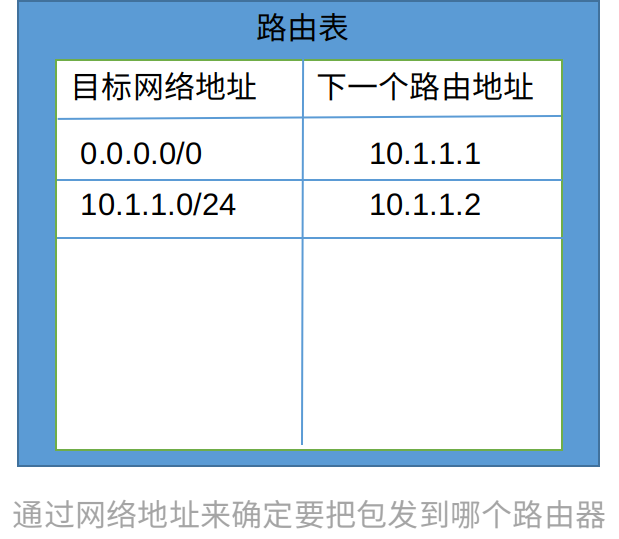

> 如果目标网络地址为 `0.0.0.0/0` 则表示默认, 即在路由表里匹配不到目标网络地址就通通发给 10.1.1.1
>
> 一个特殊的网络地址: `127.0.0.1`, 该地址对应主机名localhost, 向该地址发送请请求回回到发送的主机, 故而该地址称为环回地址(loop)

由于各类的网络地址长度不同, 所以同一网络下可以分配的主机数量不同. 但这样的分配方式不够灵活, 可能造成某个网络下的IP不够分而另外一些网络IP闲置的情况. 所以我们开始用**子网掩码**来划分网络地址和主机地址, 该方式称作CIDR(classless inter-domain routing).

当我们引入CIDR后我们的网络划分更灵活了, 利用率也提高了, 但是依旧没有解决IPv4最多只够不到$2^{32}$台主机使用的问题, 而现在这不到40亿个的地址显然已经不够了. 于是就有了IPv6和NAT的方式来直接或间接的扩大地址范围的解决方案.

> Q: 子网掩码是如何工作的?

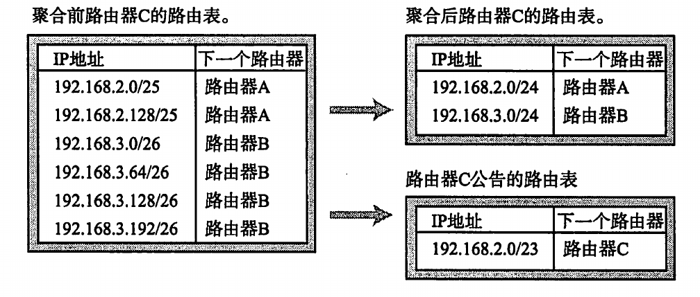

IP报文会根据链路层的MTU(Maximum Transfer Unit)来进行分割, 只要路由器认为接下来要使用的链路无法承载当前的报文大小就会对报文进行切割. 但路由器只会切割, 报文要等到了目标主机之后由目标主机进行合并. 虽然路由器只需要将IP报文分割来进行发送, 但这依旧会增加路由器内存和CPU的负载, 后来我们就想到让路由器给主机发送ICMP报文,让源主机知道PathMTU(路径最大传输单元), 这样源主机就可以提前把IP报文切割好.

> Q: 让路由切割IP报文比多级路由向源主机发ICMP还要占用资源?

**IP报文首部**

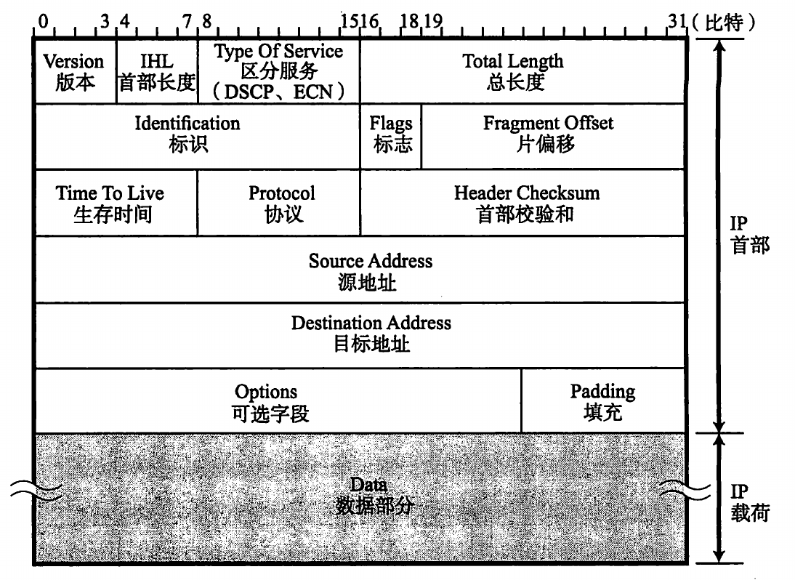

IP报文首部

Version: 版本号.

IHL(Internet Header Length): 首部长度. 长度为4bit(0~16), 单位为4byte(32bit), 即IHL为6时表示首部长度为24byte.

TOS(Type Of Service): 区分服务类型. (没用)

TL(Total Length): 首部和数据加起来的总长度, 该字段16位, 及总长度最多$2^{16}$

Identification: 用于分片重组.

Flags: 分片标志

* 第一位必须为0
* 第二位为0表示可以分片, 第二位为1表示不可以分片
* 在分片的情况下0表示最后一个分片, 1表示中间的分片

FO(Fragment Offset): 片偏移. 用于标识分片相对原始报文的位置.

TTL(Time To Live): 没经过一个路由器TTL会减一, 当TTL为0时会被路由器丢弃

Protocol: 标识上一层(传输层)的协议

HC(Header Check): 首部校验和, 用于校验报文首部. 

SA(Source Address): 源地址

DA(Destination Address): 目标地址

Options: 可选项

Padding: 填充, 用于把首部补足为4byte的倍数

Data: 数据

**多播和任播**

* 多播: 同时向多个目标主机发送报文.
* 任播: 多台服务器使用相同的IP, 需要服务的设备可以就近获取服务.

#### ARP

address resolve protocol将IP转为MAC

#### RARP

reserve ARP, 将MAC转为IP

#### PARP

Proxy ARP, 通常ARP包会被路由器隔断, 而有PARP的路由器则会将ARP包发到临近网络

#### ICMP

Internet Control Message Protocol, 用于检查处理IP分组, 返回传输过程信息, `ping`和`traceroute`命令都依靠ICMP

#### DHCP

Dynamic Host Configuration Protocol, 动态配置主机IP, DNS, 子网掩码等

#### NAT

Network Address Translator		

#### NAPT

Network Address Port Translator

### 网络访问层

包括链路层, 硬件设计和驱动软件

* 链路层用于实现同种链路下互联的节点之间的通信, 如果需要跨越不同的链路则需要用到网络层

#### MAC

MAC (Media Access Control) 用于在数据链路层中进行寻址

MAC 地址结构

* 长48bit, 通常被烧录到NIC(Network Interface Controller, 网卡)的ROM中
* 第1位: 单播地址(0)/多播地址(1)
* 第2位: 全局地址(0)/本地地址(1)
* 第3~24位: IEEE发给厂商的识别码
* 第25~48位: 厂商自行管理的识别码

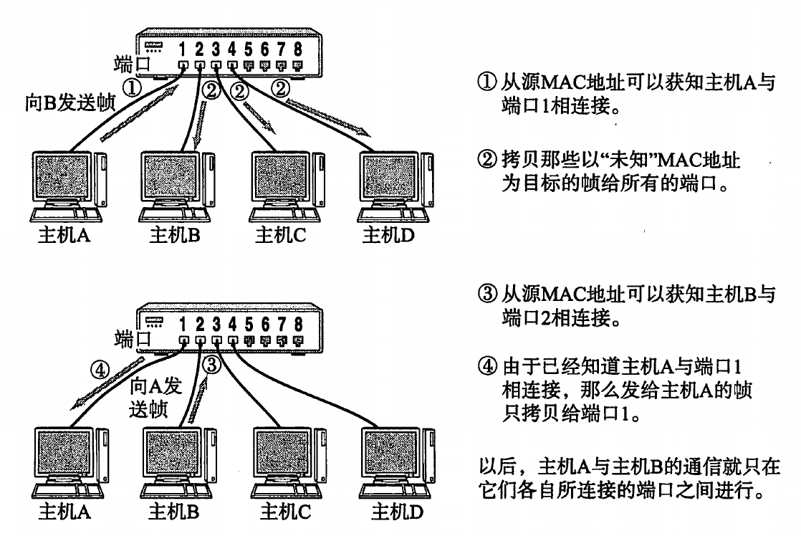

交换机自动生成MAC转发表的过程

#### FDDI 和 Ethernet

FDDI(Fiber Distributed Data Interface)和Ethernet作为网络层的规范, 包含了OSI中的数据链路层

Ethernet使用的是CSMA/CD的控制访问方式, FDDI使用的是特殊的Token Ring

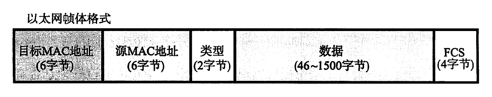

* FCS(Frame Check Sequence), 用于校验以太网帧

* 类型则标注该该帧的数据应该给上层(传输层)的什么协议来处理

  | 常用协议 | 编号 |
  | -------- | ---- |
  | IPv4     | 0800 |
  | IPv6     | 86DD |
  | ARP      | 0806 |
  | RARP     | 8035 |

#### 控制访问方式

**共享介质型网络**

争用方式(CSMA/CD)

1. 检查信道上是否有数据, 没有就发送
2. 发送过程中, 检查是否发生冲突(根据电压), 冲突则立即结束发送并腾出信道
3. 发送过程中没有冲突则视为发送成功, 如果有冲突则随机等待一段时间再试

令牌环方式(Token Ring)

1. 结束发送或没有需要发送的数据就将令牌交给下一台主机
2. 主机拿到令牌就可以发送数据
3. 收到的数据不是给自己的就向下传递
4. 收到的数据是给自己的就发送一个已收到的数据包给下一个主机
5. 发送数据的主机接收到目标主机发来的确认后就把令牌交给下一台主机

**非共享介质网络**

每台主机都直连交换机, 有交换机来实现数据的转发

#### 无线通信

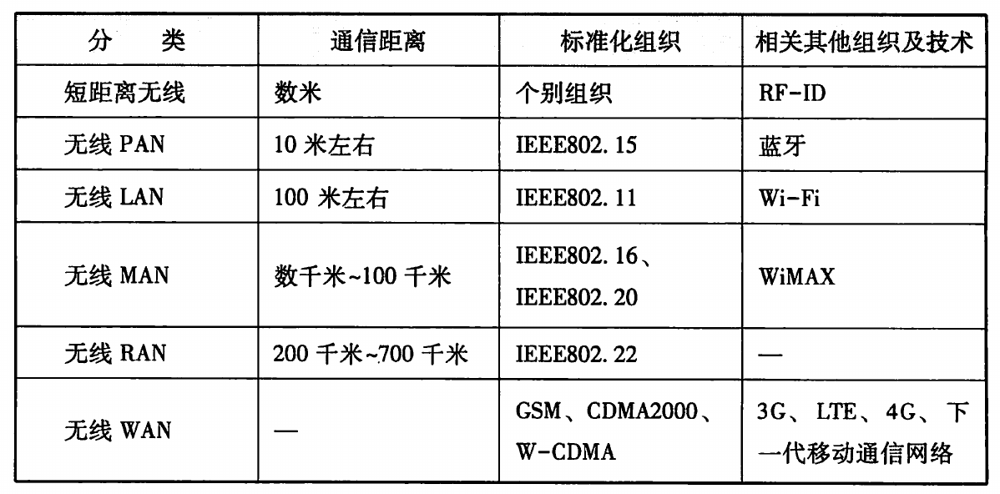

无线通信分类

WLAN由 IEEE802.11定义. 我们常用的wifi就是基于802.11(WECA, 2002改名为Wi-Fi appliance)打造的一个标准品牌, 需要注意的是蓝牙所使用的标准WPAN的频率为2.4GHz, 会与wifi产生冲突.

#### PPP

PPP(Point to Point Protocol)在层级上与FDDI和Ethernet不同在于FDDI,Ethernet除了包括数据链路层, 还包括了部分物理层, 而PPP仅仅在数据链路层,所以PPP需要结合ISDN,ATM等来实现通信.

PPP的一大优点是可以统计流量(用以计费)以及在建立连接时进行身份验证, 然后由于Ethernet所使用的设备便宜, 所以运营商偏爱PPPoE这种模式

PPP通过LCP(link control protocol)来建立连接, 断开和设置MRU(Maximum Recive Unit), 通过NCP(Network Control Protocal)来与网络层进行交互.

PPP在连接时通过PAP(Password Authentication Protocol)或CHAP(Challenge Handshake Authentication Protocol)进行身份验证

## 路由控制

路由协议分为两大类, 一类是用于企业等内部(区域)网络的IGP(Interior Gateway Protocal), 另一类是用于各个内部(区域)网络的连接的EGP(Exteriotr Gateway Protocal). 在IGP中我们常用的协议有RIP, RIP2和OSPF, 在EGP中我们常用的协议是BGP

### RIP/RIP2

RIP是一种距离向量路由协议.

路由器会将自己知道的距离某个网络的距离信息广播给周围的路由器, 而接收到的路由器会在这个基础长将距离加1后继续广播出去.

### OSFP

OSFP是一种链路状态路由协议.

路由器会将自己知道的信息广播出去, 收到信息的路由器会根据信息生成网络拓扑图

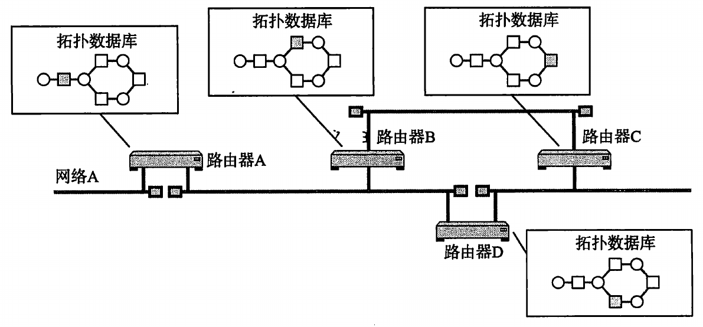

由于拓扑数据库太大, 我们通常会将OSFP路由进行区域分层化处理

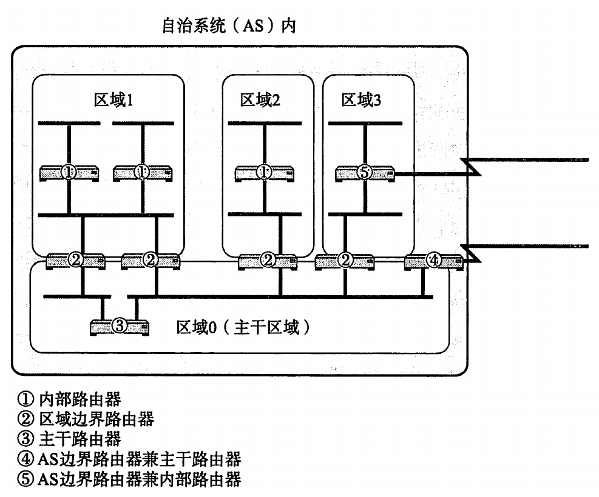

### BGP

Borer Gateway Protocol, 是一种路径向量路由协议, 其连接着各个AS. 在路由时通常会选择经过AS少的路径

### MPLS

## 公共网络

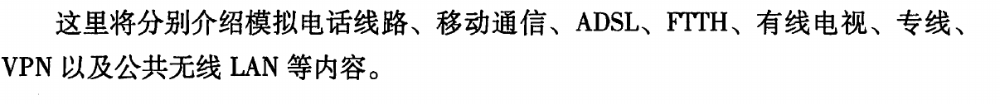

## Question

以太网的定义是什么?

图解TCP/IP说近期用户一般通过ADSL(Asymmetric digital subscriber line)或PPPoE(PPP over Ethernet)来进行网络通信, 但ADSL和PPPoE并不是一个层级的东西, 为什么要把他们放在一起?

为什么PPP不能出现连续的6个以上的1?

分组式网络是否会导致维护成本变高?

ATM是什么?

tcp是数据流, 而udp是数据报, 那数据流和数据报的区别是什么?

端口对应的是进程(如httpd), 进程将报文发送给对应的协议(tcp)进行处理?

---

[^1]: 伪首部是一个虚拟的概念在报文中并不存在, 其包括了源IP, 目标IP, 填充, 协议号, UDP包长度