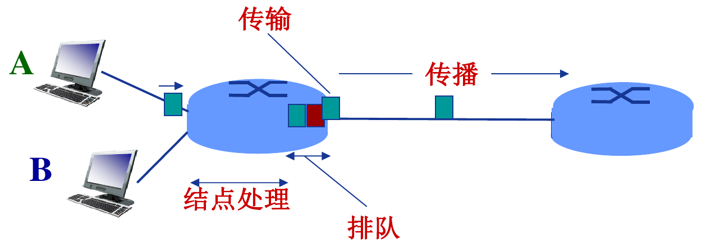
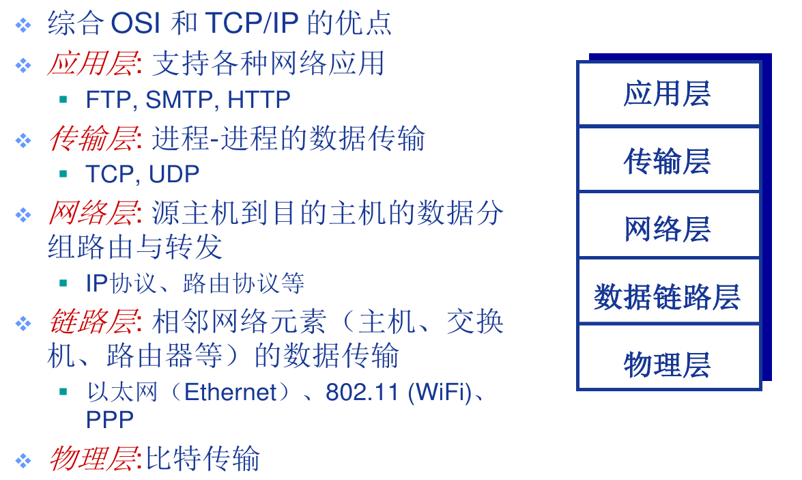

# 计算机网络

计算机网络: **互连**的**自治**的计算机集合

## 网络硬件

### 网络的物理组成结构

网络由网络边缘(各种端系统),网络核心(中继路由设备)以及物理链路(有线或无线)组成

### 网络核心

说明: 网络核心的主要功能是路由和转发, 网络核心使得多个节点互联成为可能(如果不通过路由直连计算机则需要$\frac{N(N-1)}{2}$条链路)

- 路由: 确定源到目标的路径
- 转发: 将数据从源发送到目标

## 网络协议

网络协议是数据交换必须遵守事先约定好的规则

### 协议三要素

**语法：**用来规定信息格式;数据及控制信息的格式、编码及信号电平等。

**语义：**用来说明通信双方应当怎么做;用于协调与差错处理的控制信息。

**时序：**定义了何时进行通信，先讲什么，后讲什么，讲话的速度等。比如是采用同步传输还是异步传输。

# 数据交换方式

## 报文交换

报文交换和分组交换都是将数据包发送到路由器然, 路由器缓存后确定路线并发送出去

报文交换和分组交换实现了统计多路复用(异步时分多路复用), 与电路交换中的时分多路不同的是, 电话一旦接通, 分配给你的时隙即使你不用也还是你的, 但统计多路复用则是在你需要的时候向路由器请求一张票, 你可以凭票在某个时隙进行链路资源的使用

## 分组交换

优点: 

* 速度比报文交换快
* 缓存需求比报交换文小
* 资源利用率比电路交换高

缺点: 

* 分组交换需要对报文进行**拆分**和**重组**, 并且组要对分组加上**头**让分组到达后得以恢复

  > 拆分和重组需要消耗计算资源

  > 头会增大报文总体的体积

* 可能会丢包(报文交换也会)

## 电路交换

电路交换是独占式的

### 多路复用技术

在电路交换中由于单一通信所需的链路资源远小于链路实际能提供的资源, 为了避免资源浪费, 通过多路复用技术来使得一条链路上的资源能被多个通讯共用.

常见的多路复用技术有: 频分多路复用, 波分多路复用, 时分多路复用, 码分多路复用

# 网络性能

## 延迟

### 传输延迟

公式: 

$d_{trans}=M/R+(h-1)L/R=M/R+nL/R$

> M - 报文总长度(包括头), L - 分组大小(包括头), R - 链路带宽, h - 跳步数, n - 路由数

$丢包率 = \frac{丢包数}{已发分组数}$

### 结点处理延迟

差错检测, 确定输出链路, 通常< ms

### 排队延迟

等待输出链路可用, 取决于路由器拥塞程度

**流量强度**

公式: traffic intensity = La/R

> L: 分组大小, a: 平均分组到达速率, R: 链路带宽

- $La/R \rightarrow 0$: 平均排队延迟很小
- $La/R \rightarrow 1$: 平均排队延迟很大
- $La/R > 1$: 超出服务能力,平均排队延迟无限大!(丢包)

### 传播延迟

公式: $d_{prop} = d/s$

> d: 物理链路长度, s: 信号传播速度($2\times10^8 m/s$)

$时延带宽积 = 传播时延 \times 带宽 = d_{prop} \times R (bits)$

# 网络模型

<table>
  <tr><th>OSI</th><th>TCP/IP</th><th>5层模型</th></tr>
  <tr><td>Application</td><td rowspan="3">Application</td><td rowspan="3">Application</td></tr>
  <tr><td>Presentation</td></tr>
  <tr><td>Session</td></tr>
  <tr><td>Transport</td><td>Transport</td><td>Transport</td></tr>
  <tr><td>Network</td><td>Network</td><td>Network</td></tr>
  <tr><td>Data link</td><td rowspan="2">Physical</td><td>Data link</td></tr>
  <tr><td>Physical</td><td>Physical</td></tr>
</table>

## OSI

协议模型从应用层到数据链路层逐层封装控制信息, 包括了

* 地址(Address): 标识发送端/接收端, 可以是节点, 可以是主机, 可以是进程
* 差错检测编码(Error-detecting code)
* 协议控制(Protocol control): 优先级(priority)、服务质量(QoS)、 和安全控制等

### 物理层

接口特性: 机械特性、电气特性、功能特性、规程特性
比特编码
数据率
比特同步: 时钟同步
传输模式

* 单工(Simplex)
* 半双工(half-duplex)
* 全双工(full-duplex)

### 数据链路层

功能: 负责相邻节点的数据传输

具体操作: 

1. 组帧(给报文加头加尾)
2. 寻址
3. 流量控制: 避免淹没接收端
4. 差错控制: 检测并重传损坏或丢失帧,并避免重复帧
5. 访问(接入)控制: 决定哪个设备拥有链路的使用权

### 网络层

功能: 负责源主机到目的主机的数据传输

具体操作

1. 逻辑寻址
2. 路由

### 传输层

功能: 源主机进程到目的主机进程

具体操作

1. 分段与重组
2. SAP寻址(确保将完整报文提交给正确进程)
3. 连接控制
4. 流量控制
5. 差错控制

### 会话层

功能: 建立, 维护, 断开会话

具体操作

1. 同步
2. 数据表示转化(转化为与主机无关的编码)
3. 加密/解密
4. 压缩/解压缩

### 应用层

功能: 支持用户通过用户代理(如浏览器)或网络接口使用网络(服务)

## TCP/IP

核心概念: everything over IP and IP over everything

## 5层模型

# Rest

internet: 是通用名词, 泛指互联网
Internet: 是专有名词, 专指因特网

互联网: 网络的网络. 网络把计算机连在一起, 互联网将网络连在一起

> Internet标准由IETF(互联网工程任务组, Internet Engineering Task Force)制定, 具体可见RFC(Request for Comments)文档

# Question

多路复用是由谁实现的?如何实现的? 