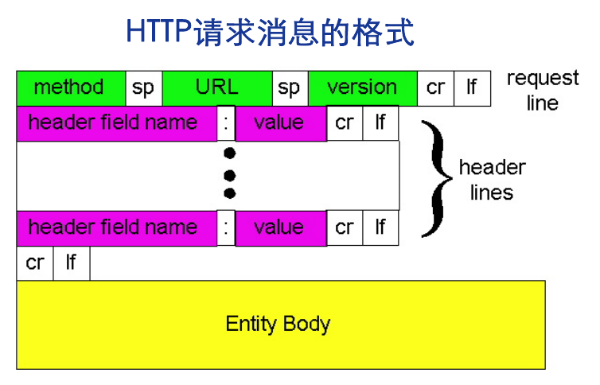

# 应用层

应用层是网络模型的最上层, 其提供的传输协议有HTTP, SMTP等.

通过调用socket编程接口来使用传输层提供的服务, 传输层提供了TCP和UDP服务

## 网络应用结构

### 客户机/服务器结构(Client/Server)

服务器

* 7*24小时提供服务
* 永久性访问地址/域名
* 利用大量服务器实现可扩展性

客户机

* 与服务器通信,使用服务器提供的服务
* 间歇性接入网络
* 可能使用动态IP地址
* 不会与其他客户机直接通信

### 点对点结构(Peer to Peer)

特点

* 没有永远在线的服务器

* 任意端系统/节点之间可以直接通讯
* 节点间歇性接入网络
* 节点可能改变IP地址

优点:高度可伸缩

缺点:难于管理

### 混合结构(Hybrid)

通过C/S来搜索数据

通过P2P来传输数据

## 进程间通信

同一主机上的进程之间依靠由系统提供的进程通信机制来进行通信, 不同主机上的进程通过消息交换进行通信.

进程的标识由 **IP+PortNumber** 组成

## 网络性能要求

数据丢失(data loss)/可靠性(reliability)

* 某些网络应用能够容忍一定的数据丢失:网络电话

* 某些网络应用要求100%可靠的数据传输:文件传输,telnet

时间(timing)/延迟(delay)

* 有些应用只有在延迟足够低时才“有效”
* 网络电话/网络游戏

带宽(bandwidth)

* 某些应用只有在带宽达到最低要求时才“有效”:网络视频
* 某些应用能够适应任何带宽——弹性应用:email

# 网络应用

## WEB应用

WEB应用采用HTTP协议, HTTP是一种无状态的协议
### HTTP1.0和HTTP1.1对比

| 版本 | 连接方式     | 支持的方法               |
| ---- | ------------ | ------------------------ |
| 1.0  | 非持久性连接 | GET,POST,HEAD            |
| 1.1  | 持久性连接   | GET,POST,HEAD,PUT,DELETE |

连接方式

* 非持久性连接, 即服务器向服务器发送一个请求资源后就关闭TCP连接. 其缺点是会造成较大的RTT开销.
* 持久性连接, 即服务器和客户端保持TCP连接.

请求机制

* 无流水机制, 客户端每收到一个响应后才发送下一个请求
* 有流水机制, 客户端只要有需求就立即发送请求

> RTT(Round-Trip Time): 往返时延。表示从发送端发送数据开始，到发送端收到来自接收端的确认，总共经历的时延。
>
> RTT比较: 非持久性连接 > 无流水机制的持久性连接 > 有流水机制的持久性连接

### HTTP请求

### HTTP响应

响应状态码
200 OK
301 Moved Permanently
400 Bad Request
404 Not Found
505 HTTP Version Not Support

### cookie

用于身份确认

### web缓存/代理技术

在不访问实际服务器的情况下满足HTTP请求

## Email应用

Email应用由客户端, 服务器组成
Email应用使用的协议
* SMTP(Simple Mail Transfer Protocol) 用于邮件传输
* POP(Post Office Protocol) 用于从服务器获取邮件
* IMAP(Inernet Mail Access Protocol) 比POP强大
* HTTP WEB邮件客户端使用该协议从服务器获取邮件

### MIME
简介: MIME(Multipurpose Internet Mail Extensions, 多媒体邮件扩展)
功能: 由于SMTP只能传输ASCII码, 所以为了传输多媒体文件而增加了MIME
原理: 通过增加头部信息来指出是如何进行编码的,然后将原数据编码为ASCII数据后进行发送

## DNS应用
Domain Name System
功能: 
* 域名与IP的转换
* 负载均衡
* 主机别名
* 邮箱别名

### DNS协议
查询-回复
消息格式相同

### DNS 查询
DNS查询都是需要本地的DNS作为客户端的代理来进行查询, 如果本地DNS服务器知道IP则直接返回结果, 如果本地DNS不知道则由本地DNS服务器进行查询(通常本地域名服务器会缓存顶级域名服务器,所以并不需要访问根域名服务器)
查询方式有迭代查询和递归查询

## P2P 应用

### Bit Torrent

由tracker跟踪torrent, 从而实现文件分发

文件划分为256KB的chunk

* 获取chunk: 优先获取提供某些chunk少的torrent.
* 发送chunk: 

### P2P 分发

P2P 文件分发的效率高

### PSP索引

集中式索引

* 优点: 结构简答
* 缺点: 单点失效, 性能瓶颈, 版权问题

洪泛式查询(Query Flooding)

* 原理: 每个节点只对自己所拥有的文件进行索引. 查询消息通过已有的TCP连接发送, 接收到查询的主机继续进行查询, 查询到后原路进行返回
* 优点: 解决了集中式的缺点
* 缺点: 大量占用公共网络资源

层次式覆盖网络

由超级节点和子节点构成一个局部集中式索引, 超级节点之间构成洪泛式查询

# 网络编程接口

网络编程接口介于应用层和传输层之间

最有代表性的网络编程接口Socket API由Berkly University设计

进程标识

* 对外采用IP+port
* 对内使用套接字描述符(socket descriptor)

socket调用的协议

* SOCK_STREAM 对应了TCP

* SOCK_DGRAM 对应了UDP
* SOCK_RAW 对应了IP/ICMP/IGMP