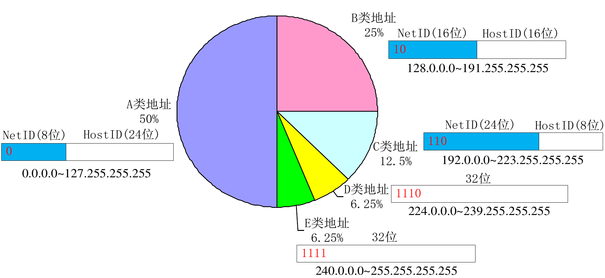
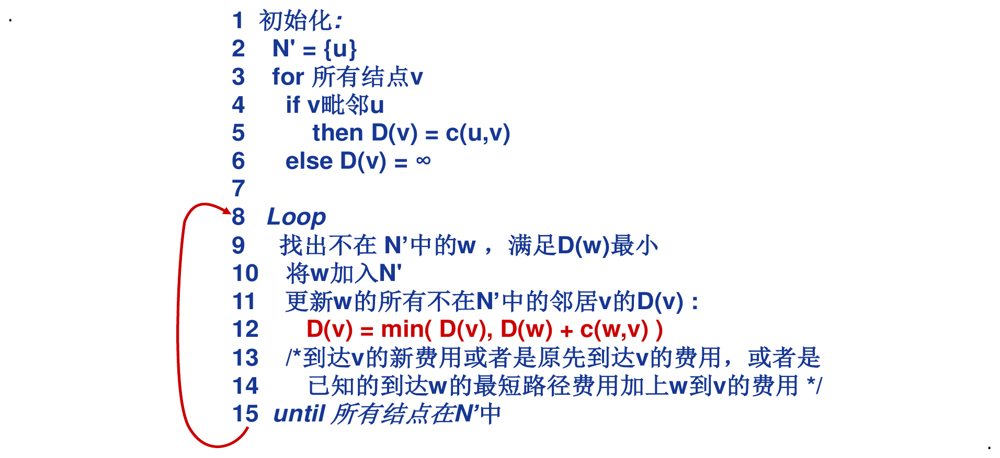
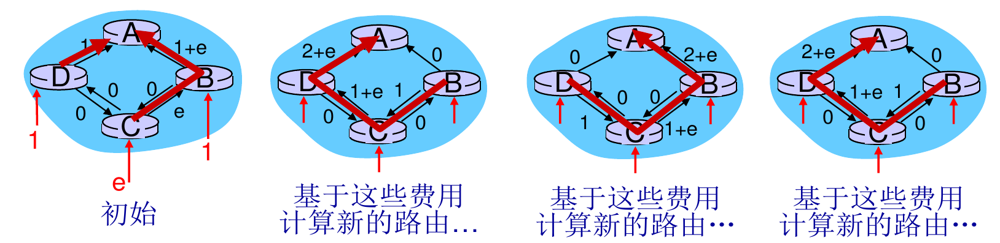

# 网络层

## 概述

网络层是点到点(主机到主机)的传输, 路由器参与到传输过程中(在传输层是看不到路由器的)

网络层将传输层的数据段(segment)封装为数据报(datagram)

### 网络层的核心功能

* 转发(forwarding):将分组从路由器的输入端口转移到合适的输出端口

* 路由(routing): 确定分组从源到目的经过的路径

### 网络层提供的服务

* 无连接服务(connection-less service):不事先为系列分组的传输确定传输路径, 每个分组独立确定传输路径, 不同分组可能传输路径不同. 是一种数据报网络(datagram network )	
* 连接服务(connection service):首先为系列分组的传输确定从源到目的经过的路径(建立连接), 然后沿该路径(连接)传输系列分组, 系列分组传输路径相同, 传输结束后拆除连接. 是一种虚电路网络(virtual-circuit network )

## 网络模型

### 虚电路网络

逻辑上是建立了一条电路, 但实际是分组交换.

特点: 每个分组的传输利用所建立连接的全部带宽.

难点: 需要链路上的路由器都参与到线路的维护中来.

注意: 每个分组携带虚电路标识(VCID),而不是目的主机地址. 同一条VC ,在每段链路上的VCID通常不同.

### 数据报网络

每个分组携带目的地址, 路由器根据分组的目的地址转发分组

分组转发遵循最长前缀匹配优先, 即越长对应的网络范围越小, 传输也就越快

### 虚电路网络vs数据报网络

**Internet (数据报网络)**

* 计算机之间的数据交换
* “弹性”服务,没有严格时间需求
* 链路类型众多
  * 特点、性能各异
  * 统一服务困难
* “智能”端系统 (计算机)可以自适应、性能控制、差错恢复

**ATM (VC网络)**

* 电话网络演化而来
* 核心业务是实时对话:
  * 严格的时间、可靠性需求
  * 需要有保障的服务
* 适用于“哑(dumb)” 端系统(非智能),例如电话机, 传真机

> 前者将计算放到端系统, 后者将计算放到网络核心

## IP协议

通常IP和ICMP(Internet Control Message Protocol)是一起的, ICMP可用于网络层的差错检测

### IP数据报

### IP分片

最大传输单元(MTU, maximum transmission unit): 链路层数据帧可封装数据的上限(不同链路的MTU不同)

大IP分组向较小MTU链路转发时,可以被“分片” (fragmented)

IP分片只有到达目的主机后才会进行“重组”

#### 首部字段说明

标识字段(16位):每产生一个IP分组计数器加1

标志位字段(3位)

* 第一位保留
* 第二位DF(Don't fragment)位: DF=0 表示允许分片, DF=0 表示不允许分片
* 第三位MF(More fragment)位: MF=0 表示最后一片(或者没有分片), MF=1 表示非最后一片

片偏移字段(13位): 一个IP分组分片封装原IP分组数据的相对偏移量, 以8字节为单位

#### 计算分片

$d=\lfloor\frac{M-20}{8}\rfloor$

> d 最大分片大小, M MTU大小

$n=\lceil\frac{L-20}{d}\rceil$

> n 分片数, L 分组大小

$F_{i}=\frac{d}{8}\times(i-1)$

> F 片偏移量, i 表示第几个分片(从1开始)

$L_{i}=\begin{cases} d+20 &1\le i\lt n \\ L-(n-1)d & i=n \end{cases}$

> L 每片总长度

### IP编址

概述

* IPv4地址有32位, 通常8位为一组转为10进制数给人使用
* IP地址对应的是接口不是主机, 一个物理接口可以虚拟出多个接口
* 一个IPv4地址由高位的NetID和地位的HostID组成,NetID用于划分子网

IP地址分类

特殊IP地址

| NetID  | HostID       | 作为源地址 | 作为目的地址 | 用途                                                         |
| ------ | ------------ | ---------- | ------------ | ------------------------------------------------------------ |
| 全0    | 全0          | 可以       | 不可以       | 在本网范围表示本机 在路由表中表示默认路由 在Internet中表示整个网络 |
| 全0    | 特定值       | 不可以     | 可以         | 表示本网内某个特定主机                                       |
| 特定值 | 全0          | 不可以     | 不可以       | 表示一个网络                                                 |
| 全1    | 全1          | 不可以     | 可以         | 本网广播地址                                                 |
| 特定值 | 全1          | 不可以     | 可以         | 特定网络广播                                                 |
|        | 非全0且非全1 | 可以       | 可以         | 用于本地回环测试                                             |

私有IP地址

| class | NetID                    | Blocks |
| ----- | ------------------------ | ------ |
| A     | 10                       | 1      |
| B     | 172.12 to 172.31         | 16     |
| C     | 192.168.0 to 192.168.255 | 256    |

### 子网掩码

由于粗略的ABC网络划分会导致IP的浪费和管理问题, 所以我们要进一步网段进行划分.

划分时如何让路由器知道某个IP属于哪一个子网就需要用到子网掩码.

子网掩码用连续的1表示网络段用连续的0表示主机段.

具体判断某个IP属于哪个子网时用IP和子网掩码进行按位与即可.

## 其他网络层协议

### CIDR与路由聚合

无类域间路由(CIDR: Classless InterDomain Routing)

无类地址格式:a.b.c.d/x,其中x为前缀长度

优点

* 提高IPv4 地址空间分配效率
* 提高路由效率

最长前缀匹配优先

### DHCP协议

动态主机配置协议-DHCP: Dynamic Host Configuration Protocol

功能:分配IP地址, 子网掩码,默认网关地址, DNS服务器名称与IP地址
DHCP分配完后是有时限的, 需要在超时前续租

### NAT

网络地址转换, Networkd Address Translation

由NAT服务维护网络地址转换表, 用不同的进程端口来标识不同的LAN端口

网络穿透方案

1. 静态配置NAT,将特定端口的连接请求转发给服务器
2. 利用UPnP(Universal Plug and Play)互联网网关设备协议 (IGD-Internet Gateway Device )自动配置
3. 中继

### ICMP

互联网控制报文协议 ICMP (Internet Control Message Protocol)

功能

* 差错(或异常)报告: 目的不可达, 源抑制(Source Quench), 超时/超期, 参数问题, 重定向 (Redirect) 

* 网络探询: 回声(Echo)请求与应答报文(Reply), 时间戳请求与应答报文

### IPv6

## 路由算法

路由主要分为**静态路由**和**动态路由**

* 静态路由: 路由表手动配置的路由

* 动态路由: 路由表根据路由算法计算所得

路由算法分为**全局信息**和**分散信息**两种

* 全局信息: 所有路由器掌握完整的网络拓扑和链路费用信息, 使用的算法为链路状态(LS)路由算法. 
* 分散信息: 路由器只掌握物理相连的邻居以及链路费用, 使用的算法为距离向量(DV)路由算法.

### Dijkstra 算法

Dijkstra是全局信息算法

伪码描述(该算法的算法复杂度为$O(n^2)$)

该算法存在震荡(oscillations)可能

Bellman-Ford方程