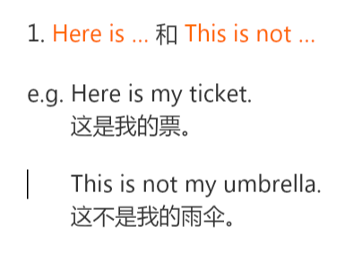

简单句

1. 主+谓
2. 主+谓+宾
3. 主+谓+宾+宾
4. 主+谓+宾+宾补
5. 主+系+表

主谓宾

I love you.

主系表

She is beautiful.

### 一般疑问句

功能: 询问

构成: 将一般陈述句的be动词置于句前

this **is** your teacher. --> **is** this your teacher?

| 主格 | 宾格 | 所有格 | 宾格所有格 |
| ---- | ---- | ------ | ---------- |
| I    | me   | my     | mine       |
| you  | you  | your   | your       |
| she  | her  | her    |            |
| he   | him  | his    |            |
| it   | it   | it's   | it's       |

coach 长途汽车

house 别墅

flat(英)/apartment(美) 公寓

## 冠词

冠词分为定冠词(the)和不定冠词(a/an)

冠词用于名词前, 定冠词表示该名词是**特指**, 不定冠词表示该名词是**泛指**.

冠词除了国家, 国籍, 城市, 人名外都要加