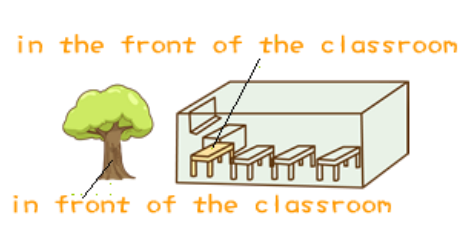

# Lesson 41

## Do you call that a hat

​	'Do you call that a hat?' I said to my wife.

　　'You **needn't be** so rude about it,' my wife answered as she looked at herself in the mirror.

　　I sat down on one of those modern chairs with holes in it and waited. We **had been** in the hat shop for half an hour and my wife **was** still in front of the mirror.

　　'We mustn't buy things we don't need,' I remarked suddenly. I regretted saying it almost at once.

　　'You **needn't have said** that,' my wife answered. 'I **needn't remind** you of that terrible tie you bought yesterday.'

　　'I **find it beautiful**,' I said. 'A man **can never** have too many ties.'

> find (sth.|sb.) + 形容词
>
> can never / cannot … too …：无论怎么 … 也不过分

　　'And a woman can't have too many hats,' she answered.

　　Ten minutes later we walked out of the shop together. My wife was wearing a hat that looked like a lighthouse!

## Vocabulary

### rude

adj. 无礼的

it's rude to do sth.

impolite：adj. 没礼貌的

### mirror

n. 镜子; 反映

side mirror：后视镜

a mirror of ...：清楚地反映 … , ... 的反映

### hole

n. 孔，洞

key hole：钥匙孔

### remark

v. / n. 评说

remark on / upon sth.：谈论某事，评论某事

### remind

v. 提醒

remind sb. of sth.：提醒某人某事

remind sb. to do sth.：提醒某人做某事

### lighthouse

n. 灯塔

### regret

regret doing sth.：后悔做了某事

regret to do sth.：为要做的事情感到遗憾

### front

## Grammar

### 情态动词

说明: 

* 有自己的词意，无人称和数的变化
* 后面跟原型

常见情态动词: can, may, must, shall, will, need

need 一般用于否定句和疑问句

否定句:  needn't do 不需要

疑问句: need + 主语 + do … ? 需要 … 么？

need have done：本来需要做，但没做

needn't have done：本来不需要做，但做了