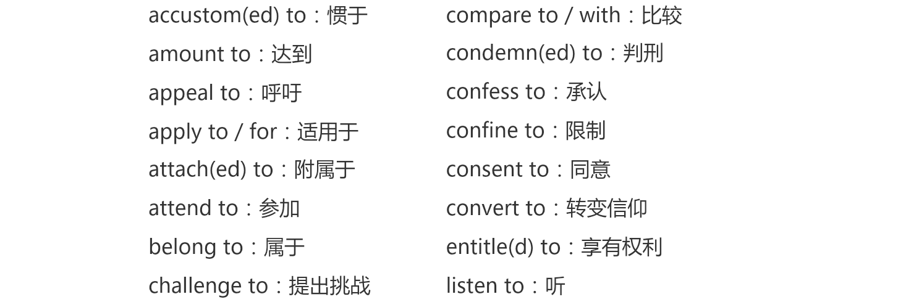
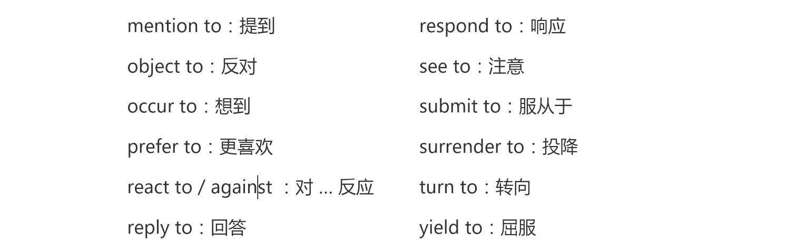
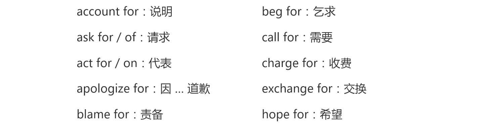
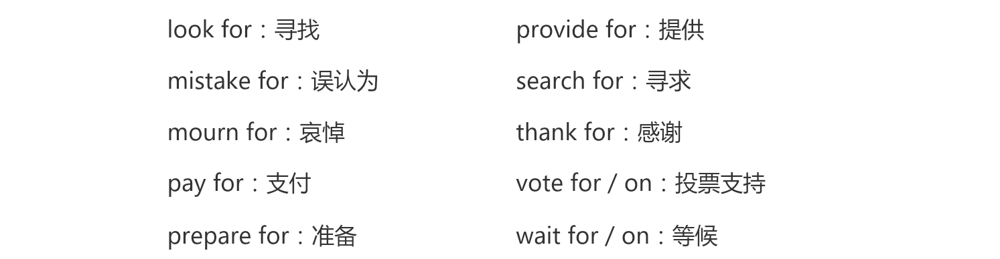
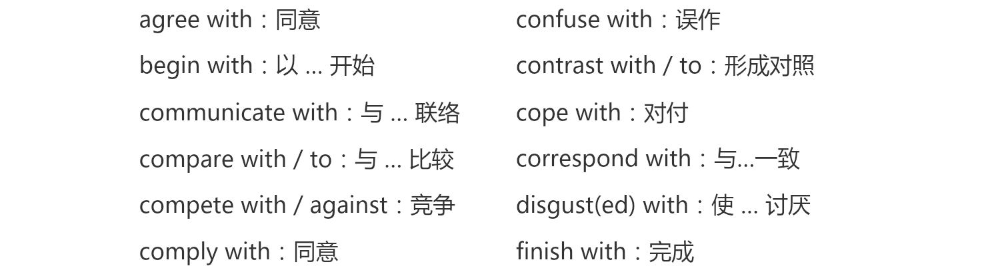
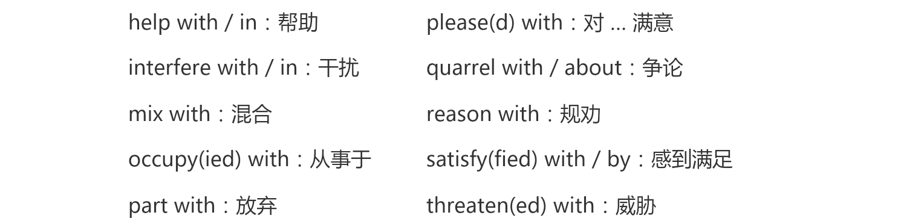

## Expensive and uncomfortable

​	When a plane from London arrived at Sydney airport, workers began to unload a number of wooden boxes which contained **clothing**. 

> clothing 衣服(统称, 更正式)
>
> cloth 布
>
> clothe 给...穿衣服
>
> clothes 衣服(统称)

No one could **account for** the fact that one of the boxes was extremely heavy. 

> account for：说明理由，做出（满意）解释

It suddenly **occurred to** one of the workers to open up the box. He **was astonished at** what he found. A man was lying in the box on top of a pile of woolen goods. He **was so surprised at being discovered** that he did not even try to run away. 

> be surprised at doing sth.

After he was arrested, the man admitted hiding in the box before the plane left London. He had had a long and uncomfortable trip, for he had been confined to the wooden box for over eighteen hours. The man was ordered to pay \$3,500 for the cost of the trip. The normal price of a ticket is ​\$2,000!

## Vocabulary

### unload

v. 卸

### extremely

adv. 非常，极其

adj. & n. - extreme

### occur

v. 发生

occur to sb.：某人突然想到 …，想法突然浮现

happen: sth. happened to sb. 某事发生在某人身上

### astonish

v. 使惊讶

astonished：对 … 感到吃惊的

astonishing：令人惊讶的

### pile

n. 堆

a pile of / piles of：a lot of / lots of

heap：（杂乱）堆

### woollen

adj. 羊毛的

woollens：羊毛衫，羊毛衣

wooden：adj. 木制的

earthen：陶制的，泥制的

### confine

v. 关在，困在（一个小空间里）

be confined to：局限于，限制于

confined：有限的，狭小的

## Grammar

动介搭配

* of / from / in / on
* to / at / for / with

to

at

for

with

