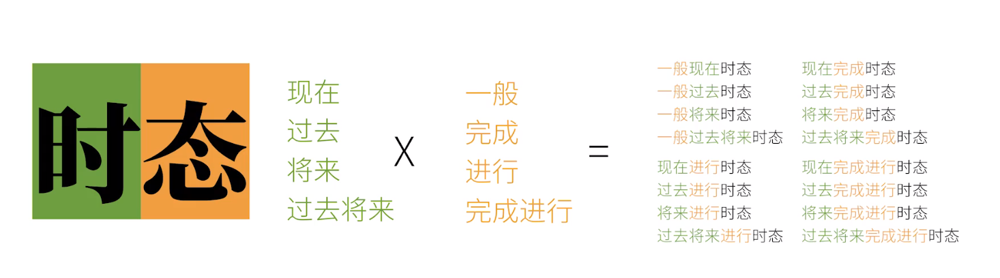

# tense

#### 时

过去将来: 以过去某一时间点为基准的将来

#### 态

一般: 表述事实或习惯

完成: 动作已经完成

进行: 动作正在进行

完成进行: 动作完成了一部分, 还在继续

## 详细语法

### 现在

#### 一般现在

主语 + 动词 + 宾语

#### 现在进行

主语 + be动词 + 动词的现在分词

* `the rabbit is eating` carrots. 

#### 现在完成

主语 + have/has + 动词的过去分词

* `the rabbit has eaten` a carrot.

#### 现在完成进行

主语 + have/has + been + 动词的现在分词

* `the rabbit has been eating ` a carrot.

### 过去

#### 一般过去

主语 + 动词的过去式

* `the rabbit ate` a carrot.

#### 过去进行

主语 + be动词的过去式 + 动词的现在分词

* `the rabbit was eating` carrots.

#### 过去完成

> 过去更远的点对过去某一个点的影响(过去的过去)

主语 + had + 动词的过去分词

* `the rabbit had eaten` lots of carrot for lunch yesterday, so it was not hungry at yesterday dinner. 

#### 过去完成进行

主语 + had + been + 动词的现在分词

* `the rabbit had been eating` carrots.

### 将来

#### 一般将来

> 有多种非正常方式可以表示将来
>
> * 一般现在时可表将来, 如 The bus leaves at 8 o'clock.
>
> * 主语 + be + going + to + 动词原型, 如 I am going to eat breakfirst.
>
> * 主语 + be + to  + 动词原型, 如 I am to eat breakfirst.
>
> * 主语 + be + about +to + 动词原型, 如 I am about to eat breakfirst.

主语 + will + 动词原型

* `the rabbit will eat` the carrot.

#### 将来进行时

主语 + will + be + 动词的现在分词

* `the rabbit will be eating` carrots for lunch tomorrow.

#### 将来完成时

主语 + will + have + 动词的过去分词

* `the rabbit will have eaten lots of carrot for lunch tomorrow`, so it will not eat carrots for dinner.

#### 将来完成进行时

主语 + will + have + been + 动词的现在分词

* `the rabbit will had been eating` carrots at tomorrow's lunch.

### 过去将来

#### 一般过去将来

主语 + would + 动词原型

* `The rabbit said it would eat carrots` next week.

主语 + was/were + going to + 动词原型

* `The rabbit was going to eat` carrots.

#### 过去将来进行

主语 + would + be + 动词现在分词

* `the rabbit said it would be eating` carrots at 1PM tomorrow.

#### 过去将来完成

主语 + would + have + 动词的过去分词

* `the rabbit said it would have eaten` a carrot at 1PM tomorrow.

#### 过去将来完成进行

主语 + would + have + been + 动词的现在分词

* `the rabbit said it would have been eating` carrots at 1PM tomorrow.

## 对比模糊概念

#### 现在完成 vs 一般过去

> 现在完成时, 重点在动作已经完成
>
> 一般过去时, 重点在动作发生过

**例子1**

I have seen a carrot

* 我见过胡萝卜(我见过胡萝卜, 别忽悠我)

I saw a carrot

* 我看见了胡萝卜(我看见了胡萝卜, 我没有撒谎)

**例子2**

I have gnoe to Shanghai.

* 我已经到上海了(我不在这里, 我去了上海)

I went to Shanghai.

* 我去了上海(我去了上海, 现在我回来了)
