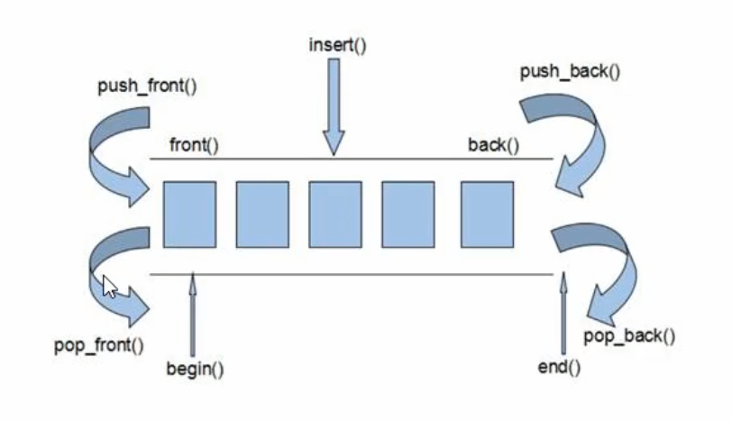

# deque

deque头部插入效率大于vector

deque的查找效率低于vector



## 构造器

```c++
deque<T> deq;
deque<T>deq(deque<T> deq.begin, deque<T>deq.end);
deque<T>deq(int n, T elem);
deque<T>deq(deque<T>);
```

## 重构运算符

#### =

说明: 赋值

语法: `deque_obj1 = deque_obj2`

#### [ ]

说明: 存取数据

语法: `deque_obj[int n]`

语法: `deque_obj[int n] = T elem`

## 方法

### 赋值

#### assign()

说明: 赋值

语法: 

```c++
deque<int> d1;
d1.assign(10,100); // 10个100
deque<int> d2;
d2.assign(d1.begin(), d1.end()); // 截取
```

### 添加内容

#### push_back()

说明: 在后端插入

语法: `deque_obj.push_back(T elem)`

#### push_front()

说明: 在前端插入

语法: `deque_obj.push_front(T elem)`

#### insert()

说明: 插入元素

语法: `deque_obj.insert(迭代器位置, 元素)`

语法: `deque_obj.insert(迭代器位置, 元素个数,元素)`

语法: `deque_obj.insert(迭代器位置, 开始, 结束)`

### 删除内容

#### pop_back()

说明: 在后端出栈

语法: `deque_obj.pop_back()`

#### pop_front()

说明: 在前端出栈

语法: `deque_obj.pop_front()`

#### clear()

说明: 清空容器

语法: `deque_obj.clear()`

#### erase()

语法: `deque_obj.erase(开始, 结束)`

语法: `deque_obj.erase(迭代器位置)`

### 获取容器信息

#### empty()

说明: 判断容器是否为空

语法: `deque_obj.empty()`

* 返回值: bool 为空返回 true

#### size()

说明: 获取容器大小

语法: `deque_obj.size()`

* 返回值 int

### 修改容器

#### resize()

说明: 重新指定容器大小

语法: `deque_obj.resize(int n)`

语法: `deque_obj.resize(int n, T ele)`

* 说明: 默认用0填充, 可以修改为其它元素

### 元素存取

#### at()

说明: 存取元素

语法: `deque_obj.at(int 位置)`

### 排序

#### sort()

说明: 排序

> 需要引入 algorithm

语法: `sort(迭代器位置, 迭代器结束位置)`	
