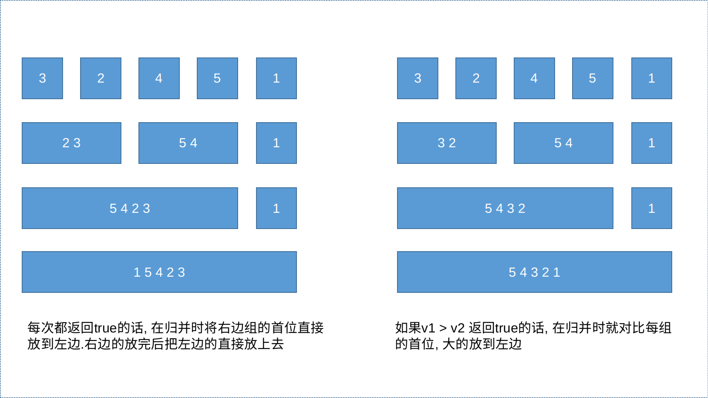

### 优点

动态存储分配, 不会造成内存浪费和溢出

插入删除效率高

### 缺点

指针域会浪费空间,  遍历速度慢, 不支持随机访问

```c++
// 不支持随机访问
list<int> l1;
list<int>::iterator it;
it = it + 1; //这样的操作是不被允许的
// 仅支持双向的单步移动
it++;
it--;
```


## 构造函数

```c++
list<T> lst;
list(beg, end);
list(n, elem);
list(const list &list);
```

## 重载

### 赋值

#### =

## 方法

### 添加

#### push_back

#### push_front

#### insert

语法: `list_obj.insert(位置指针, elem)`

语法: `list_obj.insert(位置指针, n, elem)`

语法: `list_obj.insert(位置指针, begin, end)`

### 删除

#### pop_back

#### pop_front

#### clear

清空容器

#### erase

语法: `list_obj.erase(begin, end)`

* 返回下一个数据位置

语法: `list_obj.erase(位置指针)`

* 删除位置的数据, 返回下一个位置

#### remove

语法: `list_obj.remove(elem)`

* 删除容器中所有与elem值匹配的元素

### 赋值

#### assign

### 容器信息

#### empty

语法: `list_obj.empty()`

* 判断容器是否为空

#### capacity

#### size

### 获取元素

#### front

获取第一个元素

#### back

获取最后一个元素

### 其它

#### swap

语法: `list_obj1.swap(list_obj2)`

* 交换两个容器

#### resize

重新指定容器大小

#### begin

获取容器的头指针

#### end

获取容器的尾指针

#### reserve

反转

#### sort

语法: `list_obj.sort()`

* 升序排列

语法: `list_obj.sort(排序函数)`

* 示例: 

  ```c++
  bool compare(int v1, int v2){
      return v1 > v2; // 前一个数大于后一个数, 降序
      return v1 < v2; // 前一个数小于后一个数, 升序
  }
  list_obj.sort(comapre);
  ```

* sort 使用的是归并排序

  
