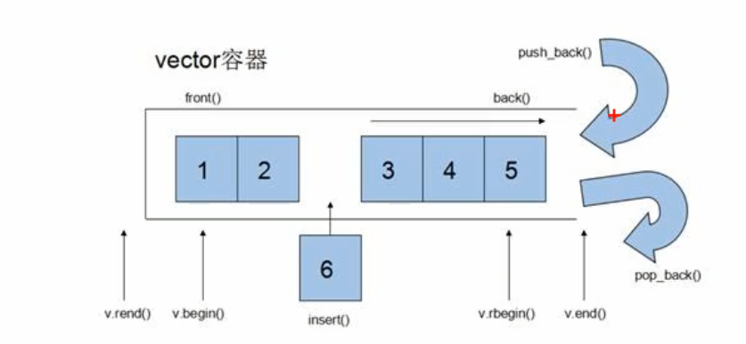

# vector

## 构造器

```c++
vector<T> v; // 模板的形式创建实例
vector(v.begin(), v.end()); // 截取已有的vector实例来作为初始化的内容
vector(n, elem); // 初始化时将elem拷贝n个
vector(const vector &v); // 拷贝构造函数
```

## 重构运算符

#### =

```c++
vector<int> v1(10,100);
vector<int> v2 = v1;
```

#### [ ]

```c++
vector<int> v1;
for(int i = 0; i <10; i++){
    v1.push_back(i);
}
cout << v1[2] << endl; //2
```

## 方法



#### assign()

> assign的取值范围 [ , )

```c++
// 截取已有实例进行赋值
vector<int> v0(10,9);
vector<int> v1;
v1.assign(v1.begin(), v1.end());

// 将元素赋值n次
vector<int> v2;
v2.assign(10, 100); //将100赋值10次
```

#### empty()

判断元素是否为空

#### capacity()

容器容量

#### size()

容器中元素个数

#### resize()

重新指定容器的大小

```c++
vector<int> v;
v.resize(10); // 比原来长会默认填充0, 比原来短则将后面的截掉
v.resize(20, 9); // 可以手动指定填充的内容
```

#### push_back()

入栈

#### pop_back()

出栈

#### insert()

插入

````c++
vector<int> v1;
v1.assgin(5,9); // 9 9 9 9 9
vecvor<int>::interator it=v1.begin();
it ++;
v1.insert(5); // 9 5 9 9 9 9
v1.insert(2,6); // 9 6 6 5 9 9 9 9
````

#### erase()

删除

```c++
vector<int> v1;
v1.assgin(5,9); // 9 9 9 9 9
v1.erase(v1.begin()); // 9 9 9 9
v1.erase(v1.begin(), v1.end()); //
```

#### clear()

清空

```c++
vector<int> v1;
v1.assgin(5,9); // 9 9 9 9 9
v1.clear(); //
```

#### at()

```c++
vector<int> v1;
for(int i = 0; i <10; i++){
    v1.push_back(i);
}
at(2); // 2
```

#### front()

vector第一个元素

#### back()

vector最后一个元素

#### swap()

```c++
vector<int> v1;
vector<int> v2;
v1.push_back(5);
v2.push_back(10);
v1.swap(v2);
cout << v1[0] << endl; // 10
cout << v2[0] << endl; // 5
```

swap可以用来收缩内存

```c++
vector<int>v;
for(int i = 0; i < 100000; i++){
    v.push_back(i);
}
cout << v.capacity() << endl; // 130000
v.resize(3); 
cout << v.capacity() << endl; // 130000
vector<int>(v).swap(v);
// vector<int>(v)
cout << v.capacity() << endl; // 3
```

#### reserve()

可以用来开辟空间, 减少vector动态增长带来的频繁数据复制和销毁操作

```c++
vector<int>v;
v.reserve(100000);
cout << v.capacity() << endl; // 100000
```