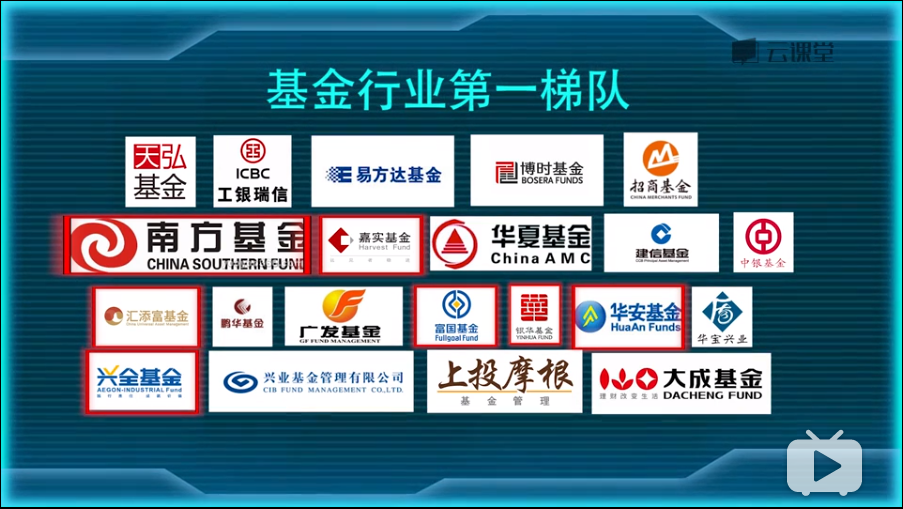

基金分类

| 基金种类 | 申赎灵活度 | 风险 | 收益 |
| -------- | ---------- | ---- | ---- |
| 货币基金 | T+0        | 极低 | 低   |
| 债券基金 | T+1        | 低   | 中低 |
| 指数基金 |            | 中低 | 中   |

## 货币基金

## 债券基金

> 只买 `纯债债基` (买时要注意不要买到 `可转债纯债基金` )

投资期限分类

| 分类               | 投资时间 |
| ------------------ | -------- |
| 短债基金           | 30天     |
| 中短债基金         | 一年     |
| 长期债券基金(推荐) | 大于一年 |

开放时间分类

| 分类         | 说明                                                        |
| ------------ | ----------------------------------------------------------- |
| 开放债基     | 基本一直开放, 申购赎回灵活                                  |
| 定期开放债基 | 定期开放申购赎回, 利润比开放高, 适合长期持有(推荐封闭期1年) |

具体操作

1. 先挑30支
2. 剔除可转债基金
3. 剔除小公司
4. 剔除基金规模超过20亿
5. 剔除同一家公司除了第一的基金
6. 筛选后挑出前10
7. 找出费率最低
8. 成立时间长
9. 经理年纪相对大的
10. 管理这支基金时间长

ABC分类

* Ａ类在申购时就扣除申购费
* B类在赎回时扣除申购费

> 红色为5星评级基金公司

全球三大评级机构

* 晨星
* 理柏
* 惠誉

基金规模

* 中小盘基金: 10-20亿
* 大盘: 30 - 100亿

## 股票型基金

分类

主动, 指数

股票基金购买策略

* 拼爹
* 拼人
* 拼业绩
* 拼规模
* 拼成本

指数基金

* 分类
  * 完全被动(推荐)
  * 增强型指数基金
* 跟踪误差小
* 买大不买小

