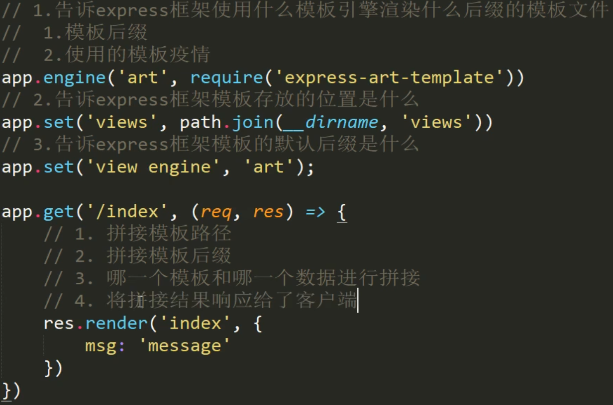

## quick start

创建express实例

```js
const express = require('express');
let app = express();
```

## 路由

### 简单路由

```js
app.METHOD(PATH, HANDLER)
```

### 中间件

```js
// 默认从上到下进行匹配, 匹配后执行并结束, 可以在参数中加入next来进一步进行处理
app.get('/request', (req,res,next)=>{
    res.name='xiaobai';
    next();
});
app.get('/request', (req,res)=>{
    app.send(res.name)
})
```

### app.use

根据父路由来进行匹配, 没有则是所有

```js
// app.use可以不添加请求地址参数, 只要有请求都会执行
app.use(function(req, res){
    res.send("hello world");
});

// 如果添加了地址, 则即可匹配post,也可匹配get
app.use("/request", (req,res)=>{
    res.send("hello");
})
```

### app.status

```js
// status可以指定状态码, 并且可以链式调用
app.use((req,res)=>{
    app.status(404).send("当前访问的页面不存在");
})
```

### 错误处理中间件

```js
app.get("/index", (req,res)=>{
    throw new Error("程序发生了未知错误");
})
// 上面抛出错误后就会执行下面的中间件
app.use((err,req,res,next)=>{
    res.status(500).send("服务器出错"+ err.message);
})
// 异步操作错误处理
app.get("/getAFile", (req,res)=>{
    fs.readFile('./nothing', 'utf8', (err, result)=>{
        if(err){
            // 如果next有值则表示要调用错误处理中间件
            next(err);
        }else{
            app.send(result);
        }
    })
})
// try-catch捕获异步函数错误
const readFile = promisify(fs.readFile);
app.get('/index', async (req,res)=>{
    try {
        await readFile('./notExistFile');
    }catch(err){
        next(err);
    }
})
```

### 模块化路由

创建模块化路由

```js
const express = require('express');
const app = express();

// 创建路由对象
const home = express.Router();
// 设置二级路由
home.get('/index', (req,res)=>{
    res.send('欢迎来到首页')
})
module.exports.home = home;
// 设置路由对象路径
app.use('/home', home);
```

引入模块化路由

```js
const home = require('./route/home');

app.use('/home', home)
```

### 获取请求参数

get请求只需要用`req.query`

post请求需要使用body-parser模块

```js
const bodyParser = require('body-parser');
// 使用bodyParser拦截并处理, 他会自动调用next方法
app.use(bodyParser.urlencoded({extended: false}));
// 在后面就可以获取到post请求参数
app.post('/add', (req,res)=>{
    console.log(req.body)
})
```

### 路由参数

```js
app.get('/index/:id', (req,res)=>{
    // params存储了参数
	console.log(req.params.id);
})
```

### 静态资源访问

```js
app.use(express.static('静态资源路径'))
```

### 使用模板引擎



不同模板的公共数据

```js
app.locals.users= [{
    name: 'xiaobai',
    age: 20
},{
    name: 'xiaolv',
    age: 99
}]
```

```html
<ul>
    {{each users}}
    <li>{{$value.name}},{{$value.age}}</li>
    {{/each}}
</ul>
```

### 链式路由

使用 `app.route(path)` 然后跟各种http请求

```javascript
app.route('/book')
  .get(function (req, res) {
    res.send('Get a random book')
  })
  .post(function (req, res) {
    res.send('Add a book')
  })
  .put(function (req, res) {
    res.send('Update the book')
  })
```

### 中间件路由

```javascript
const express = require('express')
const router = express.Router()
// 路由规则
router.get('/', function (req, res) {
  res.send('Birds home page')
});
router.get('/about', function (req, res) {
  res.send('About birds')
});
// 可以将router作为模块
module.exports = router;
// 也可以直接使用
// app.use("/birds", router);
```

```javascript
// 应用router中间件模块
var birds = require('./birds');
app.use('/birds', birds);
```

## 捕获请求

### 正则匹配

路由方法的第一个参数是一个正则表达式, 匹配后会执行回调函数.

```js
app.get("/ab?cd", function(req,res){
    // 这里可以匹配到abcd和acd
	console.log(req.param.name);
});
```

### 捕获URL

用`:varName`的形式来捕获URL

```js
app.get("/:name", function(req,res){
    //假设如果URL为http://localhost:3000/hello
	console.log(req.params.name); // 则打印出 hello
});
```

### 获取query

使用`req.query`属性即可获取query, query会被解析为`query`对象的属性

```js
app.get("/", function(req,res){
    //假设如果URL为http://localhost:3000/?name=xiaoming
    console.log(req.query.name); //打印 xiaoming
});
```

### 获取POST(表单提交数据)

```js
// 需要使用到body-parser模块
var bodyParser = require("body-parser");
app.use(bodyParser.urlencoded({extended:false}));
app.post("/", function(){
	console.log(req.body.name);
});
```

## 中间件

通过`app.use(中间件)`的行式

### static中间件

指定目录为静态文件目录, 可以直接通过地址访问到其中的文件

```js
// 将pictures指定为静态文件目录
app.use(express.static('pictures'));
// 可以直接通过 http://localhost:3000/flower.jpg 来获取pictures下的flower.jpg, 上面等价于 
app.use("/", express.static("picturezjn9s"))
//即use默认路由地址为根, 也可以自定
app.use("/giveme", express.static("pictures"))
// 这里就需要 http://localhost:3000/giveme/flower.jpg 来获取pictures下的flower.jpg
```

### 应用级中间件

```js
const express = require("express");
const app = express();
app.use(); // 这就是应用级中间件
```

### 路由级中间件

```js
const express = require("express");
const route = express.Router();
route.use(); // 这就是路由级中间件
```

## 处理函数(中间件)的参数

### request

| Parameter       | description                          |
| --------------- | ------------------------------------ |
| req.method      | request method                       |
| req.originalUrl | the original URL which was requested |
| req.query       | get请求参数对象                      |
| req.body        | post请求参数                         |

### response 

| Method                                                       | async | description                                                  |
| ------------------------------------------------------------ | ----- | ------------------------------------------------------------ |
| [res.download()](https://expressjs.com/en/4x/api.html#res.download) |       | Prompt a file to be downloaded.                              |
| [res.end()](https://expressjs.com/en/4x/api.html#res.end)    |       | End the response process.                                    |
| [res.json()](https://expressjs.com/en/4x/api.html#res.json)  |       | Send a JSON response.                                        |
| [res.jsonp()](https://expressjs.com/en/4x/api.html#res.jsonp) |       | Send a JSON response with JSONP support.                     |
| [res.redirect()](https://expressjs.com/en/4x/api.html#res.redirect) |       | Redirect a request.                                          |
| [res.render()](https://expressjs.com/en/4x/api.html#res.render) |       | Render a view template.                                      |
| [res.send()](https://expressjs.com/en/4x/api.html#res.send)  | *     | Send a response of various types.                            |
| [res.sendFile()](https://expressjs.com/en/4x/api.html#res.sendFile) | *     | Send a file as an octet stream.                              |
| [res.sendStatus()](https://expressjs.com/en/4x/api.html#res.sendStatus) |       | Set the response status code and send its string representation as the response body. |

### next

| Method          | description                                         |
| --------------- | --------------------------------------------------- |
| `next()`        | 执行**同一route**下的下一个中间件, 会构成中间件环   |
| `next('route')` | 执行**下一个同路径route**的中间件, 不会构成中间件环 |

## 模板引擎

使用`app.set("view engine", "pug");`来指定模板引擎

## Question

**实际操作无法实现**

通过`()`可控的获取一段值

```
Route path: /user/:userId(\d+)
Request URL: http://localhost:3000/user/42
req.params: {"userId": "42"}
```

