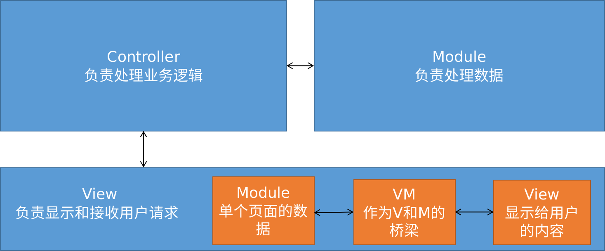

## vue组件的基本结构

```vue
<template>
  <div @click="changeMsg">{{msg}}</div>
</template>

<script>
export default {
  name: 'App',
  data(){
      return {
          msg: 'hello world';
      }
  },
  methods: {
      changeMsg(){
          this.msg = 'hello vue';
      }
  }
}
</script>
```

## vue指令

| 指令                         | 说明                                                         |
| ---------------------------- | ------------------------------------------------------------ |
| v-cloak                      | 在vue加载完毕后会去除该属性                                  |
| v-text="值"                  | 在元素中显示文本, 值可以是data中的属性<br/>不会出现插值表达式的延迟问题, 但会直接覆盖元素中的内容 |
| v-html="值"                  | 将值渲染为html                                               |
| v-bind:属性<br/>:属性        | 绑定元素属性                                                 |
| v-on:事件<br/>@事件          | 绑定事件                                                     |
| v-model                      | 数据双向绑定                                                 |
| v-for                        | 遍历数组, 对象, 数字                                         |
| v-if<br/>v-else<br/>v-elseif | 根据if条件来选择显示哪个元素<br/>                            |
| v-show                       | 显示或隐藏某个元素<br/>                                      |

### v-cloak

```html
<style>
    [v-cloak] {
        display:none;
    }
</style>

<div id="app">
    <p v-cloak>
        {{msg}}
    </p>
</div>
```

### v-for

1. 遍历数组

   ```html
   <div v-for="(item, index) in list" :key="item">
       {{index}}---{{item}}
   </div>
   <!--index非必须-->
   ```

2. 遍历对象

   ```html
   <div v-for="(value, key, index) in object" :key="value">
       {{index}} --- {{key}} --- {{value}}
   </div>
   ```

3. 遍历数

   ```html
   <div v-for="index in 10" :key="index">
       这是第{{index}}
   </div>
   ```

> key可以保证数据关联

### v-if vs v-show

`v-if`创建或删除一个元素,切换性能消耗较高

`v-show`使用`style="display:none"`来实现,初始性能消耗较高

### v-model

#### 绑定input

```vue
<template>
	<input v-model="username"/>
</template>
<script>
	export default {
  		name: 'App',
  		data(){
            return {
                username: "小白"
            }
        }
	}
</script>
```

#### 绑定radio

```vue
<template>
	<label>
        <input type="radio" name="sex" v-model="sex" value="1"/>男
    </label>
	<label>
        <input type="radio" name="sex" v-model="sex" value="2"/>女
    </label>
</template>
<script>
	export default {
  		name: 'App',
  		data(){
            return {
                sex: 1
            }
        }
	}
</script>
```

#### 绑定select

```vue
<template>
	<select v-model="city">
        <option v-for="(item, index) in cityList" :key="index" :value="item">{{item}}</option>
    </select>
</template>
<script>
	export default {
  		name: 'App',
  		data(){
            return {
                cityList: ['北京','上海','广州'],
                city: '北京'
            }
        }
	}
</script>
```

#### 绑定checkbox

```vue
<template>
	<label v-for="(item, index) in boxList" :key="index">
        <input type="checkbox" v-model="item.checked"/>{{item.label}}
    </label>
</template>
<script>
	export default {
  		name: 'App',
  		data(){
            return {
                boxList: [
                    {label: '吃饭', checked: true},
                    {label: '睡觉', checked: false},
                    {label: '写代码', checked: false},
                ]
            }
        }
	}
</script>
```

### v-bind

遍历对象放到属性中

```vue
<template>
	<div v-bind="people"></div>
	<!--通过上面的方式绑定渲染后可以得到下面的div-->
	<div name="xiaobai" age="20" pid="0"></div>
</template>
<script>
	export default {
  		name: 'App',
  		data(){
            return {
                people: {
                    name: 'xiaobai',
                    age: 20,
                    pid: 0
                }
            }
        }
	}
</script>
```

### 自定义指令

```js
// 定义全局指令
Vue.directive('指令名', { // 自定义指令在定义时不需要加`v-`前缀, 但在使用时需要加
    bind(el, arg){ // el就是原生的dom对象
        // 在指令绑定到该元素时执行, 函数只执行一次
        // 通常放样式相关的内容
    },
    inserted(el, arg){
        // 元素插入到DOM中时执行, 只触发一次
        // 通常放初始行为相关的内容
    },
    updated(el, arg){
        // 元素更新时执行, 可能触发多次
    }
})

// 定义私有指令
let vm = new Vue({
    el: "app",
    directives: {
        指令名: {}
    }
})
```

使用自定义指令

```html
<div id="app">
    <h2>I'm h2</h2 v-color="'red'">
</div>
<script>
    let vm = new Vue({
        el: 'app',
        directives: {
            'color': {
                bind(el, arg){ // 第一个参数默认为元素, 从第二个参数为传入的内容
                    el.style.color = arg.value;
                }
            }
        }
    })
</script>
```

## 事件

### 绑定事件

```vue
<template>
	<!--绑定单个事件处理函数-->
    <div @click="func1" data-name="xiaobai"></div>
	<!--一次绑定多个事件处理函数-->
	<div @click="func1,func2" data-name="xiaobai"></div>
</template>
<sctipt>
    export default {
    	methods: {
    		func1(){console.log("run func1")},
    		func2(){console.log("fun func2")}
    	}
    }
</sctipt>
```

### 事件对象

#### 获取事件对象

处理函数默认会得到一个事件对象

```html
<template>
    <div @click="getname" data-name="xiaobai"></div>
</template>
<sctipt>
    export default {
    	name: 'test',
    	data(){
    		return {
    			
    		}
    	},
    	methods: {
    		getname(e){
    			console.log('name', e.target.dataset.name);
    		}
    	}
    }
</sctipt>
```

#### 事件对象常用属性


### 事件修饰符

| 修饰符        | 说明                                             |
| ------------- | ------------------------------------------------ |
| @事件.stop    | 阻止事件冒泡                                     |
| @事件.prevent | 阻止默认事件                                     |
| @事件.capture | 在捕获阶段触发事件(默认是冒泡)                   |
| @事件.self    | 只当在 event.target 是当前元素自身时触发处理函数 |
| @事件.onece   | 只触发一次事件处理函数                           |

> 事件修饰符可以串联

### 按键修饰符

说明: 按键修饰符用于按键事件, 按键事件有 `keyup`, `keydown`等

按键修饰符格式: `@按键事件.修饰符`, 例如 `@keyup.enter`

自定义按键修饰符别名

```js
// 通过Vue的config.keyCodes属性即可自定义按键修饰符别名
Vue.config.keyCodes.f1 = 112;
```

### 表单修饰符

| 修饰符       | 说明                           |
| ------------ | ------------------------------ |
| @事件.number | 转换为数字                     |
| @事件.trim   | 去除两边的空格                 |
| @事件.lazy   | 在捕获阶段触发事件(默认是冒泡) |

## 样式

### 使用class

1. 数组

   ```html
   <div :class="['thin', 'red']"></div>
   ```

2. 三元表达式

   ```html
   <div :class="isactive ? 'red' : 'blue' "></div>
   ```

3. 直接使用对象

   ```html
   <div :class="{thin: isTrue}"></div>
   ```


> 数组, 三元表达式和对象可以互相嵌套使用, 从而绑定多个值

### 内联样式

1. 对象形式

   ```vue
   <template>
   	<div :style="style"></div>
   </template>
   <script>
   	data: {
   		style: {color:'red', fontSize:'10px'},
   	}
   </script>
   ```

2. 数组形式

   ```vue
   <template>
       <div :style="[style1, style2]"></div>
</template>
   <script>
       data: {
       	style1: {color: 'red', fontSize:'10px'},
       	style2: {margin-top: '10px'}
   	}
   </script>
   ```
   
   

## 过滤器filter

只能用在`mustache`和`v-bind`中

### 公共过滤器

过滤器基本使用

```html
<!--使用过滤器-->
<div>{{name | 过滤器名称1}}</div>

<script>
// 创建过滤器
Vue.filter('过滤器名称1', (data)=>{
    return data+'123';
})
// data默认就是管道符前的值
</script>
```

过滤器可以进行**参数传递**

```html
<div>{{name | 过滤器名称2('哈哈', '呵呵')}}</div>

<script>
Vue.filter('过滤器名称2', (data, arg1, arg2)=>{
    return data+arg1+arg2;
})
</script>
```

过滤器可以**串联使用**

```html
<div>{{name | 过滤器1 | 过滤器2}}</div>
<script>
    Vue.filter('过滤器1',(data)=>{
        return "===" + data;
    });
    Vue.filter('过滤器2',(data)=>{
        return data + "===";
    });
</script>
```

过滤器可用于绑定属性

```html
<div :id="id | 过滤器"></div>
<script>
    Vue.filter('过滤器1',(data)=>{
        return "===" + data;
    });
</script>
```

### 私有过滤器

私有过滤器的优先级高于公共过滤器

```html
<script>
    let vm = new Vue({
        filters: {}
    })
</script>
```

## 监听属性watch

可以用于监听各种属性的改变, 不仅仅只能监听data上的属性, 也可以监听路由

```html
<input v-model="name"/>
<script>
    let vm = new Vue({
        data: {
            name: "xiaobao",
        },
        watch: {
            // 当属性name发生改变时触发
            name(newValue, oldValue){
                console.log(newValue + '---' + oldValue)
            }
        }
	})
</script>
```

## 计算属性computed

计算属性可以当作属性来直接使用

计算属性所指定的函数内部的数据发生改变则会重新计算

```html
firstName: <input v-model="firstName"/>
lastName: <input v-model="lastName"/>
fullName: <input :value="fullName"/>
<script>
    let vm = new Vue({
        data: {
            firstName: 'xiao',
            lastName: 'bai'
        },
        computed: {
            fullName(){
                return this.firstName+this.lastName
            }
        }
    })
</script>
```

## 生命周期

<details>
    <summary>生命周期图</summary>
    <image src="lifecycle.png" style="zoom:50%"></image>

### 创建期

beforecreate: 实例刚被创建, 还未初始化data和methods

created: data和methods初始化完成, 还未编译模板

beforeMount: 模板编译完成, 还未挂载到页面

mounted: 模板挂载到页面

### 运行期

beforeUpdate: 状态更新前

updated: 状态更新后

### 销毁期

beforeDestroy: 实例销毁前

destroyed: 实例销毁后

### keep-alive

用于在不同路由切换时缓存组件

```vue
<keep-alive>
    <自定义组件></自定义组件>
</keep-alive>
```

#### activated 和 deactivated

这两个用于缓存的组件, 当缓存的组件被销毁则触发deactivated, 当缓存的组件被恢复则触发activated

### $nextTick

指定在下一周期执行回调函数

```vue
<template>
	<div id="hello">hello</div>
</template>
<script>
    export default {
        name: "nextTick",
        beforeMount(){
            console.log('beforeMount', document.querySelctor("#hello").innerHTML); 
            // 在beforeMount中是访问不到DOM的
            this.$nextTick( =>{
            	console.log('nexttick', document.querySelctor("#hello").innerHTML);
            	// 通过nextTick即可在下一个周期(mounted)访问DOM
            })
        }
    }
</script>
```

## vue动画

### 基础使用方法

```html
<style>
    /*设置进入结束和离开结束时的样式*/
    .v-enter,
    .v-leave-to {
        opacity: 0;
        transform: translateX(100px);
    }
    
    /*设置动画执行过程*/
    .v-enter-active,
    .v-leave-active {
        transition: all 0.4s ease;
    }
    
    /*设置元素运动, 同时需要设置.v-leave-active*/
    .move {
        transition: all 0.4s ease;
    }
    .v-leave-active {
        position: absolute;
    }
</style>
<transition>
    <h3>使用transition包裹要使用动画的元素</h3>
</transition>
<script>
    
</script>
```

### 使用第三方动画

enter-active-class 指定进入动画

leave-active-class 指定离开动画

duration 指定动画时长

* duration="毫秒数"
* duration="{enter:毫秒数, leave: 毫秒数}"

示例

```html
<link rel="stylesheet" href="./animate.css"/>
<transition enter-active-class="animated bounceIn" 
            leave-active-class="animated bounceOut"
            :duration="200">
    <h3>使用transition包裹要使用动画的元素</h3>
</transition>
```

> 可以在[animate](https://daneden.github.io/animate.css/)获取到各种动画,对于animate来说animated是基础类

### 半场动画

```html
<div id="app">
    <transition @before-enter="beforeEnter"
            @enter="enter"
            @after-enter="afterEnter">
    	<h3>使用transition包裹要使用动画的元素</h3>
	</transition>
</div>
<script>
    let vm = new Vue({
        el:"#app",
        methods:{
            beforeEnter(el){
                el.style.transform="translate(0,0)"
            },
            enter(el, done){
                el.style.transform="translate(100px, 200px)";
                el.style.transition="all 1s ease";
                // 下面两句规定要有
                el.offsetWidth;
                done()
            },
            afterEnter(el){
                this.flag=!this.flag;
            }
        }
    })
</script>

```

### 列表动画

appear 实现入场效果

tag 用于指定将transition-group渲染为哪种标签

```html
<transition-group appear tag="ul">
    <li v-for="item in list" :key="item.id">
    	用transition-group包裹v-for渲染的内容
    </li>
</transition-group>
```

### 组件切换/路由

```html
<transition mode="out-in">
    <component :is="comName"></component>
</transition>
```

## 自定义组件

### 基本使用

全局组件

```html
<!--使用组件-->
<div id="app">
    <my-com1/>
    <my-com2/>
    <my-com3/>
</div>

<template id="tmp1">
    <div>
        <h3>这是com3组件</h3>
    </div>
</template>

<script>
    let vm = new Vue({
        el: "#app"
    })	
    // 1.------- 先创建后注册 ------
    // 创建全局组件
    let com1 = Vue.extend({
		template: "<h3>这是com1组件</h3>"
	})
    // 注册组件
    Vue.component('myCom1', com1);
    
    // 2.----- 直接通过component来创建并注册 -----
    Vue.component('myCom2', {
        template: "<h3>这是com2组件</h3>"
    })
    
    // 3.---- 引用定义在html的模板 -----
    Vue.component('myCom3', {
        template: '#tmp1'
    })
</script>
```

> 如果在注册时使用驼峰命名, 在使用是要用-来分隔
>
> template只能有一个根标签
>
> 引用定义在html的template应当写在#app外, 而使用组件则需要在#app内使用

私有组件

```html
<div id="app">
    <com4/>
</div>

<script>
    let vm = new Vue({
        el: "#app",
        components: {
            com4: {
                template: "<h3>这是com4</h3>"
            }
        }
    })
</script>
```

### 组件切换

组件切换可以通过结合使用`v-if`, `v-else`, `v-else-if`或者通过`component`标签,例如:

```html
<component :is="组件名"></component>
```

### 父子组件传值

#### 父组件向子组件传值

子组件获取父组件的属性和方法有三种方式

1. 在子组件绑定属性
2. 在子组件绑定属性并把 `this` 传给子组件
3. 子组件使用 `this.$parent` 直接获取父组件

示例: 

```vue
<!--父组件-->
<template>
	<!--通过绑定属性来进行传值-->
	<son :msg="msg"></son>
	<!--你可以直接把父组件传给子组件, 但不建议这样做-->
	<son :father="this"></son>
</template>
<script>
    import son from "son";
    export default {
        name: "father",
        data(){
            return {
                msg: "hello son"
            }
        },
        components: {
            son
        }
    }
</script>
```

```html
<!--子组件-->
<template>
	<div>{{father ? father.msg : msg}}</div>
</template>
<script>
    export default {
        name: "son",
        props: ["msg", "father"],
        methods: {
            showFathersMsg(){
                // 子组件可以通过this.$parent来获取父组件和属性和方法, 但不建议这么做
                console.log(this.$parent.msg);
            }
        }
    }
</script>
```

> props中的属性是只读的

#### 子组件向父组件传值

有两种方式从子组件获取值

1. 通过自定义事件来向父组件传值
2. 父组件通过 `$refs` 直接获取子组件中的属性

示例:

```html
<!--父组件-->
<template>
    <!--通过子组件触发自定义事件-->
	<son @getMsgFromSon="getMsgFromSon"></son>
    <!--通过$refs直接获取子组件中的属性-->
    <son ref="son"></son>
</template>
<script>
    import son from "son";
    export default {
        name: "father",
        methods: {
            getMsgFromSon(data){
                console.log(data);
            },
            getArgFromSon(){
                console.log("this.$refs.son.msg");
            }
        }
    }
</script>
```

```vue
<!--子组件-->
<template>
	<div @click="sendMsgToFather"></div>
</template>
<script>
    import son from "son";
    export default {
        name: "son",
        data(){
            return {
                msg: 'hello father'
            }
        },
        methods: {
            sendMsgToFather(){
                this.$emit("getMsgFromSon", this.msg);
            }
        }
    }
</script>
```

> emit触发的事件名要小写(驼峰命名会转为小写)

#### emits

我们可以在 `emits` 属性中添加对 `$emit` 主动触发事件的监听

```vue
<!--子组件-->
<template>
	<div @click="sendMsgToFather"></div>
</template>
<script>
    import son from "son";
    export default {
        name: "son",
        data(){
            return {
                msg: 'hello father'
            }
        },
        emits: {
            getMsgFromSon(msg){
                if(!msg){
                    console.log('you should put something in msg');
                }
            }
        }
        methods: {
            sendMsgToFather(){
                this.$emit("getMsgFromSon", this.msg);
            }
        }
    }
</script>
```

### 事件中心

事件中心实现了非父子组件之间的传值

在vue2中通过 `$on` 来监听广播, 通过 `$emit` 发送广播来实现实事件中心.

在vue3中去掉了 `$on` `$off` `$once` 我们需要通过第三方的[mitt](https://www.npmjs.com/package/mitt)来实现事件中心

### 自定义组件双向数据绑定

```vue
<!--父组件-->
<template>
    <son v-model:value="value"></son>
</template>
<script>
    import son from "son";
    export default {
        name: "father",
        data(){
            return {
                value: "hello"
            }
        }
    }
</script>
```

```vue
<!--子组件-->
<template>
	<input :value="value" @input="$emit('update:value', $event.target.value)"/>
</template>
<script>
    export default {
        name: "son",
        props: ["value"]
    }
</script>
```

### 组件插槽

```vue
<!--父组件-->
<template>
    <my-button>确认</my-button>  <!--这里会将button组件的slot渲染为 确认-->
	<my-button>取消</my-button>	<!--这里会将button组件的slot渲染为 取消-->
	<my-button></my-button>  <!--没有值则渲染slot中的默认值-->
</template>
<script>
    import button from "Button";
    export default {
        name: "father",
        data(){
            return {
                value: "hello"
            }
        },
        components: {
            "my-button": "button"
        }
    }
</script>
```

```html
<!--button组件-->
<template>
	<button>
        <slot>默认值</slot>
    </button>
</template>
<script>
    export default {
        name: "son",
        props: ["value"]
    }
</script>
```

具名插槽

```vue
<!--父组件-->
<template>
	<alert-box>
        <div>这里的内容1会被放到"不具"名插槽中</div>
        <div>这里的内容2会被放到"不具"名插槽中</div>
        <div slot="namedSlot">这里的内容会被放到"具"名插槽中</div>
    </alert-box>
</template>
<script>
    import AlertBox from "AlertBox";
    export default {
        name: "father",
        components: {
            alert-box: AlertBox
        }
    }
</script>
```

```html
<!--alert-box组件-->
<template>
    <div>
        <string>ERROR:</strong>
		<div>下面是不具名插槽</div>
        <slot></slot>
		<div>下面是具名插槽</div>
    	<slot name="namedSlot"></slot>
    </div>
</template>
<script>
    import button from "Button";
    export default {
        name: "father",
    }
</script>
```

### 非prop属性继承

> 1. 通过$attrs可以获取赋给子组件的属性
> 2. 如果只有一个根节点则属性自动继承到根节点上, 如果有多个根节点则不会自动继承

```vue
<!--父组件-->
<template>
    <my-button class="confirm" test-id="1">确认</my-button> 
	<!--上面的class和test-id会继承给button组件的根元素, 也就是button元素-->
	<my-input class="confirm" test-id="3"></my-input>
	<!--上面的class会继承给div元素, 而test-id会继承给input元素-->
</template>
<script>
    import Button from "Button";
    import input from "Input";
    export default {
        name: "father",
        data(){
            return {
                value: "hello"
            }
        },
        components: {
            "my-button": Button,
            "my-input": Input
        }
    }
</script>
```

```vue
<!--button组件-->
<template>
	<button>
        <slot>默认值</slot>
    </button>
</template>
<script>
    export default {
        name: "button"
    }
</script>
<style>
    .confirm{
        color: blue;
    }
    .cancel {
        color: red
    }
</style>
```

```vue
<!--input组件-->
<template>
	<div :class="$attrs['class']"> <!--手动设置继承的位置-->
        <input :test-id="$attrs['test-id']"/> <!--手动设置继承的位置-->
    </div>
</template>
<script>
    export default {
        name: "input",
        inheritAttrs: false // 禁用默认继承
    }
</script>
<style>
    .confirm{
        color: blue;
    }
    .cancel {
        color: red
    }
</style>
```

### teleport

将一个组件放到dom中的任意位置, 而不包含在父组件中.

如下面son组件默认会被放到parent组件中, 但通过使用teleport标签指定放置位置后, son组件将会被放到body下面

> to 属性支持css选择器

```vue
<!--parent.vue-->
<template>
	<son></son>
</template>
<script>
    import son from "Son";
    export default {
        name: "parent",
        components: {
            son
        }
    }
</script>
```

```vue
<!--son.vue-->
<template>
	<teleport to="body">
        <div>hello world</div>
    </teleport>
</template>
```

## Composition API

vue3中加入了Composition API用于提高代码的复用性

> composition-api 提供的函数
>
> * 生命周期hooks
> * setup
> * ref
> * reactive
> * watchEffect
> * watch
> * computed
> * toRefs

### 生命周期

setup在beforeCreate 和 created这两个周期执行, 所以在setup中不能申明这两个函数, 而其它的生命周期都可以在setup中申明

### setup

setup在beforeCreate和created阶段执行, 所以访问不到data中的属性和methods中的方法, 但可以获取到props

```vue
<template>
	<div>{{msg}}</div>
</template>
<script>
    export default{
        name: 'com',
        props: ['msg'],
        setup(props){
            let msg = props.msg
            return {
                msg
            }
        }
    }
</script>
```

### ref&reactive

ref和reactive用来申明响应式数据

* ref 申明的变量只能通过value属性来改变他的值, 即变量对应的整个值都会改变, 所以如果值是一个对象则会把该对象替换掉,而无法修改对象的属性
* reactive 可用于 object

```vue
<template>
	<div>{{msg}}</div>
	<div @click="changeMsg">changeMsg</div>
	<div>{{name}}</div>
	<div @click="changeName">changeName</div>
	<div>{{book.title}} -- {{book.no}}</div>
	<div @click="changeBookTitle">changeBookTitle</div>
	<div @click="changeBookNo">changeBookNo</div>
</template>
<script>
    import {ref, reactive} from 'vue';
    export default{
        name: 'com',
        setup(){
            // 下面的msg并没有申明为响应式数据, 所以在changeMsg触发后msg值修改了却不会渲染到页面
            let msg = "hello"; 
            const changeMsg = ()=>{
                msg = "hello world"
            }
            
            let name = ref("xiaobai");
            const changeName = ()=>{
                name.value = "xiaohei"
            }
            
            let book = reactive({
                title: '小黄书',
                no: 999
            })
            const changeBookTitle = ()=>{
                book.title = '小白书'
            }
            const changeBookNo = ()=>{
                book.no = '0'
            }
            return {
                msg,
                changeMsg,
                name,
                changeName,
                book,
                changeBookTitle,
                changeBookNo
            }
        }
    }
</script>
```

### toRefs

将reactive类型的对象**的属性**转化为ref类型的对象, 以此让reactive类型对象的属性可以实现响应式

```vue
<template>
	<div>{{name}} -- {{age}}</div>
	<div @click="changeName">changeName</div>
</template>
<script>
    import {reative, toRefs} from 'vue';
    export default{
        name: 'com',
        setup(){
            const people = reactive({
                name: 'xiaobai',
                age: 10
            })
            const changeName = ()=>{
                people.name = "xiaobai bai"
            }
            return {
                people,
                changeName,
                ...toRefs(people) // 通过toRefs将people中的属性解出
            }
        }
    }
</script>
```

### computed

```vue
<template>
  <div id="container">
    <input v-model="firstName">
    <input v-model="lastName">
    <div >{{fullName}}</div>
  </div>
</template>

<script>
import {reactive, computed, toRefs} from 'vue';
export default{
    name: 'com',
    setup(){
      const people = reactive({
        firstName: 'san',
        lastName: 'zhang'
      })
      const {firstName, lastName} = toRefs(people);
      const fullName = computed( () => {
        return firstName.value + " " + lastName.value
      })
      return {
        firstName,
        lastName,
        fullName
      }
    }
}
</script>
```

### watch&watchEffect

>  注意: watch只能监听 getter/effect 函数, ref/reactive 对象

```vue
<template>
  <div id="container">
    <div >{{vOfWatch}}</div>
    <div >{{vOfWatchEffect}}</div>
  </div>
</template>

<script>
import {reactive, watch, watchEffect} from 'vue'
export default {
  name: 'test',
  setup(){
    const vOfWatch = reactive({
      num: 10
    })
    const vOfWatchEffect = reactive({
      num: 10
    })
    // 1. watch 需要指定监听对象
    // 2. watch 可以得到改变前的值
    watch(()=>vOfWatch.num, (newData, oldData) => {
      console.log('watch', newData, oldData);
    })
    // watchEffect 无需手动指定监听对象
    watchEffect( (arg) => {
      console.log('watchEffect', vOfWatchEffect.num, arg);
    })
    let count = 0;
    const interval = setInterval( () => {
      if (count == 10) {
        clearInterval(interval);
      }
      vOfWatch.num ++;
      vOfWatchEffect.num ++;
      count ++;
    }, 1000)
    return {
      vOfWatch,
      vOfWatchEffect
    }
  }
}
</script>
```

### provide&inject

通过provide和inject可以让子(孙)组件方便的获取父(祖)组件中的值

下面的示例是非响应式

```vue
<!--parent.vue-->
<template>
	<div>{{parantTitle}}</div>
</template>
<script>
    export default{
        name: 'parent',
        data(){
            return{
                parentTitle: 'parent title'
            }
        },
        provide(){
            return{
                parentTitle: this.parentTitle
            }
    	}
    }
</script>
```

```vue
<!--son.vue-->
<template>
	<div>{{parantTitle}}</div>
</template>
<script>
    export default{
        name: 'son',
        inject: ['parentTitle']
    }
</script>
```

下面的示例是响应式

> 需要注意的是, 如果子组件对通过 `inject` 获取的属性进行修改, 会影响父组件. 这是与 `props` 不同的

```vue
<!--parent.vue-->
<template>
	<div>这是父组件---{{parantTitle}}</div>
	下面是子组件
	<son></son>
</template>
<script>
    import {ref, provide} from 'vue';
    import Son from 'Son.vue';
    export default{
        name: 'parent',
        setup(){
            const parentTitle = ref('parent title');
            provide('parentTitle', parentTitle);
            return {
                parentTitle
            }
        },
        components: {
            son: Son
        }
    }
</script>
```

```vue
<!--Son.vue-->
<template>
	<div>{{parantTitle}}</div>
</template>
<script>
    import {inject} from 'vue';
    export default{
        name: 'son',
        setup(){
            let parentTitle = inject("parentTitle");
            return {
                parentTitle
            }
        }
    }
</script>
```

## 其他

### mixins

mixins可以抽离组件的方法和属性, 以便多个组件进行共用

> mixin采用就近原则, 即组件自身的属性和方法优先于mixin的属性和方法

下面是一个mixin示例

```js
// myMixin.js
export default {
	data: ()=>{
		return {
			msg: "hello"
		}
	},
	methods: {
		sayHi(){
			console.log("hi");
		}
	}
}
```

下面是在单个组件中引入myMixin

```vue
<template>
	<!--引入并注册myMixin后可以直接使用myMixin中的属性和方法-->
	<div>{{msg}}</div> 
	<div @click="sayHi">say hi</div> 
</template>
<script>
    import myMixin from "./myMixin.js"
    export default {
        name: "myCom",
        mixins: [myMixin] //通过mixins属性进行注册
    }
</script>
```

下面是在全局引入myMixin, 全局引入后任何组件都可以直接使用myMixin中的属性和方法

```js
// main.js
import {createApp} from "vue";
import App from "./App.vue";
import myMixin from "./myMixin.js";

createApp(App).mixin(myMixin).mount("#app");
```

### ref获取DOM元素或组件

1. 在标签上加上`ref=自定义名字`属性
2. 调用`this.$ref.自定义名字`获取

```html
<p ref="aPhrase">hello world</p>
<script>
    ...
    methods: {
        printText(){
            console.log(this.$ref.aPhrase.innerText);
        }
    }
</script>
```

### Vue.set/vm.$set

说明: 用于设置手动设置数组/对象的值并渲染到页面

Vue.set(data中的变量, 索引/属性, 值)

vm.$set(data中的变量, 索引/属性, 值)

### 深刻理解MVC和MVVM



## Question

### composition-api

composition-api为了提高代码的复用性而出现在vue3中, 那它和mixin有什么区别, 有什么它能做或比mixin做得更好的?

### 为什么说ref不能申明响应式对象?

下面的代码可以正常运行

```vue
<template>
  <div id="container">
    <div >{{people.name}} -- {{people.age}}</div>
    <div class="button" @click="changeName">changeName</div>
    <input type="text" v-model="people.age">
  </div>
</template>

<script>
import {ref} from "vue"
export default {
  name: 'ExploreContainer',
  setup(){
    const people = ref({
      name: 'xiaobai',
      age: '10'
    })
    const changeName = ()=>{
      people.value.name = '小黑'
    }
    return {
      people,
      changeName
    }
  }
}
</script>
```

