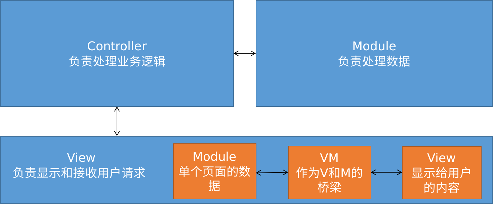

## 其他

### mixins

mixins可以抽离组件的方法和属性, 以便多个组件进行共用

> mixin采用就近原则, 即组件自身的属性和方法优先于mixin的属性和方法

下面是一个mixin示例

```js
// myMixin.js
export default {
	data: ()=>{
		return {
			msg: "hello"
		}
	},
	methods: {
		sayHi(){
			console.log("hi");
		}
	}
}
```

下面是在单个组件中引入myMixin

```vue
<template>
	<!--引入并注册myMixin后可以直接使用myMixin中的属性和方法-->
	<div>{{msg}}</div> 
	<div @click="sayHi">say hi</div> 
</template>
<script>
    import myMixin from "./myMixin.js"
    export default {
        name: "myCom",
        mixins: [myMixin] //通过mixins属性进行注册
    }
</script>
```

下面是在全局引入myMixin, 全局引入后任何组件都可以直接使用myMixin中的属性和方法

```js
// main.js
import {createApp} from "vue";
import App from "./App.vue";
import myMixin from "./myMixin.js";

createApp(App).mixin(myMixin).mount("#app");
```

### Vue.set/vm.$set

说明: 用于设置手动设置数组/对象的值并渲染到页面

Vue.set(data中的变量, 索引/属性, 值)

vm.$set(data中的变量, 索引/属性, 值)

### 深刻理解MVC和MVVM



## Question

### composition-api

composition-api为了提高代码的复用性而出现在vue3中, 那它和mixin有什么区别, 有什么它能做或比mixin做得更好的?

### 为什么说ref不能申明响应式对象?

下面的代码可以正常运行

```vue
<template>
  <div id="container">
    <div >{{people.name}} -- {{people.age}}</div>
    <div class="button" @click="changeName">changeName</div>
    <input type="text" v-model="people.age">
  </div>
</template>

<script>
import {ref} from "vue"
export default {
  name: 'ExploreContainer',
  setup(){
    const people = ref({
      name: 'xiaobai',
      age: '10'
    })
    const changeName = ()=>{
      people.value.name = '小黑'
    }
    return {
      people,
      changeName
    }
  }
}
</script>
```
