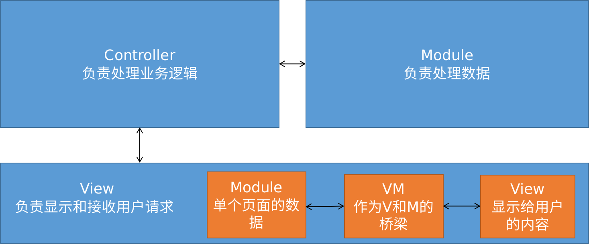

## vue的基本代码

```html
<div id="app">
    {{ meg }}
    <button @click="handleClick">
        按钮
    </button>
</div>
```

```js
let vm = new Vue({
    el: "#app", // 绑定控制的元素
    data: { // 控制的元素中所使用到的数据
        msg: 'hello world'
    },
    methods:{
        handleClick(){
            console.log(this.msg);
        }
    }
}
```

## vue指令

| 指令                         | 说明                                                         |
| ---------------------------- | ------------------------------------------------------------ |
| v-cloak                      | 在vue加载完毕后会去除该属性                                  |
| v-text="值"                  | 在元素中显示文本, 值可以是data中的属性<br/>不会出现插值表达式的延迟问题, 但会直接覆盖元素中的内容 |
| v-html="值"                  | 将值渲染为html                                               |
| v-bind:属性<br/>:属性        | 绑定元素属性                                                 |
| v-on:事件<br/>@事件          | 绑定事件                                                     |
| v-model                      | 数据双向绑定                                                 |
| v-for                        | 遍历数组, 对象, 数字                                         |
| v-if<br/>v-else<br/>v-elseif | 根据if条件来选择显示哪个元素<br/>                            |
| v-show                       | 显示或隐藏某个元素<br/>                                      |

### v-cloak

```html
<style>
    [v-cloak] {
        display:none;
    }
</style>

<div id="app">
    <p v-cloak>
        {{msg}}
    </p>
</div>
```

### v-for

1. 遍历数组

   ```html
   <div v-for="(item, index) in list" :key="item">
       {{index}}---{{item}}
   </div>
   <!--index非必须-->
   ```

2. 遍历对象

   ```html
   <div v-for="(value, key, index) in object" :key="value">
       {{index}} --- {{key}} --- {{value}}
   </div>
   ```

3. 遍历数

   ```html
   <div v-for="index in 10" :key="index">
       这是第{{index}}
   </div>
   ```

> key可以保证数据关联

### v-if vs v-show

`v-if`创建或删除一个元素,切换性能消耗较高

`v-show`使用`style="display:none"`来实现,初始性能消耗较高

### 自定义指令

```js
// 定义全局指令
Vue.directive('指令名', { // 自定义指令在定义时不需要加`v-`前缀, 但在使用时需要加
    bind(el){ // el就是原生的dom对象
        // 在指令绑定到该元素时执行, 函数只执行一次
        // 通常放样式相关的内容
    },
    inserted(el){
        // 元素插入到DOM中时执行, 只触发一次
        // 通常放初始行为相关的内容
    },
    updated(el){
        // 元素更新时执行, 可能触发多次
    }
})

// 定义私有指令
let vm = new Vue({
    el: "app",
    directives: {
        指令名: {}
    }
})
```

使用自定义指令

```html
<div id="app">
    <h2>I'm h2</h2 v-color="'red'">
</div>
<script>
    let vm = new Vue({
        el: 'app',
        directives: {
            'color': {
                bind(el, arg){ // 第一个参数默认为元素, 从第二个参数为传入的内容
                    el.style.color = arg.value;
                }
            }
        }
    })
</script>
```

## 事件

### 事件修饰符

| 修饰符        | 说明                             |
| ------------- | -------------------------------- |
| @事件.stop    | 阻止事件冒泡                     |
| @事件.prevent | 阻止默认事件                     |
| @事件.capture | 在捕获阶段触发事件(默认是冒泡)   |
| @事件.self    | 只在自己主动触发事件时才调用回调 |
| @事件.onece   | 只触发一次事件处理函数           |

> 事件修饰符可以串联

### 按键修饰符

说明: 按键修饰符用于按键事件, 如`keyup`, `keydown`等

按键修饰符格式: `@按键事件.修饰符`, 例如 `keyup.enter`

自定义按键修饰符别名

```js
// 通过Vue的config.keyCodes属性即可自定义按键修饰符别名
Vue.config.keyCodes.f1 = 112;
```

## 样式

### 使用class

1. 数组

   ```html
   <div :class="['thin', 'red']"></div>
   ```

2. 三元表达式

   ```html
   <div :class="['thin', 'red', isactive?'active':'']"></div>
   ```

3. 数组中嵌套对象

   ```html
   <div :class="['thin', 'red', {active: isactive}]"></div>
   ```

4. 直接使用对象

   ```html
   <div :class="{thin: true, red: true, active: false}"></div>
   ```

### 内联样式

1. 直接写入样式

   ```html
   <div :style="{color:'red', font-size:'10px'}"></div>
   ```

2. 使用data中定义的样式

   ```html
   <div :style="[style1, style2]"></div>
   ```

   ```js
   data: {
       style1: {color: 'red', font-size:'10px'},
       style2: {margin-top: '10px'}
   }
   ```

## 过滤器filter

只能用在`mustache`和`v-bind`中

### 公共过滤器

过滤器基本使用

```html
<!--使用过滤器-->
<div>{{name | 过滤器名称1}}</div>

<script>
// 创建过滤器
Vue.filter('过滤器名称1', (data)=>{
    return data+'123';
})
// data默认就是管道符前的值
</script>
```

过滤器可以进行**参数传递**

```html
<div>{{name | 过滤器名称2('哈哈', '呵呵')}}</div>

<script>
Vue.filter('过滤器名称2', (data, arg1, arg2)=>{
    return data+arg1+arg2;
})
</script>
```

过滤器可以**串联使用**

```html
<div>{{name | 过滤器1 | 过滤器2}}</div>
<script>
    Vue.filter('过滤器1',(data)=>{
        return "===" + data;
    });
    Vue.filter('过滤器2',(data)=>{
        return data + "===";
    });
</script>
```

### 私有过滤器

私有过滤器的优先级高于公共过滤器

```html
<script>
    let vm = new Vue({
        filters: {}
    })
</script>
```

## 监听属性watch

可以用于监听各种属性的改变, 不仅仅只能监听data上的属性, 也可以监听路由

```html
<input v-model="name"/>
<script>
    let vm = new Vue({
        data: {
            name: "xiaobao",
        },
        watch: {
            // 当属性name发生改变时触发
            name(newValue, oldValue){
                console.log(newValue + '---' + oldValue)
            }
        }
	})
</script>
```

## 计算属性computed

计算属性可以当作属性来直接使用

计算属性所指定的函数内部的数据发生改变则会重新计算

```html
firstName: <input v-model="firstName"/>
lastName: <input v-model="lastName"/>
fullName: <input :value="fullName"/>
<script>
    let vm = new Vue({
        data: {
            firstName: 'xiao',
            lastName: 'bai'
        },
        computed: {
            fullName(){
                return this.firstName+this.lastName
            }
        }
    })
</script>
```

## 生命周期

<details>
    <summary>生命周期图</summary>
    <image src="lifecycle.png"></image>

### 创建期

beforecreate: 实例刚被创建, 还未初始化data和methods

created: data和methods初始化完成, 还未编译模板

beforeMount: 模板编译完成, 还未挂载到页面

mounted: 模板挂载到页面

### 运行期

beforeUpdate: 状态更新前

updated: 状态更新后

### 销毁期

beforeDestroy: 实例销毁前

destroyed: 实例销毁后

## vue动画

### 基础使用方法

```html
<style>
    /*设置进入结束和离开结束时的样式*/
    .v-enter,
    .v-leave-to {
        opacity: 0;
        transform: translateX(100px);
    }
    
    /*设置动画执行过程*/
    .v-enter-active,
    .v-leave-active {
        transition: all 0.4s ease;
    }
    
    /*设置元素运动, 同时需要设置.v-leave-active*/
    .move {
        transition: all 0.4s ease;
    }
    .v-leave-active {
        position: absolute;
    }
</style>
<transition>
    <h3>使用transition包裹要使用动画的元素</h3>
</transition>
<script>
    
</script>
```

### 使用第三方动画

enter-active-class 指定进入动画

leave-active-class 指定离开动画

duration 指定动画时长

* duration="毫秒数"
* duration="{enter:毫秒数, leave: 毫秒数}"

示例

```html
<link rel="stylesheet" href="./animate.css"/>
<transition enter-active-class="animated bounceIn" 
            leave-active-class="animated bounceOut"
            :duration="200">
    <h3>使用transition包裹要使用动画的元素</h3>
</transition>
```

> 可以在[animate](https://daneden.github.io/animate.css/)获取到各种动画,对于animate来说animated是基础类

### 半场动画

```html
<div id="app">
    <transition @before-enter="beforeEnter"
            @enter="enter"
            @after-enter="afterEnter">
    	<h3>使用transition包裹要使用动画的元素</h3>
	</transition>
</div>
<script>
    let vm = new Vue({
        el:"#app",
        methods:{
            beforeEnter(el){
                el.style.transform="translate(0,0)"
            },
            enter(el, done){
                el.style.transform="translate(100px, 200px)";
                el.style.transition="all 1s ease";
                // 下面两句规定要有
                el.offsetWidth;
                done()
            },
            afterEnter(el){
                this.flag=!this.flag;
            }
        }
    })
</script>

```

### 列表动画

appear 实现入场效果

tag 用于指定将transition-group渲染为哪种标签

```html
<transition-group appear tag="ul">
    <li v-for="item in list" :key="item.id">
    	用transition-group包裹v-for渲染的内容
    </li>
</transition-group>
```

### 组件切换/路由

```html
<transition mode="out-in">
    <component :is="comName"></component>
</transition>
```

## vue组件

### 基本使用

全局组件

```html
<!--使用组件-->
<div id="app">
    <my-com1/>
    <my-com2/>
    <my-com3/>
</div>

<template id="tmp1">
    <div>
        <h3>这是com3组件</h3>
    </div>
</template>

<script>
    let vm = new Vue({
        el: "#app"
    })
    // 1.------- 先创建后注册 ------
    // 创建全局组件
    let com1 = Vue.extend({
		template: "<h3>这是com1组件</h3>"
	})
    // 注册组件
    Vue.component('myCom1', com1);
    
    // 2.----- 直接通过component来创建并注册 -----
    Vue.component('myCom2', {
        template: "<h3>这是com2组件</h3>"
    })
    
    // 3.---- 引用定义在html的模板 -----
    Vue.component('myCom3', {
        template: '#tmp1'
    })
</script>
```

> 如果在注册时使用驼峰命名, 在使用是要用-来分隔
>
> template只能有一个根标签
>
> 引用定义在html的template应当写在#app外, 而使用组件则需要在#app内使用

私有组件

```html
<div id="app">
    <com4/>
</div>

<script>
    let vm = new Vue({
        el: "#app",
        components: {
            com4: {
                template: "<h3>这是com4</h3>"
            }
        }
    })
</script>
```

### 组件切换

组件切换可以通过结合使用`v-if`, `v-else`, `v-else-if`或者通过`component`标签,例如:

```html
<component :is="组件名"></component>
```

### 父子组件传值

父组件向子组件传值

1. 在子组件绑定属性
2. 在子组件的props属性中注册绑定的属性

示例: 

```html
<div id="app">
    <com1 :fatherData="msg"></com1>
</div>
<script>
    let vm = new Vue({
        el: "#app",
        data: {
            msg: 'hello son'
        },
        components: {
            com1: {
                template: "<h3>我是组件1 {{fatherData}}<h3>",
                props: ['fatherData']
            }
        }
    })
</script>
```

> props中的属性是只读的

子组件向父组件传值(父组件向自组件传递方法)

```html
<div id="app">
    <com1 @transportDataToFather="getDataFromSon"></com1>
</div>
<script>
    let vm = new Vue({
        el: "#app",
        data: {
            name: ''
        },
        methods: {
            getDataFromSon(data){
                this.name = data
            }
        },
        components: {
            com1: {
                data: {
                    name: xiaobai
                }
                template: "<h3>我是组件1 {{fatherData}}<h3>",
                methods: {
                     transData(){
                         transportDataToFather(this.name);
                     }
                }
            }
        }
    })
</script>
```

## vue-resource

vue-resource 用于发送ajax请求

vue-resource 依赖于vue, 所以需要先导入vue,再导入vue-resource

```js
// 示例
{
  // GET /someUrl
  this.$http.get('/someUrl').then(response => {

    // get body data
    this.someData = response.body;

  }, response => {
    // error callback
  });
}
```

[详细文档](https://github.com/pagekit/vue-resource)

### vue-resource配置

| 配置                              | 说明             |
| --------------------------------- | ---------------- |
| Vue.http.options.root="/root"     | 设置默认根路径   |
| Vue.http.options.emulateJSON=true | 默认启用表单格式 |

> 如果要让默认根路径启用, 请求必须为相对路径

## vue-router

说明: vue-router 用于实现前端路由

### 基本使用

1. 引入vue-router

   ```html
   <!--直接通过script标签引用-->
   <script src="vue-router.js"></script>
   ```

2. 创建路由实例

   ```js
   let router = new VueRouter({
       routes: [
           {path: '/login', component: 组件模板对象}, 
           //注意是模板对象, 不是注册后的模板名
           {path: '/register', component: 组件模板对象}
       ]
   })
   ```

3. 在vue实例上挂载路由

   ```js
   let vm = new Vue({
       router: router
   })
   ```

4. 在页面放置router-view, 路由指定的组件将会替代这个标签

   ```html
   <router-view></router-view>
   ```

5. 放置router-link, 用于实现路由跳转

   ```html
   <router-link to="/login"></router-link>
   <router-link to="/register"></router-link>
   ```

### 重定向

```js
let router = new VueRouter({
    routes: [
        {path: '/', redirect: '/login'},
        {path: '/login', component: 组件模板对象},
        {path: '/register', component: 组件模板对象}
    ]
})
```

### 高亮router-link

默认对激活的router-link会有一个, 可以自定义激活的类名:

```js
let router = new VueRouter({
    linkActiveClass: '自定义激活类名'
})
```

### 传参

```html
<router-link to="/login?id=10"></router-link>
<script>
    ...
    let login = {
        template: '<h3>{{$route.query.id}}<h3>', //可以直接在组件中使用
        methods:{
            showId(){
                console.log(this.$route.query.id); //也可以在方法中调用
            }
        }
    }
</script>
```

### 路由嵌套

在路由规则上添加children属性

```html
<router-view>
    账户组件
    <router-link to="/account/login">登录</router-link>
    <router-link to="/account/register">注册</router-link>
    <router-view></router-view>
</router-view>
<script>
    let router = new VueRouter({
        routes: [
            {path: "/account",
            component: account,
            children: [
            	{path:'login', component: login},
                {path: 'register', component: register}
        	]}
        ]
    })
</script>
```

### 命名视图

命名视图使用要在routes里面使用components属性, 然后在router-view上加上name属性

default表示默认, 即没有指定name的router-view

```html
<router-view></router-view>
<router-view name="left"></router-view>
<router-view name="main"></router-view>
<script>
    let router = new VueRouter({
        routes: [{
            path: '/',
            components: {
                default: head,
                left: left,
                main: main
            }
        }]
    })
</script>
```


## 其他

### ref获取DOM元素或组件

1. 在标签上加上`ref=自定义名字`属性
2. 调用`this.$ref.自定义名字`获取

```html
<p ref="aPhrase">hello world</p>
<script>
    ...
    methods: {
        printText(){
            console.log(this.$ref.aPhrase.innerText);
        }
    }
</script>
```

## Question

### webpack和gulp的用处及区别?

### EJS和art-template的用处和区别?

### 深刻理解MVC和MVVM

