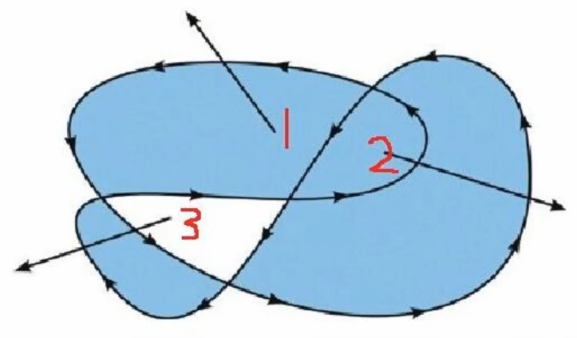

```html
<canvas id="canvas" width="800" height="600"></canvas>
<script>
    let canvas = docuemtn.getElementById("canvas");
    const ctx = canvas.getContext();
    // 也可以修改canvas的宽高
    canvas.width = 1280;
    canvas.height = 720;
</script>
```

## 基础ctx

移动画笔 `ctx.moveTo(x,y)`

线性渐变

```js
let linearGradient = ctx.createLinearGradient(x0,y0,x1,y1);
linearGradient.addColorStop(0,'red');
linearGradient.addColorStop(0.5,'green');
linearGradient.addColorStop(1,'blue');

ctx.fillStyle = linearGradient;
```

画

* 

* 画线 `ctx.lineTo(x,y)`

* 画矩形 `ctx.rect(起始X, 起始Y, 宽, 高)`

* 

* 圆 `ctx.arc(x,y, startAngle, endAngle, counterClockWise)`

  > 注意angle要使用弧度

样式

* 线条宽度 `ctx.lineWidth= [Number]`

* 描线样式 `ctx.strokeStyle= color[String]`

* 填充样式 `ctx.fillStyle=样式`

* 线条粗细 `ctx.lineWidth()`

* 字体 `ctx.font="italic small-caps bold 12px arial"`

* 基线 `ctx.textBaseline = "bottom|"`

* 水平对齐 `ctx.textAlign= "left|center|right"`

  > 与x坐标对齐

渲染

*  渲染线条 `ctx.stroke()`
* 填充内容 `ctx.fill()`
* 绘制并渲染文字 `ctx.strokeText("内容",x,y)`
* 绘制并渲染填充文字 `ctx.fillText("内容",x,y)`

矩形

* 画并渲染 `ctx.strokeRect()`
* 画并渲染 `ctx.fillRect()`

阴影

* 阴影颜色 `ctx.shadowColor=颜色值`
* blur `ctx.shadowBlur = 像素值`
* X轴偏移 `ctx.shadowOffsetX = 像素值`
* Y轴偏移 `ctx.shadowOffsetY = 像素值`

图片

```js
// 创建图片实例
let img = new Image();
img.src = '图片路径';
img.onload = function(){
    ctx.drawImage(img, x, y)
    //获取图片宽高
    let width = img.width;
    let height = img.height;
}
```

* 绘制并渲染图片 `ctx.drawImage(img, x, y[,width, height])`
* 裁剪并绘制并渲染图片 `ctx.drawImage(img, 截取图片的x, 截取图片的y, 画布x, 画布y[,width,height])`

### canvas状态

canvas是基于状态的, 例如

```js
ctx.strokStyle='green';
ctx.moveTo(0,0)
ctx.lineTo(100, 0)
ctx.stroke()

ctx.strokStyle='black';
ctx.moveTo(100,0)
ctx.lineTo(200, 0)
ctx.stroke()
```

这样你会得到两条黑色的线, 如果你想一绿一黑, 需要使用 `ctx.begingPath()` ,开启一个新的状态

```
ctx.strokStyle='green';
ctx.moveTo(0,0)
ctx.lineTo(100, 0)
ctx.stroke()

ctx.begingPath()
ctx.strokStyle='black';
ctx.moveTo(100,0)
ctx.lineTo(200, 0)
ctx.stroke()
```

> 默认开启新状态会继承旧状态 

开启新状态 `ctx.begingPath()`

#### ctx.beginPath()

#### ctx.save() & ctx.restore()

ctx.save()和ctx.restore()是一种堆栈操作

## 线条

闭合线条路径 `closePath()`

### 线条属性	

#### ctx.lineCap 线条的头

* 语法: `ctx.lineCap = 'square' || 'round'`
* square 矩形头
* round 圆形头

#### ctx.lineJoin 线接头

* 语法: `ctx.lineJoin = 'round' || 'bevel'`
* round 圆形平滑
* bevel 切掉接头延展


#### ctx.setLineDash 设置虚线

* 语法: `ctx.setLineDash([实线, 虚线])`
* 实线 实线长度 Number
* 虚线 虚线长 度 Number
* 如果实线和虚线一样长指定一次就好, 例如 `ctx.setLineDash([5])`

#### ctx.getLineDash 获取虚线设置集合

#### ctx.lineDashOffset 设置虚线偏移量

* 语法: `ctx.setLineDash= Number`
* Number 负值向右偏移, 正值向坐偏移

## 矩形

### 绘制矩形

ctx.rect 绘制矩形**路径**(非独立路径)

ctx.strokeRect 绘制矩形(非独立)

ctx.fillRect 绘制矩形(非独立)

## 其他

### 请求关键帧动画

浏览器引擎根据硬件,软件来自动决定动画的帧率

```js
// 创建动画函数
function animation(){
	// ...动画效果...
	
	// 请求关键帧自动决定帧率
	window.requestAnimationFram(animation); 
}

// 执行动画
animation();
```

### 橡皮

ctx.clearRect(x0,y0,x1,y1);

### 获取画布宽高

```js
const canvas = document.querySelector('#myCanvas');

const canvasWidth = canvas.width;
const canvasHeight = canvas.height;
```


### 非零环绕

判断某个闭合图形是否会被填充, 从该图形拉一条线出来, 与该线相交的线是顺时针路径则记分+1, 逆时针则记分-1, 记分只要不是0就会被填充



### 公式

Math.PI/180 对应1度的弧度

$Math.sin(角度 \times Math.PI/180)=\frac{对边}{斜边}$

$Math.cos(角度 \times Math.PI/180) = \frac{邻边}{斜边}$

## question

ctx.rect()的非零环绕怎么算

closePath()有什么用

ctx.translate是在移动画布吗