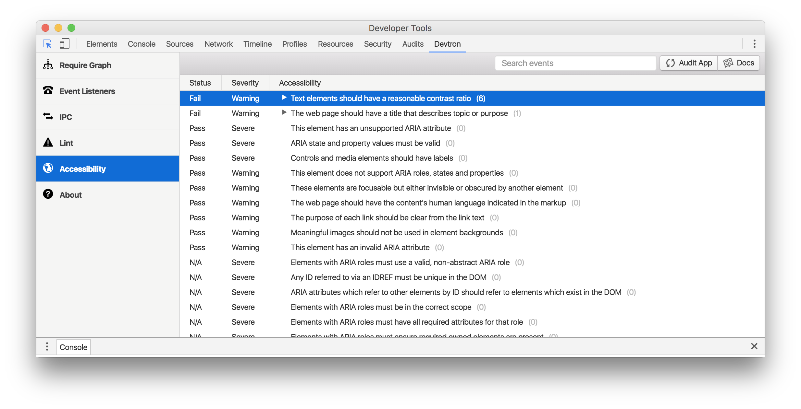

# Guides (引导)

## About Electron (关于Electron)

[Electron](https://electronjs.org/) is an open source library developed by GitHub for building cross-platform desktop applications with HTML, CSS, and JavaScript. Electron accomplishes this by combining [Chromium](https://www.chromium.org/Home) and [Node.js](https://nodejs.org/) into a single runtime and apps can be packaged for Mac, Windows, and Linux.

> Electron是一个开源的库由Github团队开发, 通过HTML,CSS,JavaScript来制作跨平台的桌面应用.Electron通过组合Chromium和Node.js为一个运行环境来让应用可以打包到Mac,Windows和Linux.


Electron began in 2013 as the framework on which [Atom](https://atom.io/), GitHub's hackable text editor, would be built. The two were open sourced in the Spring of 2014.

> Electron开始于2013年, 其作为Atom和Github文本编辑器的框架. 前面提到的的两个软件在2014年开源了出来.


It has since become a popular tool used by open source developers, startups, and established companies. [See who is building on Electron](https://electronjs.org/apps).

> Electron从那以后便成了流行的开发工具被开源开发者, 创业人员以及公司所使用.


Read on to learn more about the contributors and releases of Electron or get started building with Electron in the [Quick Start Guide](https://electronjs.org/docs/tutorial/quick-start).

> 阅读了解更多有关建设者和Electron的资料或者开始通过快速开始引导来制作你的软件.

### Core Team and Contributors (核心团队及建设人员)

Electron is maintained by a team at GitHub as well as a group of [active contributors](https://github.com/electron/electron/graphs/contributors) from the community. Some of the contributors are individuals and some work at larger companies who are developing on Electron. We're happy to add frequent contributors to the project as maintainers. Read more about [contributing to Electron](https://github.com/electron/electron/blob/master/CONTRIBUTING.md).

> Electron 由github团队和来自社区的建设者来维护. 开发Electron的有独立开发者和大型公司的开发者. 我们很高兴有积极的建设者加入到维护中. 阅读更多有关建设Electron的内容.

### Releases(更新发布)

[Electron releases](https://github.com/electron/electron/releases) frequently. We release when there are significant bug fixes, new APIs or are updating versions of Chromium or Node.js.

> Electron更新发布很频繁. 我们会在有重大bug修复和新API或者chromium和node.js更新时进行新版的发布

### Updating Dependencies(更新依赖)

Electron's version of Chromium is usually updated within one or two weeks after a new stable Chromium version is released, depending on the effort involved in the upgrade.

> Electron的版本会在chromium稳定版更新后两到三个星期内更新, 取决于更新的工作量.


When a new version of Node.js is released, Electron usually waits about a month before upgrading in order to bring in a more stable version.

> 当新版Node.js更新后, Electron通常会等一个月在更新, 这是为了保证稳定性


In Electron, Node.js and Chromium share a single V8 instance—usually the version that Chromium is using. Most of the time this *just works* but sometimes it means patching Node.js.

> 在Electron中, Node.js和Chromium共享一个V8实例--通常使用Chromium的V8. 大部分时候这样做都能运行, 但偶尔会需要对Node.js打补丁

### Versioning(版本)

As of version 2.0 Electron [follows `semver`](https://semver.org/). For most applications, and using any recent version of npm, running `$ npm install electron` will do the right thing.

>从2.0版本开始Electron将会遵循semver标准. 对于绝大多数的应用来说, 使用最新的npm来运行`$npm install electron`都能正确工作.


The version update process is detailed explicitly in our [Versioning Doc](https://electronjs.org/docs/tutorial/electron-versioning).

> 版本更新精度被详细列在我们的版本文档中

### LTS(长期支持)

Long term support of older versions of Electron does not currently exist. If your current version of Electron works for you, you can stay on it for as long as you'd like. If you want to make use of new features as they come in you should upgrade to a newer version.

> 目前Electron并不存在长期支持的旧版本. 如果你当前的Electron版本工作正常, 你可以停留在当前版本. 如果你想要使用新的特性, 你需要更新到更新的版本.


A major update came with version `v1.0.0`. If you're not yet using this version, you should [read more about the `v1.0.0` changes](https://electronjs.org/blog/electron-1-0).

> 一个主要的更新来自`v1.0.0`. 如果你目前还没有使用该版本, 你应该阅读更多有关`v1.0.0`的变化

### Core Philosophy(核心哲学)

In order to keep Electron small (file size) and sustainable (the spread of dependencies and APIs) the project limits the scope of the core project.

> 为了保障Electron足够小(文件大小)并且可持续(以防依赖库和API的泛滥) , Electron限制了所使用的核心项目的数量。


For instance, Electron uses Chromium's rendering library rather than all of Chromium. This makes it easier to upgrade Chromium but also means some browser features found in Google Chrome do not exist in Electron.

> 举例来说, Electron使用Chromium的渲染库而不是整个的Chromium.这使得更新Chromium更容易但也意味着一些在Chromium浏览器上的特性不存在于Electron


New features added to Electron should primarily be native APIs. If a feature can be its own Node.js module, it probably should be. See the [Electron tools built by the community](https://electronjs.org/community).

> 新添加到Electron的特性应该主要是本地APIs. 如果一个特性能作为一个Node.js模块存在, 那它就该如此. 查阅由社区开发的Electron 工具.

### History(历史)

Below are milestones in Electron's history.

> 下面是Electron的重要时刻

| **April 2013**  | [Atom Shell is started](https://github.com/electron/electron/commit/6ef8875b1e93787fa9759f602e7880f28e8e6b45) . Atom shell 开始了 |
| --------------- | ------------------------------------------------------------ |
| **May 2014**    | [Atom Shell is open sourced](https://blog.atom.io/2014/05/06/atom-is-now-open-source.html) . Atom shell 开源了 |
| **April 2015**  | [Atom Shell is re-named Electron](https://github.com/electron/electron/pull/1389) . Atom shell 重命名为Electron |
| **May 2016**    | [Electron releases `v1.0.0`](https://electronjs.org/blog/electron-1-0) . Electron 1.0.0 版本发布了 |
| **May 2016**    | [Electron apps compatible with Mac App Store](https://electronjs.org/docs/tutorial/mac-app-store-submission-guide) . <br/>Electron 应用可以发布到 Mac的应用商店了 |
| **August 2016** | [Windows Store support for Electron apps](https://electronjs.org/docs/tutorial/windows-store-guide) .<br/>Windows商店也支持Electron应用了 |

## Accessibility(辅助功能)

### Accessibility(辅助功能)

Making accessible applications is important and we're happy to introduce new functionality to [Devtron](https://electronjs.org/devtron) and [Spectron](https://electronjs.org/spectron) that gives developers the opportunity to make their apps better for everyone.

> 制作具有辅助功能的应用是非常重要的并且我们很高兴引入新的功能给Devtron和Spectron它们能让开发者制作出更好的应用给所有人

------

Accessibility concerns in Electron applications are similar to those of websites because they're both ultimately HTML. With Electron apps, however, you can't use the online resources for accessibility audits because your app doesn't have a URL to point the auditor to.

辅助功能对Electron应用的考虑和网页相似因为他们到底都是HTML. 然而对于Electron应用来说, 你不使用网络资源来辅助审查因为你的应用并没有URL提供给审查者.

These new features bring those auditing tools to your Electron app. You can choose to add audits to your tests with Spectron or use them within DevTools with Devtron. Read on for a summary of the tools.

这些新的特性给你的Electron应用带来这些审查工具. 你可以选择添加审计工具Spectron或者在开发者工具中使用Devtron来进行测试. 下面是这些审查工具的概述.

### Spectron

In the testing framework Spectron, you can now audit each window and `<webview>` tag in your application. For example:

> 在Spectron测试框架中, 你可以审查你应用中的每一个窗口和`<webview>`标签. 例如:

```javascript
app.client.auditAccessibility().then(function (audit) {
  if (audit.failed) {
    console.error(audit.message)
  }
})Copy
```

You can read more about this feature in [Spectron's documentation](https://github.com/electron/spectron#accessibility-testing).

> 你可以查看更多相关内容

### Devtron

In Devtron, there is a new accessibility tab which will allow you to audit a page in your app, sort and filter the results.

> 在Devrton中有新的辅助页可以让你审计你应用中的某个页面, 你可以排序和过滤结果.



Both of these tools are using the [Accessibility Developer Tools](https://github.com/GoogleChrome/accessibility-developer-tools) library built by Google for Chrome. You can learn more about the accessibility audit rules this library uses on that [repository's wiki](https://github.com/GoogleChrome/accessibility-developer-tools/wiki/Audit-Rules).

> 这两个工具都使用由谷歌开发的辅助功能开发工具库. 你可以查看更多有关这个库用于辅助审计规则的内容

If you know of other great accessibility tools for Electron, add them to the accessibility documentation with a pull request.

> 如果你知道其他好的Electron辅助功能工具, 通过请求将他们添加到辅助功能文档中.

### Enabling Accessibility(启用辅助功能)

Electron applications keep accessibility disabled by default for performance reasons but there are multiple ways to enable it.

> Electron应用出于性能考虑默认不起用辅助功能, 但有很多方法可以启动它.

#### Inside Application(在应用中)

By using [`app.setAccessibilitySupportEnabled(enabled)`](https://electronjs.org/docs/api/app#appsetaccessibilitysupportenabledenabled-macos-windows), you can expose accessibility switch to users in the application preferences. User's system assistive utilities have priority over this setting and will override it.

> 通过`app.setAccessibilitySupportEnabled(enabled)`, 你可以在应用设置中设置辅助功能开关. 用户系统的辅助工具优先权高于这个设这.

#### Assistive Technology(辅助技术)

Electron application will enable accessibility automatically when it detects assistive technology (Windows) or VoiceOver (macOS). See Chrome's [accessibility documentation](https://www.chromium.org/developers/design-documents/accessibility#TOC-How-Chrome-detects-the-presence-of-Assistive-Technology) for more details.

> Electron应用会自动启动辅助功能当它侦测到系统启用了辅助功能. 看chrome的辅助功能文档获取更多信息.

On macOS, third-party assistive technology can switch accessibility inside Electron applications by setting the attribute `AXManualAccessibility` programmatically:

> 在macOS上, 第三方的辅助技术可以通过设置`AXManualAccessibility`属性来切换Electron应用中的辅助功能:

```objc
CFStringRef kAXManualAccessibility = CFSTR("AXManualAccessibility");

+ (void)enableAccessibility:(BOOL)enable inElectronApplication:(NSRunningApplication *)app
{
    AXUIElementRef appRef = AXUIElementCreateApplication(app.processIdentifier);
    if (appRef == nil)
        return;

    CFBooleanRef value = enable ? kCFBooleanTrue : kCFBooleanFalse;
    AXUIElementSetAttributeValue(appRef, kAXManualAccessibility, value);
    CFRelease(appRef);
}Copy
```

## Electron App Feedback Program(Electron 应用反馈程序)

Electron is working on building a streamlined release process and having faster releases. To help with that, we have the App Feedback Program for large-scale Electron apps to test our beta releases and report app-specific issues to the Electron team. We use this program to help us prioritize work and get applications upgraded to the next stable release as soon as possible. There are a few requirements we expect from participants, such as attending short, online weekly check-ins. Please visit the [blog post](https://electronjs.org/blog/app-feedback-program) for details and sign-up.

> Electron正在致力于构建流水线发布以得到更快的发布速度. 为了帮助实现这个目标, 我们将应用反馈程序用在在大范围的Electron应用上去测试我们的测试版并反馈给我们的Electron团队.我们使用这个程序来帮助我们设置工作优先级从而快速的升级到下个稳定版. 这里有几个要求希望参与者来实现, 例如参加会议, 每周线上签到. 请访问博客发布页以得到详细内容以及进行登记.

## Electron Application Architecture(Electron应用架构)

Before we can dive into Electron's APIs, we need to discuss the two process types available in Electron. They are fundamentally different and important to understand.

> 在我们深入Electron的应用编程接口之前, 我们需要讨论一下两种不同的Electron进程. 他们十分不同而且很重要.

### Main and Renderer Processes(主进程和渲染进程)

In Electron, the process that runs `package.json`'s `main` script is called **the main process**. The script that runs in the main process can display a GUI by creating web pages. An Electron app always has one main process, but never more.

> 在Electron中, `package.json`中`main`参数指定的脚本被称作主进程. 这个脚本执行在主进程中可以通过创建网页来现实一个图形界面. 一个Electron应用总有一个而且只有一个主进程.

Since Electron uses Chromium for displaying web pages, Chromium's multi-process architecture is also used. Each web page in Electron runs in its own process, which is called **the renderer process**.

> 从Electron使用Chromium来现实网页起, chromium的多进程架构就在使用.在Electron中运行的每一个网页都有自己的进程,这些称为渲染进程.

In normal browsers, web pages usually run in a sandboxed environment and are not allowed access to native resources. Electron users, however, have the power to use Node.js APIs in web pages allowing lower level operating system interactions.

> 在普通浏览器中, 网页通常运行在沙盒环境中并且不被允许访问本地资源. 然而Electron用户有能力通过Node.js的应用编程接口来让网页访问底层操作系统.

### Differences Between Main Process and Renderer Process(主进程和渲染进程的区别)

The main process creates web pages by creating `BrowserWindow` instances. Each`BrowserWindow` instance runs the web page in its own renderer process. When a`BrowserWindow` instance is destroyed, the corresponding renderer process is also terminated.

>主进程通过`BrowserWindow`创建网页实例.每一个`BrowserWindow`实例都将网页运行在自己的进程上.当一个`BrowserWindow`实例销毁后, 相应的渲染进程也被终结.

The main process manages all web pages and their corresponding renderer processes. Each renderer process is isolated and only cares about the web page running in it.

> 主进程管理所有的页面以及相应的渲染进程.每一个渲染进程都是独立的, 并且只关心运行在他们各自上面的网页.

In web pages, calling native GUI related APIs is not allowed because managing native GUI resources in web pages is very dangerous and it is easy to leak resources. If you want to perform GUI operations in a web page, the renderer process of the web page must communicate with the main process to request that the main process perform those operations.

> 在网页中访问本地图形界面有关的应用编程接口是不被允许的因为在网页中管理本地图形界面资源非常危险并且容易造成资源泄漏.如果你想要在网页中执行图形界面操作, 那么渲染进程必须要和主进程进行申请.


> #### [Aside: Communication Between Processes](https://electronjs.org/docs/tutorial/application-architecture#aside-communication-between-processes)
>
> In Electron, we have several ways to communicate between the main process and renderer processes, such as [`ipcRenderer`](https://electronjs.org/docs/api/ipc-renderer) and [`ipcMain`](https://electronjs.org/docs/api/ipc-main) modules for sending messages, and the [remote](https://electronjs.org/docs/api/remote) module for RPC style communication. There is also an FAQ entry on [how to share data between web pages](https://electronjs.org/docs/faq#how-to-share-data-between-web-pages).
>
> 备注: 两种进程之间的通信
>
> 在Electron中, 我们有许多方法让两种进程进行通信, 例如`ipRenderer`和`ipcMain`模块发送信息, 然后远程模块执行远程呼叫程序(Remote produce call).这里也有一个常见问题回答(frequent asked question)在如何共享数据页面的页面中

### Using Electron APIs(使用Electron应用编程接口)

Electron offers a number of APIs that support the development of a desktop application in both the main process and the renderer process. In both processes, you'd access Electron's APIs by requiring its included module:

> Electron提供许多支持主进程和渲染进程开发的应用编程接口.在这两种进程中, 你需要通过加入模块来访问Electron的应用编程接口

```javascript
const electron = require('electron')
```

All Electron APIs are assigned a process type. Many of them can only be used from the main process, some of them only from a renderer process, some from both. The documentation for each individual API will state which process it can be used from.

A window in Electron is for instance created using the `BrowserWindow` class. It is only available in the main process.

>所有的Electron应用编程接口都被指派为一中进程类型. 这其中许多只能用于主进程, 这其中一些只能用于渲染进程, 还有一些都可以用.文档对所有独立的应用编程接口都说明了什么进程可以用它.一个Electron的窗口通过使用`BrowserWindow`类来创建实例. 它只能被主进程调用.

```javascript
// This will work in the main process, but be `undefined` in a
// renderer process:
// 这将在主进程中起效, 但在渲染进程中值为未定义
const { BrowserWindow } = require('electron')

const win = new BrowserWindow()
```

Since communication between the processes is possible, a renderer process can call upon the main process to perform tasks. Electron comes with a module called `remote` that exposes APIs usually only available on the main process. In order to create a `BrowserWindow` from a renderer process, we'd use the remote as a middle-man:

> 从两个进程可以通信以来, 一个渲染进程便可以请求主进程执行任务.Electron对通信封装的模块叫`remote`,它暴露的应用编程接口通常只能主进程使用. 为了从渲染进程中创建一个`BrowserWindow`, 我们使用remote作为中间人.

```javascript
// This will work in a renderer process, but be `undefined` in the
// main process:
// 这将在渲染进程中起效, 但在主进程中会得到未定义的值
const { remote } = require('electron')
const { BrowserWindow } = remote

const win = new BrowserWindow()
```

### Using Node.js APIs(使用Node.js应用编程接口)

Electron exposes full access to Node.js both in the main and the renderer process. This has two important implications:

> Electron 暴露所有调用给Node.js包括主线程和渲染线程.这有两个重要含义

1) All APIs available in Node.js are available in Electron. Calling the following code from an Electron app works:

> 所有应用编程接口在Node.js中可以用的都可以在Electron中使用. 在Electron中调用下面的代码是可行的

```javascript
const fs = require('fs')

const root = fs.readdirSync('/')

// This will print all files at the root-level of the disk,
// either '/' or 'C:\'.
// 这会打印所有根目录下的文件文件
console.log(root)Copy
```

As you might already be able to guess, this has important security implications if you ever attempt to load remote content. You can find more information and guidance on loading remote content in our [security documentation](https://electronjs.org/docs/tutorial/security).

> 正如你已经猜想的那样, 这样做会带来严重的安全隐患如果你曾经尝试加载远程内容的话.你可以在我们的安全文档中找到更多有关加载远程内容的信息和指导.

2) You can use Node.js modules in your application. Pick your favorite npm module. npm offers currently the world's biggest repository of open-source code – the ability to use well-maintained and tested code that used to be reserved for server applications is one of the key features of Electron. 

> 你可以在你的应用中使用Node.js模块.选择你喜欢的npm模块.npm提供当前世界最大的开源代码仓库--这里有维护很好的并且经过测试的代码, 这些代码过去是给受保护的服务器使用的是关键的Electron特性

As an example, to use the official AWS SDK in your application, you'd first install it as a dependency:

> 如下面的例子, 在你的应用中使用AWS官方SDK,你需要先安装它作为依赖. 

```sh
npm install --save aws-sdkCopy
```

Then, in your Electron app, require and use the module as if you were building a Node.js application:

> 然后, 在你的Electron应用中require并且使用这个模块就像你在制作一个Node.js应用

```javascript
// A ready-to-use S3 Client
// 一个准备好的S3客户端
const S3 = require('aws-sdk/clients/s3')Copy
```

There is one important caveat: Native Node.js modules (that is, modules that require compilation of native code before they can be used) will need to be compiled to be used with Electron.

>这里有一个重要的警告: 本地Node.js模块(模块需要在使用前被编辑)需要被编译来让Eletron使用

The vast majority of Node.js modules are *not* native. Only 400 out of the ~650.000 modules are native. However, if you do need native modules, please consult [this guide on how to recompile them for Electron](https://electronjs.org/docs/tutorial/using-native-node-modules).

> 最主要的Node.js模块不是本地的. 只有400到650.000中模块是本地的. 然而, 如果你需要本地模块, 请查询如何将他们重新编译为Electron可用的

## Application Debugging(应用除错)

Whenever your Electron application is not behaving the way you wanted it to, an array of debugging tools might help you find coding errors, performance bottlenecks, or optimization opportunities.

> 无论何时你的Electron应用都不按照你想的工作, 一系列的出错工具或许能帮你找出错误, 性能瓶颈或者优化的机会.

### Renderer Process(渲染进程)

The most comprehensive tool to debug individual renderer processes is the Chromium Developer Toolset. It is available for all renderer processes, including instances of `BrowserWindow`, `BrowserView`, and `WebView`. You can open them programmatically by calling the `openDevTools()` API on the `webContents` of the instance:

>对单个渲染进程来说最综合的除错工具是chromium开发工具. 它可以用于所有的渲染进程, 包括`BrowserWindow`, `BrowserView`, 和 `WebView`. 你可以通过调用`webContents`实例的`openDevTools()`方法来打开

```javascript
const { BrowserWindow } = require('electron')

let win = new BrowserWindow()
win.webContents.openDevTools()Copy
```

Google offers [excellent documentation for their developer tools](https://developer.chrome.com/devtools). We recommend that you make yourself familiar with them - they are usually one of the most powerful utilities in any Electron Developer's tool belt.

> 谷歌对开发者工具提供了很棒的文档. 我们建议你去熟悉他们--他们是最强大的Electron开发工具之一

### Main Process(主进程)

Debugging the main process is a bit trickier, since you cannot open developer tools for them. The Chromium Developer Tools can [be used to debug Electron's main process](https://nodejs.org/en/docs/inspector/) thanks to a closer collaboration between Google / Chrome and Node.js, but you might encounter oddities like `require` not being present in the console.

For more information, see the [Debugging the Main Process documentation](https://electronjs.org/docs/tutorial/debugging-main-process).

> 对主进程除错需要一些技巧, 因为你无法为他们打开开发者工具. chromium的开发者工具可以用来对主进程除错, 感谢chrome和Node.js的合作, 但你或许偶尔会遇到奇怪的事例如`require`在控制台不能执行.
>
> 更多信息请查阅主进程除错文档

## Application Distribution(应用发布)

To distribute your app with Electron, you need to package and rebrand it. The easiest way to do this is to use one of the following third party packaging tools:

> 为了发布你的Electron应用, 你需要打包并更改名字. 最简单的的方法就是用下面的第三方打包工具

- [electron-forge](https://github.com/electron-userland/electron-forge)
- [electron-builder](https://github.com/electron-userland/electron-builder)
- [electron-packager](https://github.com/electron-userland/electron-packager)

These tools will take care of all the steps you need to take to end up with a distributable Electron applications, such as packaging your application, rebranding the executable, setting the right icons and optionally creating installers.

> 这些工具在创建Electron应用的每一步都帮你考虑到了, 例如打包, 更名, 设置图标, 创建安装程序

### Manual distribution(手动发布)

You can also choose to manually get your app ready for distribution. The steps needed to do this are outlined below.

> 你也可以选择手动准备发行你的应用. 这需要做下面的这些步骤.

To distribute your app with Electron, you need to download Electron's [prebuilt binaries](https://github.com/electron/electron/releases). Next, the folder containing your app should be named `app` and placed in Electron's resources directory as shown in the following examples. Note that the location of Electron's prebuilt binaries is indicated with `electron/` in the examples below.

> 发行你的Electron应用, 你需要下载预创建程序. 下一步, 包含你应用的文件夹应该命名为`app`并放在Electron的Resources目录, 像下面的目录结构一样. 注意Electron的预创建程序要放在`electron/`目录下

On macOS:

> 在macOS上

```text
electron/Electron.app/Contents/Resources/app/
├── package.json
├── main.js
└── index.htmlCopy
```

On Windows and Linux:

> 在windows和linux上

```text
electron/resources/app
├── package.json
├── main.js
└── index.htmlCopy
```

Then execute `Electron.app` (or `electron` on Linux, `electron.exe` on Windows), and Electron will start as your app. The `electron` directory will then be your distribution to deliver to final users.

> 然后执行`Electron.app`(或者在linux上执行electron, 在windows上执行electron.exe), 你的Electron应用将会启动起来

### Packaging Your App into a File(将应用打包进一个文件)

Apart from shipping your app by copying all of its source files, you can also package your app into an [asar](https://github.com/electron/asar) archive to avoid exposing your app's source code to users.

> 除了通过复制源文件来转移你的应用, 你也可以将你的应用打包进一个asar文档中, 这样可以避免你的代码暴露给用户.

To use an `asar` archive to replace the `app` folder, you need to rename the archive to `app.asar`, and put it under Electron's resources directory like below, and Electron will then try to read the archive and start from it.

> 为了使用asar文档代替`app`文件夹, 你需要重命名文档为`app.asar`, 然后将它放到Electron的resource目录(就像下面这样), 然后Electron就会尝试读这个文档并启动它.

On macOS:

> 在macOS上

```text
electron/Electron.app/Contents/Resources/
└── app.asarCopy
```

On Windows and Linux:

> 在Windows和Linux上

```text
electron/resources/
└── app.asarCopy
```

More details can be found in [Application packaging](https://electronjs.org/docs/tutorial/application-packaging).

> 更多详细内容查看应用打包页面

### Rebranding with Downloaded Binaries(通过下载的程序重命名)

After bundling your app into Electron, you will want to rebrand Electron before distributing it to users.

> 在将你的应用捆绑到Electron后, 你应该会想在分发给用户之前给Electron重命名

### [Windows](https://electronjs.org/docs/tutorial/application-distribution#windows)

You can rename `electron.exe` to any name you like, and edit its icon and other information with tools like [rcedit](https://github.com/atom/rcedit).

> 你可以通过rcedit重命名electron.exe为你希望的名字, 更换图标等信息

### [macOS](https://electronjs.org/docs/tutorial/application-distribution#macos)

You can rename `Electron.app` to any name you want, and you also have to rename the `CFBundleDisplayName`, `CFBundleIdentifier` and `CFBundleName` fields in the following files:

> 你可以重命名`Electron.app`为你想要的, 你还需要修改下面文件中`CFBundleDisplayName`,`CFBundleIdentifier`和`CFBundleName`的值

- `Electron.app/Contents/Info.plist`
- `Electron.app/Contents/Frameworks/Electron Helper.app/Contents/Info.plist`

You can also rename the helper app to avoid showing `Electron Helper` in the Activity Monitor, but make sure you have renamed the helper app's executable file's name.

The structure of a renamed app would be like:

> 你也可以修改帮助应用来避免其显示在活动管理器中, 但你要确保你已经修改了帮助应用的可执行文件的名字

```text
MyApp.app/Contents
├── Info.plist
├── MacOS/
│   └── MyApp
└── Frameworks/
    └── MyApp Helper.app
        ├── Info.plist
        └── MacOS/
            └── MyApp HelperCopy
```

### [Linux](https://electronjs.org/docs/tutorial/application-distribution#linux)

You can rename the `electron` executable to any name you like.

> 你可以修改electron可执行文件为任意名字

### Rebranding by Rebuilding Electron from Source(通过重新编译Electron来重命名)

It is also possible to rebrand Electron by changing the product name and building it from source. To do this you need to set the build argument corresponding to the product name (`electron_product_name = "YourProductName"`) in the `args.gn` file and rebuild.

> 通过从源代码重新构建electron来重命名是可行的. 为了这么做你需要在`args.gn`中将编译参数设置为成品的名字(`electron_product_name = "YourProductName"`)

### Creating a Custom Electron Fork(创建一个自定义Electron分支)

Creating a custom fork of Electron is almost certainly not something you will need to do in order to build your app, even for "Production Level" applications. Using a tool such as `electron-packager` or `electron-forge` will allow you to "Rebrand" Electron without having to do these steps.

> 创建一个自定义Electron分支对于构建你的应用是几乎没有必要的, 甚至是"产品级"的应用.你可以通过使用`electron-packager`或者`electron-forge`来重新命名而不需要做这些.

You need to fork Electron when you have custom C++ code that you have patched directly into Electron, that either cannot be upstreamed, or has been rejected from the official version. As maintainers of Electron, we very much would like to make your scenario work, so please try as hard as you can to get your changes into the official version of Electron, it will be much much easier on you, and we appreciate your help.

> 如果你有C++代码要直接放进Electron那你则需要自定义一个Electron分支, 这样的自定义行为要么可以被归到主代码, 要么会被拒绝. 作为Electron的维护者, 我们非常欢迎你这么做, 所以请尽可能尝试改变Electron, 我们很感谢你的帮助.

### Creating a Custom Release with surf-build()(创建自定义发行)

1. Install [Surf](https://github.com/surf-build/surf), via npm: `npm install -g surf-build@latest`

   > 通过npm命令`npm install -g surf-build@latest`安装surf, 

2. Create a new S3 bucket and create the following empty directory structure:

   > 创建一个新的S3桶子并创建下面结构的目录

   ```sh
   - electron/
     - symbols/
     - dist/Copy
   ```

3. Set the following Environment Variables:

   > 设置下面的环境变量

- `ELECTRON_GITHUB_TOKEN` - a token that can create releases on GitHub
- `ELECTRON_S3_ACCESS_KEY`, `ELECTRON_S3_BUCKET`, `ELECTRON_S3_SECRET_KEY` - the place where you'll upload Node.js headers as well as symbols
- `ELECTRON_RELEASE` - Set to `true` and the upload part will run, leave unset and `surf-build` will do CI-type checks, appropriate to run for every pull request.
- `CI` - Set to `true` or else it will fail
- `GITHUB_TOKEN` - set it to the same as `ELECTRON_GITHUB_TOKEN`
- `SURF_TEMP` - set to `C:\Temp` on Windows to prevent path too long issues
- `TARGET_ARCH` - set to `ia32` or `x64`

1. In `script/upload.py`, you *must* set `ELECTRON_REPO` to your fork (`MYORG/electron`), especially if you are a contributor to Electron proper.
2. `surf-build -r https://github.com/MYORG/electron -s YOUR_COMMIT -n 'surf-PLATFORM-ARCH'`
3. Wait a very, very long time for the build to complete.

## Application Packaging(应用打包)

To mitigate [issues](https://github.com/joyent/node/issues/6960) around long path names on Windows, slightly speed up `require` and conceal your source code from cursory inspection, you can choose to package your app into an [asar](https://github.com/electron/asar) archive with little changes to your source code.

>为了缓和长路径在windows上引发的问题, 略微提升`require`的速度并隐藏你的代码, 你可以选择打包你的应用到一个asar文档, 只需小小的改变一下你的代码.

Most users will get this feature for free, since it's supported out of the box by [`electron-packager`](https://github.com/electron-userland/electron-packager), [`electron-forge`](https://github.com/electron-userland/electron-forge), and [`electron-builder`](https://github.com/electron-userland/electron-builder). If you are not using any of these tools, read on.

> 绝大多数用户都可以轻松得到这个功能, 因为`electron-packager`,`electron-forge`和`electron-builder`都集成了这个特性. 如果你没有使用这些工具那还请继续看下去.

### Generating `asar` Archives(生成asar文档)

An [asar](https://github.com/electron/asar) archive is a simple tar-like format that concatenates files into a single file. Electron can read arbitrary files from it without unpacking the whole file.

> 一个asar文档就是一个简单的类tar包格式的文档将学多文件归档为一个.Electron不需要解包就可以读取这种文档.

Steps to package your app into an `asar` archive:

> 一步步打包你的应用为asar文档

#### 1. Install the asar Utility(安装asar工具)

```sh
$ npm install -g asarCopy
```

#### 2. Package with `asar pack`(通过命令打包)

```sh
$ asar pack your-app app.asarCopy
```

### Using `asar` Archives(使用asar文档)

In Electron there are two sets of APIs: Node APIs provided by Node.js and Web APIs provided by Chromium. Both APIs support reading files from `asar` archives.

> 在Electron中有两套应用编程接口: Node应用编程接口由Node.js提供, 网页应用编程接口由Chromium提供. 这两个应用编程接口都支持读取asar文档.

#### Node API(Node 应用编程接口)

With special patches in Electron, Node APIs like `fs.readFile` and `require` treat `asar` archives as virtual directories, and the files in it as normal files in the filesystem.

> 通过特定的补丁, Node编程接口的`fs.readFile`和`require`方法面对asar文档就像面对一个虚拟的文件夹, 并且里面的文件就像普通文件一样.

For example, suppose we have an `example.asar` archive under `/path/to`:

> 例如, 假设我们有一个`example.asar`文档在`/path/to`下面:

```sh
$ asar list /path/to/example.asar
/app.js
/file.txt
/dir/module.js
/static/index.html
/static/main.css
/static/jquery.min.js
```

Read a file in the `asar` archive:

> 读取asar文档中的文件

```javascript
const fs = require('fs')
fs.readFileSync('/path/to/example.asar/file.txt')
```

List all files under the root of the archive:

> 列出asar根路径下的文件

```javascript
const fs = require('fs')
fs.readdirSync('/path/to/example.asar')
```

Use a module from the archive:

> 使用文档中的模块

```javascript
require('/path/to/example.asar/dir/module.js')
```

You can also display a web page in an `asar` archive with `BrowserWindow`:

>你也可以通过`BrowserWindow`显示一个asar文档中的页面

```javascript
const { BrowserWindow } = require('electron')
const win = new BrowserWindow()

win.loadURL('file:///path/to/example.asar/static/index.html')
```

#### Web API(页面编程接口)

In a web page, files in an archive can be requested with the `file:` protocol. Like the Node API, `asar` archives are treated as directories.

> 在一个页面中, 文档中的文件可以通过`file:`协议活得. 就像Node应用编程接口那样, asar文档被当作一个文件夹对待

For example, to get a file with `$.get`:

> 例如, 通过`$.get`获取文件

```html
<script>
let $ = require('./jquery.min.js')
$.get('file:///path/to/example.asar/file.txt', (data) => {
  console.log(data)
})
</script>Copy
```

#### Treating an `asar` Archive as a Normal File(将asar文档当作一个普通文件对待)

For some cases like verifying the `asar` archive's checksum, we need to read the content of an `asar` archive as a file. For this purpose you can use the built-in `original-fs` module which provides original `fs` APIs without `asar` support:

>在一些场景, 例如验证asar文档验证和, 我们需要像文件一样读取asar文档.为了达到这个目的, 你可以使用内置的`original-fs`模块, 这个模块可以在没有asar支持下提供原始的`fs`应用编程接口

```javascript
const originalFs = require('original-fs')
originalFs.readFileSync('/path/to/example.asar')
```

You can also set `process.noAsar` to `true` to disable the support for `asar` in the `fs`module:

> 你也可以设置`process.noAsar`对象的值为`true`来关闭`fs`对`asar`的支持

```javascript
const fs = require('fs')
process.noAsar = true
fs.readFileSync('/path/to/example.asar')
```

### Limitations of the Node API(Node 应用编程接口的限制)

Even though we tried hard to make `asar` archives in the Node API work like directories as much as possible, there are still limitations due to the low-level nature of the Node API.

> 即使我们非常努力的尝试让`asar`文档在Node编程接口中像文件夹一样工作, 但这里依旧有一些底层的Node应用编程接口限制.

#### Archives Are Read-only(文档是只读的)

The archives can not be modified so all Node APIs that can modify files will not work with `asar` archives.

> 文档不能被修改, 所以所有可以修改文件的Node编程接口无法操作asar文档

#### Working Directory Can Not Be Set to Directories in Archive(工作目录不可以设置为文档)

Though `asar` archives are treated as directories, there are no actual directories in the filesystem, so you can never set the working directory to directories in `asar` archives. Passing them as the `cwd` option of some APIs will also cause errors.

> 即使asar文档被当作目录对待, 但并没有实际的目录存在于文件系统中, 所以你绝对没有办法将工作目录设置为asar文档. 将他们当作`cwd`选项传给一些编程接口也会导致错误

#### Extra Unpacking on Some APIs(通过特别的编程接口解包)

Most `fs` APIs can read a file or get a file's information from `asar` archives without unpacking, but for some APIs that rely on passing the real file path to underlying system calls, Electron will extract the needed file into a temporary file and pass the path of the temporary file to the APIs to make them work. This adds a little overhead for those APIs.

> 绝大多数的`fs`编程接口可以不用解包读取或者活得文件的信息, 但对一些编程接口来说它们需要将文件传输给底层的系统调用, Electron将会取出需要的文件放到一个临时文件中并传递这个临时文件的路径给这些编程接口以让他们能够工作. 下面列出这些编程接口

APIs that requires extra unpacking are:

> 需要特别解包的编程接口

- `child_process.execFile`
- `child_process.execFileSync`
- `fs.open`
- `fs.openSync`
- `process.dlopen` - Used by `require` on native modules

#### Fake Stat Information of `fs.stat`(虚假统计信息)

The `Stats` object returned by `fs.stat` and its friends on files in `asar` archives is generated by guessing, because those files do not exist on the filesystem. So you should not trust the `Stats` object except for getting file size and checking file type.

> 通过`fs.stat`返回的`Stats`对象以及相关的在asar文档中的文件信息是猜测生成出来的,因为这些文件并不真是存在于文件系统中. 所以你不应该相信`Stats`对象以期得到文件大小和文件类型

#### Executing Binaries Inside `asar` Archive(执行文档中的二进制文件)

There are Node APIs that can execute binaries like `child_process.exec`,`child_process.spawn` and `child_process.execFile`, but only `execFile` is supported to execute binaries inside `asar` archive.

> Node编程接口可以通过这些执行二进制文件,例如`child_process.exec`,`child_process.spawn` 和 `child_process.execFile`, 但只有 `execFile` 支持执行文档中的二进制文件

This is because `exec` and `spawn` accept `command` instead of `file` as input, and `command`s are executed under shell. There is no reliable way to determine whether a command uses a file in asar archive, and even if we do, we can not be sure whether we can replace the path in command without side effects.

> 这是因为`exec`和`spawn`接受`command`代替文件作为输入, 并且`command`是在shell中执行. 没有可靠的方法去侦测是否一个命令使用在文档中的文件, 即使我们可以, 我们也不确定是否我们可以替代命令中的路径而没有边际效应.

### Adding Unpacked Files to `asar` Archives(添加不打包的文件到一个文档中)

As stated above, some Node APIs will unpack the file to the filesystem when called. Apart from the performance issues, various anti-virus scanners might be triggered by this behavior.

> 向上面所陈述的, 一些Node编程接口会解包文件到文件系统中. 且不说会造成性能问题, 各种病毒扫描工具也会被这样的行为触发.

As a workaround, you can leave various files unpacked using the `--unpack` option. In the following example, shared libraries of native Node.js modules will not be packed:

>作为变通方案, 你可通过`--unpack`选项以让一些文件不打包. 在下面的例子中, 共享的本地Node.js模块库将不会被打包

```sh
$ asar pack app app.asar --unpack *.nodeCopy
```

After running the command, you will notice that a folder named `app.asar.unpacked` was created together with the `app.asar` file. It contains the unpacked files and should be shipped together with the `app.asar` archive.

> 在运行这条命令之后, 你将会注意到民为`app.asar.unpacked`文件夹和`app.asar`文件一起被创建除来. 文件夹包含没打包的文件和`app.asar`文档.

## Automated Testing with a Custom Driver(自定义自动检测)

To write automated tests for your Electron app, you will need a way to "drive" your application. [Spectron](https://electronjs.org/spectron) is a commonly-used solution which lets you emulate user actions via [WebDriver](http://webdriver.io/). However, it's also possible to write your own custom driver using node's builtin IPC-over-STDIO. The benefit of a custom driver is that it tends to require less overhead than Spectron, and lets you expose custom methods to your test suite.

> 为了写一个自动测试给你的Electron应用, 你需要一个驱动你应用的方法. Spectron是一个通用的解决办法可以让你通过WebDriver模拟用户行为. 但你也可以写一个自己的驱动, 使用node内建的IPC-over-STDIO. 好处是自定义的驱动所需资源比Spectron少, 并且让你可以公开测试套件自定义方法

To create a custom driver, we'll use nodejs' [child_process](https://nodejs.org/api/child_process.html) API. The test suite will spawn the Electron process, then establish a simple messaging protocol:

> 为了创建自定义驱动, 我们将要使用node.js自进程编程接口. 测试套件会生成Electron进程, 然后建立起一个简单的通信协议

```js
var childProcess = require('child_process')
var electronPath = require('electron')

// spawn the process
var env = { /* ... */ }
var stdio = ['inherit', 'inherit', 'inherit', 'ipc']
var appProcess = childProcess.spawn(electronPath, ['./app'], { stdio, env })

// listen for IPC messages from the app
appProcess.on('message', (msg) => {
  // ...
})

// send an IPC message to the app
appProcess.send({ my: 'message' })Copy
```

From within the Electron app, you can listen for messages and send replies using the nodejs [process](https://nodejs.org/api/process.html) API:

> 通过Electron应用, 你可以通过nodejs的进程编程接口监听信息并发送反馈

```js
// listen for IPC messages from the test suite
process.on('message', (msg) => {
  // ...
})

// send an IPC message to the test suite
process.send({ my: 'message' })
```

We can now communicate from the test suite to the Electron app using the `appProcess`object.

>我们现在可以使用测试套件的`appProcess`对象来和Electron应用通信

For convenience, you may want to wrap `appProcess` in a driver object that provides more high-level functions. Here is an example of how you can do this:

>出于方便, 你或许想要把`appProcess`打包进一个驱动对象, 驱动对象可以提供更高级的方法. 这里是一个示例:

```js
class TestDriver {
  constructor ({ path, args, env }) {
    this.rpcCalls = []

    // start child process
    env.APP_TEST_DRIVER = 1 // let the app know it should listen for messages
    this.process = childProcess.spawn(path, args, { stdio: ['inherit', 'inherit', 'inherit', 'ipc'], env })

    // handle rpc responses
    this.process.on('message', (message) => {
      // pop the handler
      var rpcCall = this.rpcCalls[message.msgId]
      if (!rpcCall) return
      this.rpcCalls[message.msgId] = null
      // reject/resolve
      if (message.reject) rpcCall.reject(message.reject)
      else rpcCall.resolve(message.resolve)
    })

    // wait for ready
    this.isReady = this.rpc('isReady').catch((err) => {
      console.error('Application failed to start', err)
      this.stop()
      process.exit(1)
    })
  }

  // simple RPC call
  // to use: driver.rpc('method', 1, 2, 3).then(...)
  async rpc (cmd, ...args) {
    // send rpc request
    var msgId = this.rpcCalls.length
    this.process.send({ msgId, cmd, args })
    return new Promise((resolve, reject) => this.rpcCalls.push({ resolve, reject }))
  }

  stop () {
    this.process.kill()
  }
}
```

In the app, you'd need to write a simple handler for the RPC calls:

> 在应用中, 你需要为RPC呼叫写一个简单的处理函数

```js
if (process.env.APP_TEST_DRIVER) {
  process.on('message', onMessage)
}

async function onMessage ({ msgId, cmd, args }) {
  var method = METHODS[cmd]
  if (!method) method = () => new Error('Invalid method: ' + cmd)
  try {
    var resolve = await method(...args)
    process.send({ msgId, resolve })
  } catch (err) {
    var reject = {
      message: err.message,
      stack: err.stack,
      name: err.name
    }
    process.send({ msgId, reject })
  }
}

const METHODS = {
  isReady () {
    // do any setup needed
    return true
  }
  // define your RPC-able methods here
}
```

Then, in your test suite, you can use your test-driver as follows:

> 然后在你的测试套件中, 你可以像下面这样使用你的测试套件

```js
var test = require('ava')
var electronPath = require('electron')

var app = new TestDriver({
  path: electronPath,
  args: ['./app'],
  env: {
    NODE_ENV: 'test'
  }
})
test.before(async t => {
  await app.isReady
})
test.after.always('cleanup', async t => {
  await app.stop()
})Copy
```

## Boilerplates and CLIs

Electron development is un-opinionated - there is no "one true way" to develop, build, package, or release an Electron application. Additional features for Electron, both for build- and run-time, can usually be found on [npm](https://www.npmjs.com/search?q=electron) in individual packages, allowing developers to build both the app and build pipeline they need.

> Electron 开发是没有一个确定套路的, 开发, 建设, 打包或者发行Electron应用的方法都不固定. 可以在npm找到独立的包, 让开发者根据需要去建设应用或者管道.

That level of modularity and extendability ensures that all developers working with Electron, both big and small in team-size, are never restricted in what they can or cannot do at any time during their development lifecycle. However, for many developers, one of the community-driven boilerplates or command line tools might make it dramatically easier to compile, package, and release an app.

>这样级别的模块性和扩展性确保了所有Electron开发者, 无论团队大小在开发的时候所能做的事都不会被限制. 然而, 对许多开发者来说一个社区驱动的样板或者命令行工具让编译打包和发行应用都更加容易

### Boilerplate vs CLI(样板对比命令行)

A boilerplate is only a starting point - a canvas, so to speak - from which you build your application. They usually come in the form of a repository you can clone and customize to your heart's content.

> 一个样板只是一个起始点. 他们通常来自一个你可以克隆的仓库, 然后你将其变为心中所想的.

A command line tool on the other hand continues to support you throughout the development and release. They are more helpful and supportive but enforce guidelines on how your code should be structured and built. *Especially for beginners, using a command line tool is likely to be helpful*.

> 一个命令行工具在另一方面继续帮助你经过开发和发行. 他们更有帮助但会强制引导你你的代码该如何被构建以及生成.特别对与新手来说,使用一个命令行工具应该会有所帮助.

### electron-forge

A "complete tool for building modern Electron applications". Electron Forge unifies the existing (and well maintained) build tools for Electron development into a cohesive package so that anyone can jump right in to Electron development.

> 这货是一个完整的工具用于建立现在Electron应用. Electron 熔炉统一了已经存在(以及维护良好)的构建工具, 这个构建工具将Electron开紧密结合到一起, 以至于任何一个人都可以马上开始Electron开发

Forge comes with [ready-to-use templates](https://electronforge.io/templates) for popular frameworks like React, Vue, or Angular. It uses the same core modules used by the greater Electron community (like [`electron-packager`](https://github.com/electron-userland/electron-packager)) –  changes made by Electron maintainers (like Slack) benefit Forge's users, too.

> 熔炉为流行的框架例如React, Vue或者Angular准备好了模板. 熔炉和更大的Electron社区(例如electron-packager)使用同样的核心模块--Electron维护者(例如Slack)所做的改动也对熔炉的用户有好处

You can find more information and documentation on [electronforge.io](https://electronforge.io/).

> 你可以找到更多的信息在electronforge.io

### electron-builder

A "complete solution to package and build a ready-for-distribution Electron app" that focuses on an integrated experience. [`electron-builder`](https://github.com/electron-userland/electron-builder) adds one single dependency focused on simplicity and manages all further requirements internally.

> 一个"完整的打包和建立准备好发行的Electron应用解决方案"该工具聚焦于完整的体验. `electron-builder`添加一个专注于简单和管理进一步内部需求的单一的依赖

`electron-builder` replaces features and modules used by the Electron maintainers (such as the auto-updater) with custom ones. They are generally tighter integrated but will have less in common with popular Electron apps like Atom, Visual Studio Code, or Slack.

> `electron-builder`用自定义的东西替换了被Electron维护者所使用的特性和模块(例如自动更新). 他们通常更紧凑, 但是与Atom, Visual Studio Code或者slack的共同点较少.

You can find more information and documentation in [the repository](https://github.com/electron-userland/electron-builder).

> 你可以在仓库找到更多相关内容

### electron-react-boilerplate

If you don't want any tools but only a solid boilerplate to build from, CT Lin's [`electron-react-boilerplate`](https://github.com/chentsulin/electron-react-boilerplate) might be worth a look. It's quite popular in the community and uses `electron-builder` internally.

> 如果你不想要任何工具仅仅只想要一个固定的模板, CT Lin的`electron-react-boilerplate`或许值得你看一看. 它在社区里十分流行并且内部使用了`electron-builder`

### Other Tools and Boilerplates(其他工具和模板)

The ["Awesome Electron" list](https://github.com/sindresorhus/awesome-electron#boilerplates) contains more tools and boilerplates to choose from. If you find the length of the list intimidating, don't forget that adding tools as you go along is a valid approach, too.

> "厉害了Electron"列表包含更多工具和模板. 如果你发现这个列表恐怖的长度, 不要忘记随着你的开发来添加工具也是一种有效的方法.

## Code Signing(代码注册)

Code signing is a security technology that you use to certify that an app was created by you.

> 代码注册是一种安全技术, 用于证明某个应用是你写的

On macOS the system can detect any change to the app, whether the change is introduced accidentally or by malicious code.

>在macOS系统可以检测应用的任何变化, 无论变化是由意外还是恶意代码造成的

On Windows the system assigns a trust level to your code signing certificate which if you don't have, or if your trust level is low will cause security dialogs to appear when users start using your application. Trust level builds over time so it's better to start code signing as early as possible.

>在Windows中会分配一个信任等级给你的应用, 让你注册你的代码. 如果你的信用等级低,则会在用户使用你的应用时弹出对话框.信用等级建立在时间上, 所以你最好早点注册.

While it is possible to distribute unsigned apps, it is not recommended. For example, here's what macOS users see when attempting to start an unsigned app:

>虽然你可以发行没有注册的程序, 但不建议这么做. 例如下面就是用户尝试打开一个没有注册的应用


> App can't be opened because it is from an unidentified developer
>
> 因为开发者没有注册, 所以应用不能被打开

If you are building an Electron app that you intend to package and distribute, it should be code signed. The Mac and Windows app stores do not allow unsigned apps.

> 如果你想要打包发行一个Electron应用, 代码应该被注册. Mac和Windows的应用商店不允许未注册应用上架

### Signing macOS builds(在macOS上注册)

Before signing macOS builds, you must do the following:

> 在注册之前你要做下面这些事

1. Enroll in the [Apple Developer Program](https://developer.apple.com/programs/) (requires an annual fee)

   >加入苹果开发者项目(需要年费)

2. Download and install Xcode

   > 下载安装Xcode

3. Generate, download, and install signing certificates

   > 生成,下载,安装注册证书

There are a number of tools for signing your packaged app:

> 这里有一些工具用于注册你的应用

- [`electron-osx-sign`](https://github.com/electron-userland/electron-osx-sign) is a standalone tool for signing macOS packages.

  > `electron-osx-sign`是一个独立注册的工具

- [`electron-packager`](https://github.com/electron-userland/electron-packager) bundles `electron-osx-sign`. If you're using `electron-packager`, pass the `--osx-sign=true` flag to sign your build.

  >`electron-packager`捆绑了`electron-osxsign`.如果你使用`electron-packager`, 通过`--osx-sign=true`标志来注册.

  - [`electron-forge`](https://github.com/electron-userland/electron-forge) uses `electron-packager` internally, you can set the `osxSign` option in your forge config.

    > `electron-forge`内部使用`electron-packager`,你可以在配置中设置`osxSign`选项

- [`electron-builder`](https://github.com/electron-userland/electron-builder) has built-in code-signing capabilities. See [electron.build/code-signing](https://www.electron.build/code-signing)

  > `electron-builder`有内建的代码注册能力.

For more info, see the [Mac App Store Submission Guide](https://electronjs.org/docs/tutorial/mac-app-store-submission-guide).

### Signing Windows builds(注册windows程序)

Before signing Windows builds, you must do the following:

> 在注册windows程序之前,你需要做这些

1. Get a Windows Authenticode code signing certificate (requires an annual fee)

   > 获取一个Windows验证码注册许可(需要年费)

2. Install Visual Studio 2015/2017 (to get the signing utility)

   > 安装Visual Stuidio 2015/2017(用于获取注册工具)

You can get a code signing certificate from a lot of resellers. Prices vary, so it may be worth your time to shop around. Popular resellers include:

> 你可以从二道贩子得到一个注册码.价格贵, 所以你该多看看, 最流行的二道贩子

- [digicert](https://www.digicert.com/code-signing/microsoft-authenticode.htm)

- [Comodo](https://www.comodo.com/landing/ssl-certificate/authenticode-signature/)

- [GoDaddy](https://au.godaddy.com/web-security/code-signing-certificate)

- Amongst others, please shop around to find one that suits your needs, Google is your friend :)

  > 包括其他的, 请按需选择, google是你的好朋友.

There are a number of tools for signing your packaged app:

> 这里有许多工具可以注册你的软件

- [`electron-winstaller`](https://github.com/electron/windows-installer) will generate an installer for windows and sign it for you

  > `electron-winstaller`会生成一个window的安装程序并为你注册它

- [`electron-forge`](https://github.com/electron-userland/electron-forge) can sign installers it generates through the Squirrel.Windows or MSI targets.

  > `electron-forge`可以注册他所生成的安装程序.

- [`electron-builder`](https://github.com/electron-userland/electron-builder) can sign some of its windows targets

  > `electron-builder`可以注册他的一些window目标

## Writing Your First Electron App(写你的第一个Electron应用)

Electron enables you to create desktop applications with pure JavaScript by providing a runtime with rich native (operating system) APIs. You could see it as a variant of the Node.js runtime that is focused on desktop applications instead of web servers.

> Electron通过提供丰富本地应用编程接口, 让你可以单纯的使用Javascript来创建桌面应用.你可以将其看作一个Node.js运行环境的变体, 他专注在桌面应用而不是网页服务.

This doesn't mean Electron is a JavaScript binding to graphical user interface (GUI) libraries. Instead, Electron uses web pages as its GUI, so you could also see it as a minimal Chromium browser, controlled by JavaScript.

> 这并不意味着Electron是绑定javascript的图形用户界面库. 相反, Electron使用网页来作为图形用户界面, 所以你也可以将其看作一个由javascript控制的精简的Chromium浏览器.

**Note**: This example is also available as a repository you can [download and run immediately](https://electronjs.org/docs/tutorial/first-app#trying-this-example).

> Note: 你可以在仓库中下载这个例子的代码.

As far as development is concerned, an Electron application is essentially a Node.js application. The starting point is a `package.json` that is identical to that of a Node.js module. A most basic Electron app would have the following folder structure:

>至于开发相关的, 一个Electron应用本质上是一个Nodej.js应用. 开始的点是一个`package.js`文件, 这和Node.js的模块是一样的. 一个最基本的Electron应用应该具有下面的目录结构

```text
your-app/
├── package.json
├── main.js
└── index.htmlCopy
```

Create a new empty folder for your new Electron application. Open up your command line client and run `npm init` from that very folder. 

> 为你的Electron应用创建一个新的空文件夹, 打开命令行并执行`npm init`

```sh
npm initCopy
```

npm will guide you through creating a basic `package.json` file. The script specified by the `main` field is the startup script of your app, which will run the main process. An example of your `package.json` might look like this:

> npm将会指引你创建基本的`package.json`文件. 开始脚本由`main`指定, 他将执行主进程. 下面是一个`package.json`的例子

```json
{
  "name": "your-app",
  "version": "0.1.0",
  "main": "main.js"
}Copy
```

**Note**: If the `main` field is not present in `package.json`, Electron will attempt to load an `index.js` (as Node.js does). If this was actually a simple Node application, you would add a `start` script that instructs `node` to execute the current package:

> Note: 如果`main`不在`package.json`中, Electron将会尝试加载index.js(就像Node.js做的).如果这是一个简单的Node应用, 你应该添加一个`start`脚本, 以此来指示`node`执行当前的包

```json
{
  "name": "your-app",
  "version": "0.1.0",
  "main": "main.js",
  "scripts": {
    "start": "node ."
  }
}
```

Turning this Node application into an Electron application is quite simple - we merely replace the `node` runtime with the `electron` runtime.

> 转换这个Node应用为Electron应用是十分简单的-我们仅仅替换`node`执行环境为`electron`环境

```json
{
  "name": "your-app",
  "version": "0.1.0",
  "main": "main.js",
  "scripts": {
    "start": "electron ."
  }
}
```

### Installing Electron(安装Electron)

At this point, you'll need to install `electron` itself. The recommended way of doing so is to install it as a development dependency in your app, which allows you to work on multiple apps with different Electron versions. To do so, run the following command from your app's directory:

> 在这里, 你将会需要安装`electron`本身. 建议将其当作开发依赖安装到你的应用中, 这将让你可以分别运行多个应用在不同的Electron版本中

```sh
npm install --save-dev electronCopy
```

Other means for installing Electron exist. Please consult the [installation guide](https://electronjs.org/docs/tutorial/installation) to learn about use with proxies, mirrors, and custom caches.

>其他安装Electron的方法请查询安装引导来了解使用代理, 镜像和自定义缓存.

### Electron Development in a Nutshell(在容器中开发Electron)

Electron apps are developed in JavaScript using the same principles and methods found in Node.js development. All APIs and features found in Electron are accessible through the `electron` module, which can be required like any other Node.js module:

> Electron应用使用javascript开发, 和Node.js的开发原则及开发方式相同. Electron所有的应用编程接口和特性都可以通过`electron`模块来访问, 该模块可以像其他Node.js模块那样引入

```javascript
const electron = require('electron')
```

The `electron` module exposes features in namespaces. As examples, the lifecycle of the application is managed through `electron.app`, windows can be created using the `electron.BrowserWindow` class. A simple `main.js` file might wait for the application to be ready and open a window:

> `electron`模块通过命名空间来暴露特性. 例如应用生命周期通过`electron.app`管理, 窗口可以通过`electrno.BrowerWindow`类来创建一个简单的`main.js`文件会等待应用准备好后打开窗口

```javascript
const { app, BrowserWindow } = require('electron')

function createWindow () {
  // Create the browser window.
  let win = new BrowserWindow({ width: 800, height: 600 })

  // and load the index.html of the app.
  win.loadFile('index.html')
}

app.on('ready', createWindow)
```

The `main.js` should create windows and handle all the system events your application might encounter. A more complete version of the above example might open developer tools, handle the window being closed, or re-create windows on macOS if the user clicks on the app's icon in the dock.

> `main.js`应该创建窗口并处理所有你的应用会遇到的的系统事件.下面是较上面例子更完整的版本, 可以打开开发者工具, 处理窗口关闭, 或者在macOS上用户点击dock上的应用图标而重新创建窗口

```javascript
const { app, BrowserWindow } = require('electron')

// Keep a global reference of the window object, if you don't, the window will be closed automatically when the JavaScript object is garbage collected.
let win

function createWindow () {
  // Create the browser window.
  win = new BrowserWindow({ width: 800, height: 600 })

  // and load the index.html of the app.
  win.loadFile('index.html')

  // Open the DevTools.
  win.webContents.openDevTools()

  // Emitted when the window is closed.
  win.on('closed', () => {
    // Dereference the window object, usually you would store windows
    // in an array if your app supports multi windows, this is the time
    // when you should delete the corresponding element.
    win = null
  })
}

// This method will be called when Electron has finished
// initialization and is ready to create browser windows.
// Some APIs can only be used after this event occurs.
app.on('ready', createWindow)

// Quit when all windows are closed.
app.on('window-all-closed', () => {
  // On macOS it is common for applications and their menu bar
  // to stay active until the user quits explicitly with Cmd + Q
  if (process.platform !== 'darwin') {
    app.quit()
  }
})

app.on('activate', () => {
  // On macOS it's common to re-create a window in the app when the
  // dock icon is clicked and there are no other windows open.
  if (win === null) {
    createWindow()
  }
})

// In this file you can include the rest of your app's specific main process
// code. You can also put them in separate files and require them here.
```

Finally the `index.html` is the web page you want to show:

> 最终`index.html`文件就是你想展示的页面

```html
<!DOCTYPE html>
<html>
  <head>
    <meta charset="UTF-8">
    <title>Hello World!</title>
  </head>
  <body>
    <h1>Hello World!</h1>
    We are using node <script>document.write(process.versions.node)</script>,
    Chrome <script>document.write(process.versions.chrome)</script>,
    and Electron <script>document.write(process.versions.electron)</script>.
  </body>
</html>Copy
```

### Running Your App(运行你的应用)

Once you've created your initial `main.js`, `index.html`, and `package.json` files, you can try your app by running `npm start` from your application's directory.

> 一旦你创建了初始化文件包括`main.js`,`index.html`和`package.json`文件, 你可以尝试唉应用文件夹下通过`npm start`来运行你的文件

### Trying this Example(尝试这个例子)

Clone and run the code in this tutorial by using the [`electron/electron-quick-start`](https://github.com/electron/electron-quick-start)repository.

> 使用上面的软件仓库运行本指引

**Note**: Running this requires [Git](https://git-scm.com/) and [npm](https://www.npmjs.com/).

> 注意: 运行这个例子需要Git和npm

```sh
# Clone the repository
$ git clone https://github.com/electron/electron-quick-start
# Go into the repository
$ cd electron-quick-start
# Install dependencies
$ npm install
# Run the app
$ npm startCopy
```

For a list of boilerplates and tools to kick-start your development process, see the [Boilerplates and CLIs documentation](https://electronjs.org/docs/tutorial/boilerplates-and-clis).

> 这里有个模板列表和工具可以促进你的开发进程, 查看模板和命令行文档

## [Installation](https://electronjs.org/docs/tutorial/installation#installation)(安装)

To install prebuilt Electron binaries, use [`npm`](https://docs.npmjs.com/). The preferred method is to install Electron as a development dependency in your app:

> 使用`npm`安装预编译的Electron程序.推荐使用开发依赖的方式安装Electron.

```sh
npm install electron --save-dev
```

See the [Electron versioning doc](https://electronjs.org/docs/tutorial/electron-versioning) for info on how to manage Electron versions in your apps.

> 查看Electron版本额外文档来管理你应用的Electron版本.

### [Global Installation](https://electronjs.org/docs/tutorial/installation#global-installation)(全局安装)

You can also install the `electron` command globally in your `$PATH`:

> 你也可以全局安装`electron`

```sh
npm install electron -g
```

### [Customization](https://electronjs.org/docs/tutorial/installation#customization)(自定义)

If you want to change the architecture that is downloaded (e.g., `ia32` on an `x64`machine), you can use the `--arch` flag with npm install or set the `npm_config_arch`environment variable:

> 如果你想要更改下载的文档(例如在64位电脑上下载32位版本), 你可以使用`--arch`标志在npm中或者修改环境变量`npm_config_arch`

```shell
npm install --arch=ia32 electron
```

In addition to changing the architecture, you can also specify the platform (e.g., `win32`, `linux`, etc.) using the `--platform` flag:

> 你可以使用`--platform`标志指定平台来进一步更改(例如window平台, linux平台等)

```shell
npm install --platform=win32 electron
```

### [Proxies](https://electronjs.org/docs/tutorial/installation#proxies)(代理)

If you need to use an HTTP proxy you can [set these environment variables](https://github.com/request/request/tree/f0c4ec061141051988d1216c24936ad2e7d5c45d#controlling-proxy-behaviour-using-environment-variables).

> 如果你需要使用HTTP代理, 你可以设置环境变量

### [Custom Mirrors and Caches](https://electronjs.org/docs/tutorial/installation#custom-mirrors-and-caches)(自定义镜像和缓存)

During installation, the `electron` module will call out to [`electron-download`](https://github.com/electron-userland/electron-download) to download prebuilt binaries of Electron for your platform. It will do so by contacting GitHub's release download page (`https://github.com/electron/electron/releases/tag/v$VERSION`, where `$VERSION`is the exact version of Electron).

> 在安装过程中, `electron`模块将会呼叫`electron-download`去下载对应你平台的预编译Electron程序. 它会连接Github的发行页(`https://github.com/electron/electron/releases/tag/v$VERSION`, 这里的 `$VERSION`就是准确的版本).

If you are unable to access GitHub or you need to provide a custom build, you can do so by either providing a mirror or an existing cache directory.

> 如果你不能访问Github或者你需要提供一个自定义的编译, 你可以提供一个镜像或者一个已经存在的缓存

[Mirror](https://electronjs.org/docs/tutorial/installation#mirror)(镜像)

You can use environment variables to override the base URL, the path at which to look for Electron binaries, and the binary filename. The url used by `electron-download` is composed as follows:

> 你可以使用环境变量来覆盖基础的URL, 这个路径指向Electron的二进制文件. 这个URL的组成像下面这样

```txt
url = ELECTRON_MIRROR + ELECTRON_CUSTOM_DIR + '/' + ELECTRON_CUSTOM_FILENAME
```

For instance, to use the China mirror:

> 例如下面是指向中国的镜像

```txt
ELECTRON_MIRROR="https://npm.taobao.org/mirrors/electron/"
```

[Cache](https://electronjs.org/docs/tutorial/installation#cache)(缓存)

Alternatively, you can override the local cache. `electron-download` will cache downloaded binaries in a local directory to not stress your network. You can use that cache folder to provide custom builds of Electron or to avoid making contact with the network at all.

> 你也可以覆盖本地缓存. `electron-download`会将下载到的二进制文件缓存到本地的目录中来减轻你的网络负担. 你可以使用这个缓存文件夹来提供自定义的Electron或者可以用来避免产生网络连接

- Linux: `$XDG_CACHE_HOME` or `~/.cache/electron/`
- MacOS: `~/Library/Caches/electron/`
- Windows: `$LOCALAPPDATA/electron/Cache` or `~/AppData/Local/electron/Cache/`

On environments that have been using older versions of Electron, you might find the cache also in `~/.electron`.

> 在使用旧版本Electron的环境中, 你或许可以在`~/.electron`找到缓存

You can also override the local cache location by providing a `ELECTRON_CACHE` environment variable.

> 你也可以通过提供`ELECTRON_CACHE`环境变量来覆盖本地缓存

The cache contains the version's official zip file as well as a checksum, stored as a text file. A typical cache might look like this:

> 缓存包括某个版本的zip文件和检验和文件. 一个典型的缓存可能像下面这样

```sh
├── electron-v1.7.9-darwin-x64.zip
├── electron-v1.8.1-darwin-x64.zip
├── electron-v1.8.2-beta.1-darwin-x64.zip
├── electron-v1.8.2-beta.2-darwin-x64.zip
├── electron-v1.8.2-beta.3-darwin-x64.zip
├── SHASUMS256.txt-1.7.9
├── SHASUMS256.txt-1.8.1
├── SHASUMS256.txt-1.8.2-beta.1
├── SHASUMS256.txt-1.8.2-beta.2
├── SHASUMS256.txt-1.8.2-beta.3Copy
```

### [Troubleshooting](https://electronjs.org/docs/tutorial/installation#troubleshooting)(排错)

When running `npm install electron`, some users occasionally encounter installation errors.

> 当运行`npm install electron`的时候, 有些用户偶尔会遇到安装错误

In almost all cases, these errors are the result of network problems and not actual issues with the `electron` npm package. Errors like `ELIFECYCLE`, `EAI_AGAIN`, `ECONNRESET`, and `ETIMEDOUT` are all indications of such network problems. The best resolution is to try switching networks, or wait a bit and try installing again.

> 绝大部分情况都是网络问题并非确实是`Electron`npm包的问题. 类似`ELIFECYCLE`,`EAI_AGAIN`,`ECONNRESET`和`ETIMEDOUT`都是网络问题的标志.最好的解决办法就是尝试切换网络或者等一下再试试

You can also attempt to download Electron directly from [electron/electron/releases](https://github.com/electron/electron/releases) if installing via `npm` is failing.

> 如果通过`npm`下载失败你也可以尝试直接从electron/electron/releases下载

If installation fails with an `EACCESS` error you may need to [fix your npm permissions](https://docs.npmjs.com/getting-started/fixing-npm-permissions).

If the above error persists, the [unsafe-perm](https://docs.npmjs.com/misc/config#unsafe-perm) flag may need to be set to true:

> 如果安装失败, 标识有`EACCESS`错误, 你或许需要修复你的npm权限.如果上述错误还存在, 你需要修改unfase-perm标志为true

```sh
sudo npm install electron --unsafe-perm=true
```

On slower networks, it may be advisable to use the `--verbose` flag in order to show download progress:

> 如果网速慢, 可以使用`--verbose`标志显示下载进程

```sh
npm install --verbose electronCopy
```

If you need to force a re-download of the asset and the SHASUM file set the`force_no_cache` environment variable to `true`.

> 如果你需要强制重新下载你需要设置环境变量`force_no_cache`为`true`

