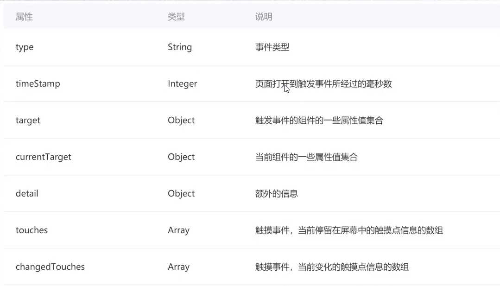

# 事件

## 事件绑定

app.xml

```html
<view bind:tap="">count: {{num}}</view>
```

app.js

```js
Page({
    data: {
        num: 0;
    },
    Counter(){
        this.data.num++;
        // wx小程序不同于vue, data中属性的改变并不会被同步到页面上, 需要手动设置
        this.setData({
            num: this.data.num;
        })
    }
})
```

### bind和catch

事件先捕获后冒泡

wxml

```html
<!--通过capture前缀指定捕获阶段-->
<view capture-bind:tap="handleCaptureTap"></view>
<!--不加前缀则是冒泡阶段-->
<view bind:tap="handleCaptureTap"></view>

<!--catch可以阻止事件进一步传递-->
<view capture-catch:tap="handleCaptureTap"></view>
<view catch:tap="handleCaptureTap"></view>
```

小程序把很多开发需求放到配置文件中

| 常见事件    | 说明           |
| ----------- | -------------- |
| tap         | 点击事件       |
| touchstart  | 手指触摸开始   |
| touchmove   | 手指触摸后移动 |
| touchend    | 结束触摸       |
| touchcancel | 手指触摸被打断 |
| longpress   | 长按超过350ms  |



## 事件传递参数

wxml

```html
<button bind:tap="handleTap" data-name="xiaobai" data-age="10">button</button>
```

js

```js
handleTap(event){
    let dataset = event.target.dataset;
	console.log(dataset.name, dataset.age);
}
// 这里就会打印xiaobai和10
```

## event对象

| 属性           | 类型    | 说明                             |
| -------------- | ------- | -------------------------------- |
| type           | string  | 事件类型                         |
| timeStamp      | Integer | 页面打开到触发事件的毫秒数       |
| target         | Object  | 触发事件的组件的一些属性         |
| currentTarget  | Object  | 当前组件的一些属性值集合         |
| detail         | Object  | 额外的信息                       |
| touches        | Array   | 当前有几个手指, 以及触摸点的信息 |
| changedTouches | Array   | 触摸事件中当前变化的触摸点信息组 |


