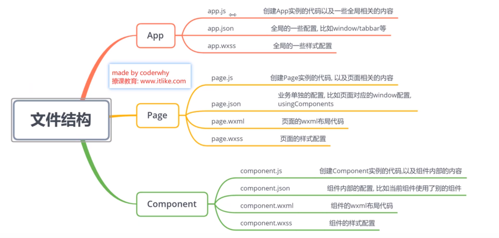
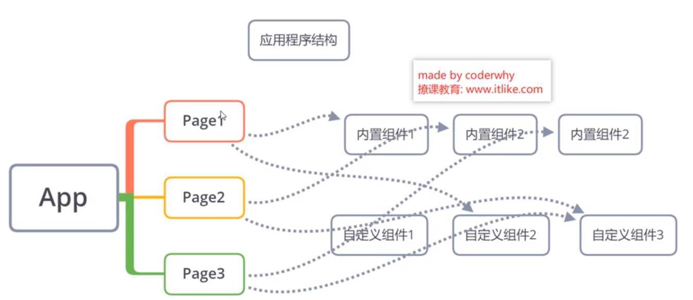
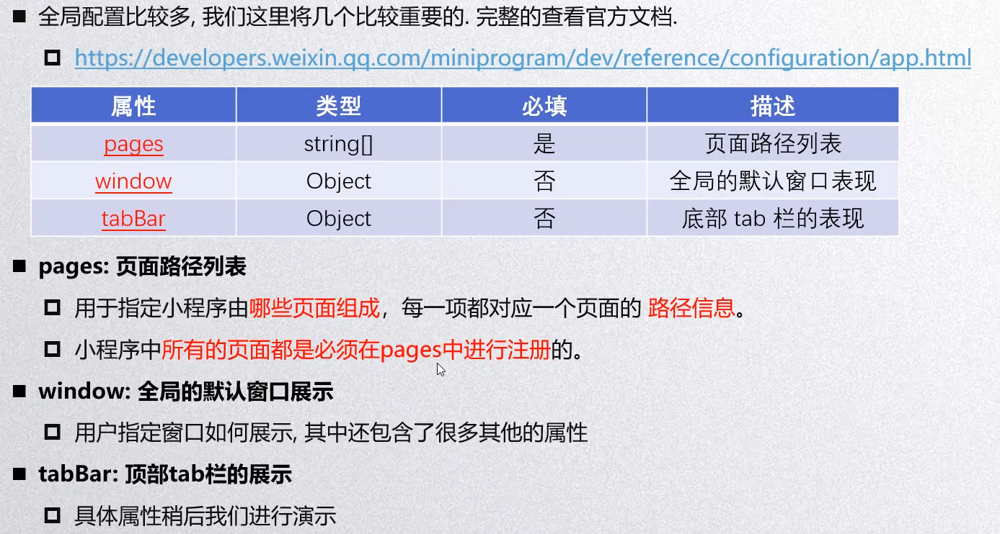
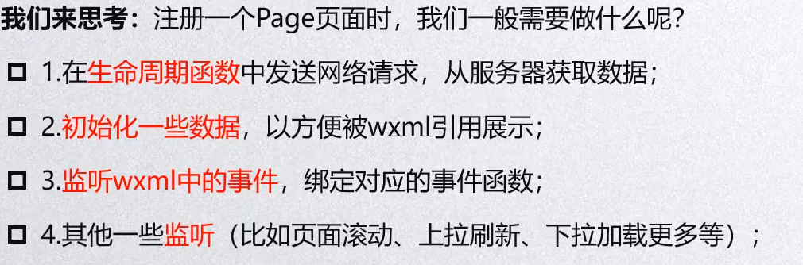
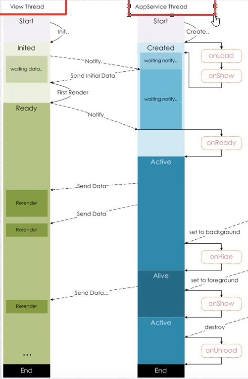
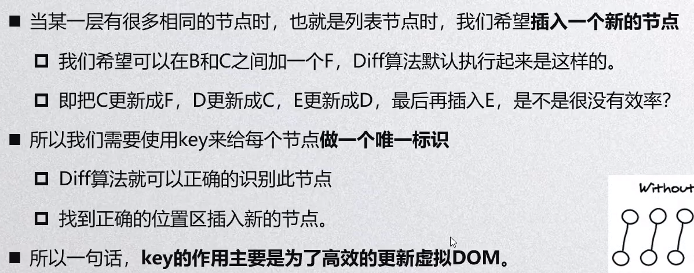
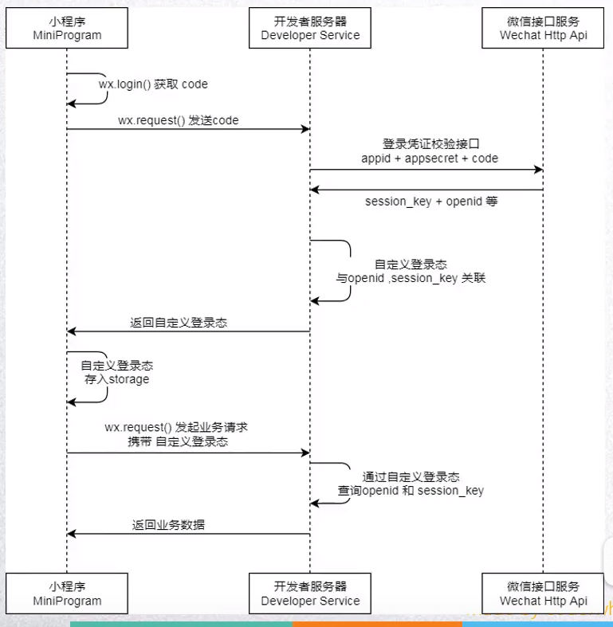

mpvue(mini program vue)



### 绑定数据

app.wxml

```html
<view>hello {{name}}</view>
```

app.js

```js
Page({
	data: {
        name: "ruinb0w"
    }
})
```

## 页面json

| 属性   | 类型   | 必填 | 描述             |
| ------ | ------ | ---- | ---------------- |
| pages  | string | 是   | 页面路径列表     |
| window | Object | 否   | 全局默认窗口表现 |
| tabBar | Object | 否   | 底部tab栏        |




`getApp()`







箭头函数和function的区别

## 内置组件

### text组件

属性

`selectable` 文字是否可选, 默认false

`space` 显示连续空格

* `ensp` 英文空格
* `emsp` 中文空格
* `nbsp` 根据字体大小设置空格

`decode` 是否解码, 默认false

### button组件

属性

`size` 按钮的大小

`type` 按钮的样式

`plain` 是否镂空

`disabled` 是否禁用

`loading` 是否带有loading图标

`form-type` 用于触发form组件的sumbit/reset

`open-type` 微信开放能力

* `getUserInfo` 获取用户信息
* `getPhoneNumber` 获取手机号
* `share` 触发用户转发
* `contact` 打开客服会话

`hover-class` 指定按下去的样式

### view组件

通常用作容器, 可类比于div

属性

`hover-view` 指定手指点下的类

`hover-stay-time` 手指松开多久后恢复

`hover-start-time` 手指按下多久后开始

### image组件

image默认有自己的大小

小程序的根目录就是小程序的小程序目录

属性

`lazy-load`  懒加载

`show-menu-by-longpress` 长按对图片进行各种操作(例如保存,识别小程序码)

`mode` 图片模式(缩放, 裁剪等):widthFix

`bindload` 图片加载完成事件

### input组件

属性

`value` input中的默认值

`type` 指定输入的类型

* `text` 文本(默认)
* `number` 数字
* `idcard` 身份证键盘
* `digit` 带小数点的数字键盘

`password` 密码(隐藏输入)

`placeholder=站位文字`

`confirm-type` 

事件

`bindInput`

`bindFocus`

`bindBlur`

### scroll-view

滚动

需要对容器设置nowrap, 需要对内容设置inline-block

属性

`scroll-x` 水平滚动

事件

`bindscroll` 处理函数的event参数可以获取数据

### navigator

```html
<navigator url="">跳转</navigator>
```

属性

open-type=redirect|switchTab|reLaunch|navigateBack

delta=返回层级

**跳转数据传递**

wxml

```html
<navigator url="/hello/world?name='xiaobai'&age=18"></navigator>
```

js

```js
Page({
    onLoad: function(options){
        console.log(options);
        // 可以通过options获取传递的数据
    }
})
```

## wxss

rpx(responsive pixel)

样式导入`@import '路径';`

不可以使用id,属性,标签选择器

## wx指令

### for

基本使用

wxml

```html
<!--遍历students数组-->
<view wx:for="{{students}}">{{index}} {{item.name}}</view>
<!--按照指定次数循环-->
<view wx:for="{{9}}">{{index}} {{item}}</view>
<!--遍历字符串-->
<view wx:for="helloWorld">{{index}} {{item}}</view>
<!--item,index别名-->
<view wx:for="{{students}}" 
      wx:for-index="i" 
      wx:for-item="thing">{{i}} {{thing}}</view>
```

js

```js
Page({
	data: {
        students: [
        {id: 1, name: "xiaobai"},
        {id: 2, name: "xiaohong"}
        ]
    }
})
```



通过使用wx:

### if-else

通过if-else语句实现内容的条件显示

hidden 是隐藏, if-else直接不会渲染

wx:if

wx:elif

wx:else

## wxml

### block标签

说明:

1. 包裹一组组件, 性能比用view包裹强

2. block标签并不会被渲染

wxml

```html
<block wx:if="{{true}}">
    <text>hello world</text>
    <image src="hello.png"/>
    <button>click me</button>
</block>
```

### template模板

直接在页面内定义

```html
<!--定义模板-->
<template name="testTemplate">
    <button>{{button}}</button>
    <view>{{content}}</view>
</template>

<!--调用模板-->
<template is="testTemplate" 
          data="{{button: '按钮', content: '内容'}}"></template>
```

### import

import不可以递归导入

也可以导入另一个文件中的模板

```html
<import src="./template.wxml"/>
```

### include

嵌入除template以外的内容

include可以递归导入

## wxs

由于不可以直接在wxml中使用`Page()`中的属性和方法, 所以需要使用wxs

直接使用wxs

```html
<wxs module="test">
    var name="xiaobai";
    var age=10;
    var sum=function(n1, n2){
    	return n1+n2;
    }
    module.exports= {
    	name=name;
    	age=age;
    	sum=sum;
    }
</wxs>

<view>{{test.name}}</view>
<view>{{test.age}}</view>
<view>{{test.sum(10,20)}}</view>
```

 使用wxs文件

```js
var name="xiaobai";
var age=10;
var sum=function(n1, n2){
	return n1+n2;
}
module.exports= {
	name:name;
	age:age;
	sum:sum;
}
```

```html
<wxs src="./test.wxs" module="test"/>

<view>{{test.name}}</view>
<view>{{test.age}}</view>
<view>{{test.sum(10,20)}}</view>
```


## 文件结构

### app.js

### page.js

### component.js

```js
Component({
    // 定义组件配置选项
    // 1.multipleSlot: true|false(默认) 设置多插槽
    // 2.styleIsolation: isoloate|设置样式隔离方式
	options: {},
    // 让组件使用者可以向组件传递数据
    properties: {},
    // 定义内部数据
    data: {},
    // 定义组件内部函数
    methods: {},
    // 外界给组件传入样式
    externalClasses: [],
    // 监听属性改变(包括properties,data)
    observers:{
        argument: function(newValue){}
    },
    
    // ----- 组件生命周期 -----
    // 监听组件本身生命周期
    lifeTimes: {
        createad(){},
        attached(){},
        ready(){},
        moved(){},
        detached(){}
    },
    // 监听页面生命周期
    pageLifeTimes: {
    	show(){},
        hide(){}
	}
})
```

## 分享

```html
<button open-type="share">分享</button>
```

## 登录



获取组件到顶部的距离

```js
wx.createSelectorQuery().select("#tab-control").boundingClientRect(rect=>{
    console.log(rect)
}).exect()
```

