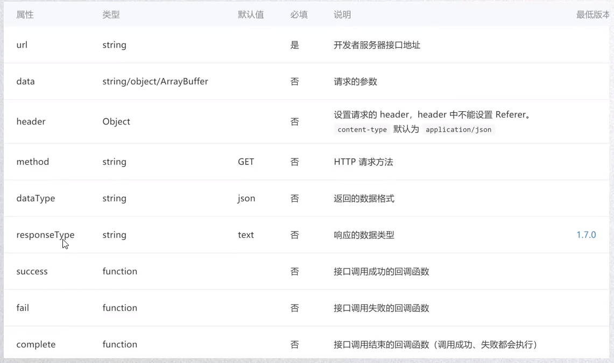

# 系统API

## 网络请求

在使用网络请求前, 需要在小程序控制台中添加要访问的域名

`wx.request()`

示例

```js
wx.request({
    url:"",
    success: function(res){}
})
```



封装请求

## toast

### Toast

```js
wx.showToast({
    title: "显示的文字",
    duration: 显示毫秒数,
    icon: 'loading'
})
```

### Modal

```js

```

### Loading

```js
wx.showLoading({
    title: "显示的内容"
    mask: true|false
})

wx.hideLoading()
```

## 获取用户信息

### wx.getUserInfo

### 通过事件处理函数的属性获取

wxml

```html
<button open-type="getUserInfo" 
        bindGetUserInfo="handleGetUserInfo">
    获取用户信息
</button>
```

js

```js
App({
    handleGetUserInfo: function(event){
        console.log(event);
    }
})
```

获取App()产生的对象

### 选择图片 wx.chooseImage

