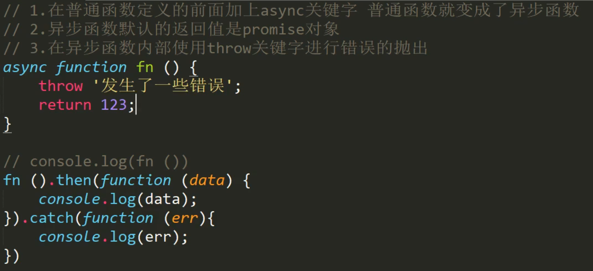
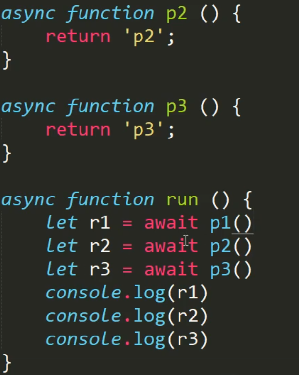

# 变量声明

<center>var let const 对比</center>
| 声明方式 | 修改值                                                       | 重复定义 | 作用域     |
| -------- | ------------------------------------------------------------ | -------- | ---------- |
| var      | 可以                                                         | 可以     | 函数作用域 |
| let      | 可以                                                         | 不可以   | 块级作用域 |
| const    | 不可以(如果是对象,则仅仅是不能修改指向的对象, 依旧可以修改对象的属性) | 可以     | 块级作用域 |

# 导入导出

## 导出

export default 默认成员

export 特定成员

## 导入

### 导入默认成员

```js
import 变量名 from 文件
```

> 只有默认成员可以随意指定变量名

### 导入特定成员

```js
// 使用成员名
import {特定成员} from 文件
// 自定义成员名
import {特定成员 as 自定义变量名} from 文件
```

> 特定成员需要根据暴露出的成员来指定名字

### import 文件

```js
// 对于非js文件, 直接使用
import 文件路径
```

# Promise

# 解构赋值

### 一般的解构赋值

```js
var [x, y, z] = ['hello', 'JavaScript', 'ES6'];
//这里分别给x,y,z进行赋值
```

### 对象的解构赋值

```js
var person = {
    name: '小明',
    age: 20,
    gender: 'male',
    passport: 'G-12345678',
    school: 'No.4 middle school'
};
var {name, age, passport} = person;
//这里会根据变量名和person的属性名进行复制
var {name, single=true} = person;
//解构赋值还可以使用默认值, 如果person没有single属性,则single变量会被赋值为true.
var {hostname:domain, pathname:path} = location;
//这里会获取location.hostname赋值给变量domain, pathname也同理.
```

# 字符串

### 多行字符串

的表示方法，用反引号 *`* ... *`* 表示

```js
`这是一个
多行
字符串`;
```

### 模板字符串

避免多个`+`连接字符串

```js
var name = '小明';
var age = 20;
var message = `你好, ${name}, 你今年${age}岁了!`;
console.log(message);
// 你好, 小明, 你今年20岁了!
```

> 恰巧和shell表示变量的值一样

# 类

```js
class Person {
  // static 表示静态属性, 即可以通过类名直接访问. 
  static info ="have name age etc."
}
```

## 异步函数

### async



### await

await只能出现在异步函数中

await使用在异步函数之前, 在异步代码没有返回结果前不会执行下一条代码

可以直接获取异步代码的返回值



