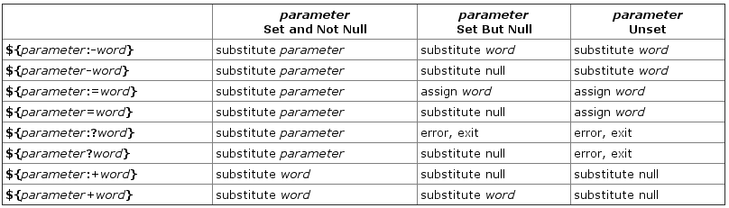

# shell

## 登录

登录shell是登录主机后创建的那个shell, 但登录图形化环境(比如GNOME、 KDE等)后所创建的终端会话并不是登录shell。使用GNOME或KDE这类显示管理器登录后并不会读取.profile或.bash_profile(绝大部分情况下不会),而使用ssh登录远程系统时则会读取.profile。

# 特殊符号

### 通配符

`*` 匹配任意内容

`?` 匹配任意一个字符

`[]` 匹配括号内任意一个字符

`[^]` 和`[]` 相反

### 命令符

`!$` 代表上一条命令的最后一个参数

`!!` 代表上一条命令

`!字符串` 字符串表示上一次执行命令的首字符串

### 参数符

`$@` 表示所有参数

`$#` 

### 命令执行顺序

`command1 || command2` 逻辑或, command1执行失败才会执行command2

`command1 && command2` 逻辑与, command1执行成功才会执行command2

`command1 ; command2` 没逻辑

> `command1 && command2 || command3` == `(command1 && command2) || command3`

### 执行命令并替换

执行command并将原句替换为命令的输出

\`command\` 执行命令并返回结果

`$(command)`  执行命令并返回结果

### 单双引号

`'sentence'` sentence是不会被解析的, 直接视为字符串

`"sentence"` sentence是可以被解析的

# 变量

## 变量基本操作

1.无需申明, 直接使用

2.给变量赋值: `变量名=值`

3.获取变量的值 `$变量名` 

### readonly

说明: 将变量设为只读

语法: `readonly 变量名`

### read

说明: 接受用户输入

语法: `read [option] variable`

* `-n 字符长度 变量` 根据字符长度来确认输入, 而不是回车
* `-d 结束字符 变量` 根据结束字符来确认输入, 而不是回车
* `-s 变量` 无回显的方式
* `-t 秒 变量` 设置输入超时

> 在zsh中交互的语法与bash不同, 推荐不要使用了, 直接用`echo`打印好了

```sh
# zsh
read chosen\?"install it? [Y/n]"
# bash
read -p "install it? [Y\n]" chosen
```


### unset

说明: 删除变量

语法: `unset 变量名`

## 环境变量

父进程的环境变量可以被子进程继承, 但在子进程中修改继承到的环境变量不会影响父进程

### env

说明: 查看当前shell的环境变量

> 通过 `cat /proc/进程ID/environ` 可以获取某个进程的环境变量

### export

说明: 将变量导出为环境变量

### 常用环境变量

PATH: 该变量保存可执行文件路径, 在该路径下的文件可以直接执行

IFS: 该变量保存了默认分隔符(空格回车制表符等)

# 函数

## 参数

shell函数不能使用型参, 只能使用下面的方式来调用参数

* `$0` 表示脚本文件路径
* `$[1-9]` 第1-9个参数
* `$*` 将所有参数合并为一个字符串, 用`$IFS`作为分隔符, 然后打印出来
* `$@` 打印出所有参数, 每个参数都是一个字符串
* `$#` 参数个数

> shell脚本也能接收参数, 使用方式同函数. 函数中的参数和脚本中的参数是独立的, 即脚本环境中的参数不会进入到函数中


可以通过`shift`命令来将参数左移一位

```bash
function printArgs(){
  while [[ $count > 0 ]] ; do
 	 echo -n $1
 	 shift
 	 count=$((count-1))
	done
}
printArgs hello world this is a test
# hello world this is a test
```

## 提升作用域

函数同变量一样, 可以通过export来将其提升, 致使subshell可以访问它

# 数组

## 普通数组

### 申明&赋值

```sh
# 方式一
array_var=(test1 test2 test3)

# 方式二
array_var[0]="test1"
array_var[1]="test2"
array_var[2]="test3"
```

### 取值

```sh
# 根据索引取值
${array_var[索引]}

# 取得所有值
${array_var[*]}

# 取得数组长度
${#array_var[*]}
```

## 关联数组

### 申明

```sh
# 申明一个变量为关联数组
declare -A ass_array

# 赋值方式1
ass_array=([index1]=val1 [index2]=val2)

# 赋值方式二
ass_array[index1]=val1
ass_array[index2]=val2
```

# 表达式

## ${变量名}

`${变量名}` 这样可以避免变量名和其他字符混在一起, 例如 `echo ${var}iable`

`${#变量}` 获取字符长度, 例如 `echo ${#var}`

`${变量:-扩展表达式}` 变量存在则得到变量值, 变量不存在则得到扩展表达式的值

`${变量:+扩展表达式}` 变量不存在得到空, 变量存在则得到扩展表达式的值



# 计算

> 除bc外均可使用 `变量+=1` 或 `变量++` 等简写形式的语法

## 命令

### let/exper

说明: 仅可以用于计算整数

语法: `let 变量=表达式`

### bc

说明: 可以进行复杂计算(包括浮点计算), 但需要通过管道传递表达式

语法: `echo 表达式 | bc`

* 设定小数精度: `echo "scale=小数位数;表达式" | bc`
* 进制转换: 
  * `echo "obase=输出进制; 值" | bc`
  * `echo "obase=输出进制; ibase=输入进制; 值 | bc"` 

> 十进制转换为其他无需指定i(nput)base

* 幂和开平方
  * `echo "sqrt(值)" | bc`
  * `echo "底数^指数" | bc`

## 符号表达式

### $[]

语法: `$[变量名+1]` 或 `$[$变量名+1]`

### $(())

语法: `$((变量名+1))`

# 终端操作

### stty

-- change and print terminal line settings

`stty -echo` 阻止回显

`stty echo` 开启回显

### tput

`tput sc` 记录光标位置

`tput rc` 移动光标到记录位置

`tput ed` 清除从光标到行尾内容

# shell进程

`()`操作符, 可以让命令在子shell执行

`source`命令和`.`可以让脚本在当前shell进程中执行

`$()`和`反引号`可以让命令先执行, 然后用输出将其替换

示例

```bash
rm $(ls *trash)
#或
rm `ls *trash`
```

> 需要注意的是上面的方式会损失\n, 如果要保留\n需要加上双引号, 例如 rm "$(ls *trash)"