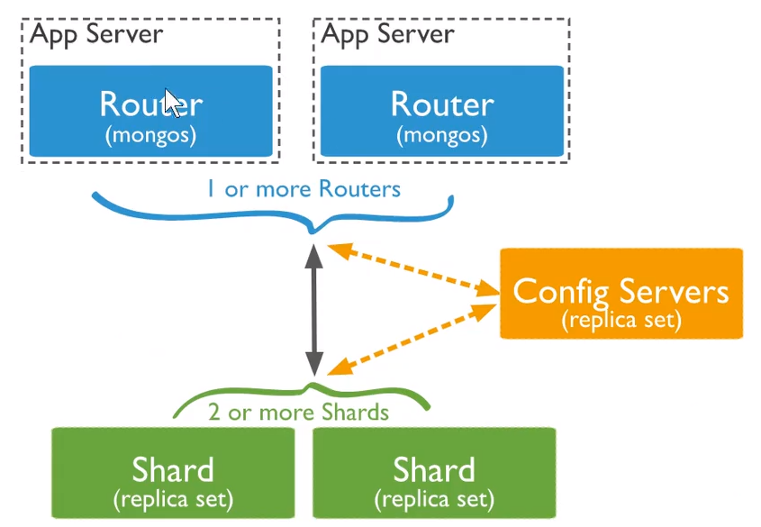

## 概念


## 安装

[在centos7下安装mongodb](https://docs.mongodb.com/manual/tutorial/install-mongodb-on-red-hat/#configure-the-package-management-system-yum)

## 配置

### 远程连接

1. 修改mongo.conf文件

   命令：`sudo  vi /etc/mongo.conf`

   将原来bindIp:127.0.0.1 修改为0.0.0.0

   ( mongodb的配置文件中的bind_ip 默认为127.0.0.1，默认只有本机可以连接。 此时，需要将bind_ip配置为0.0.0.0，表示接受任何IP的连接 )

2. 重启动mongo服务：`service mongod restart `

3. 永久开放27017端口：

   `firewall-cmd --zone=public --permanent --add-port=27017/tcp; firewall-cmd --reload`

   (一定要加上firewall-cmd --reload,否则会失败）

## 集群和安全

### 备份&还原

#### 备份

语法: `mongodump -h mongodb服务器地址 -d 需要备份的数据库 -o 备份数据要存放的路径`

* 备份数据要存放的路径: 该路径需预先创建

#### 还原

语法: `mongorestore -h mongodb服务器地址 -d 数据库名 备份数据的路径`

* 数据库名: 可以和原先备份的不同
* `--drop`: 先删除 -d 指定的数据库, 再进行恢复(慎用)

### 副本集

副本集有两种类型三种角色

两种类型

* 主节点: 数据的主要节点, 可以进行读写
* 次节点: 属于冗余备份, 可以进行读和选举

三种角色

* 主要成员: 主节点
* 副本成员: 执行备份操作, 也可以执行读操作
* 仲裁者: 不保存数据, 只作投票用


1. 需要分别为三个角色创建日志和数据库路径, 然后创建配置文件

   ```
   
   ```

2. 登录主节点, 然后将从节点和仲裁节点加入到集群

   ```
   
   ```

3. 需要登录从节点设置为slaver

   ```
   rs.slaverOK()
   ```

### 选举

选举的触发条件

1. 主节点故障
2. 主节点不可达
3. 人工干预`rs.stepDown(600)`

选举规则

1. 票数最高且获得$\frac{N}{2}+1$票及以上

   > 怎么获得投票?以及投票优先级是什么?

2. 票数相同则根据log选择数据最新的节点

> 如果arbiter和primary都挂了, 则整个数据库服务都坏了

### 分片集群

mongodb分片集群包含

* 分片: 集存储信息的子集
* mongos: 实现分片之间的路由
* config servers: 分片集群的配置

