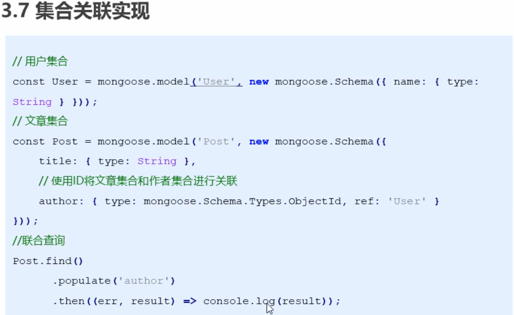

## 数据库

在mongodb中不需要显示的创建数据库, 如果正在使用的数据库不存在则会自动创建一个.

## 集合

### 创建集合

1. 设定集合规则

   ```js
   const courseSchema = new mongoose.Schema({
   	name: String,
       author: String,
       isPublished: Boolean
   })
   ```

2. 创建并应用规则

   ```js
   const Course = mongoose.model('Course', courseSchema);
   // Course 是集合的构造函数
   ```

### 集合关联



## 文档

### 创建文档

1. 使用集合实例来创建文档

   ```js
   // 创建文档实例
   const course = new Course({
       name: "xiaobai",
       author: "ruinb0w",
       isPlublished: false
   })
   // 将数据保存到数据库中
   course.save()
   ```

2. 使用集合构造函数创建文档

   ```js
   // 回调函数形式
   Course.create({name:"xiaohei", author:"ruinb0w", isPlublished: true}, 
                 (err, doc) => {
       console.log(err);
       console.log(doc);
   })
   // promise形式
   Course.create({name:"xiaohei", author:"ruinb0w", isPlublished: true})
   .then(doc=>console.log(doc))
   .catch(err=>console.log(err))
   ```

### 文档查询

使用集合构造函数查找

```js
// find 可以根据条件进行查询, 返回的是一个数组
Course.find({_id:123456}).then(result=>{
    console.log(result);
})

// findOne 只会返回查找到的第一个
Course.findOne({name:"xiaobai"}).then(result=>{
    console.log(result);
})

// 匹配大于小于
Course.find({age: {$gt:10, $lt:20}}).then(result=>{
    console.log(result);
})

// 匹配包含
Course.find({hobbies: {$in: ['足球']}}).then(result=>{
    console.log(result);
})

// 只查询某个字段
// 不想查询某个字段用-开头
Course.find().select('name email -_id').then(result=>{
    console.log(result);
})

// 排序
// 默认升序, 可以在字段前加-来执行降序排序
Course.find().sort('age').then(result=>{
    console.log(result);
})

//略过和限制查询数量
Course.find().skip(2).limit(2).then(result=>{
    console.log(result);
})
```

### 文档删除

```js
// 删除单个
// 返回删除的文档
Course.findOneAndDelete({_id:12345}).then(result=>{
    console.log(result);
})

// 删除多个
// **注意: 如果只传入空对象或者不传则会将真个集合删除**
Course.deleteMany({age:10}).then(result=>{
    console.log(result);
})
```

### 更新文档

```js
// 更新一个文档
// 返回值{n:影响的条目, nModified: 修改的条目, ok: 修改成功数}
Course.updateOne({查询条件},{要修改的值}).then(result=>{
    console.log(result);
})
// 更新多个文档
Course.updateMany({查询条件}, {要修改的值}).then(result=>{
    console.log(result);
})
```

## mongoose验证

```js
// 将Schema属性改写为对象形式则可以进行验证设置
new mongoose.Schema({
	title:{
        type: String,
        // required表示该字段必填
        required: true,
        // 表示该字段最小字符长度
        minlength: 2,
        // 表示该字段最大字符长度
        maxlength: 5,
        // 表示去除两端空格
        trim: true,
        // 确保该字段的值是唯一的
        uniq: true,
        // 指定最小数值
        min: 2,
        // 指定最大数字
        max: 100,
        // 指定发布时间
        publishDate: {
            type: Date,
            default: Date.now
        },
        // 指定分类, 只能传递enum指定的值
        category: {
            type: String,
            enum: ['html', 'css', 'js']
        },
        条目名称: {
            type: String,
            validate: {
                validator: v=>{
                	//返回true则验证通过
            	}
                ,message: "自定义错误信息"
            }
        }
    }
})

// 还可以设置提示
new mongoose.Schema({
	title:{
        type: String,
        required: [true, '请传入文章标题']
    }
})
```

