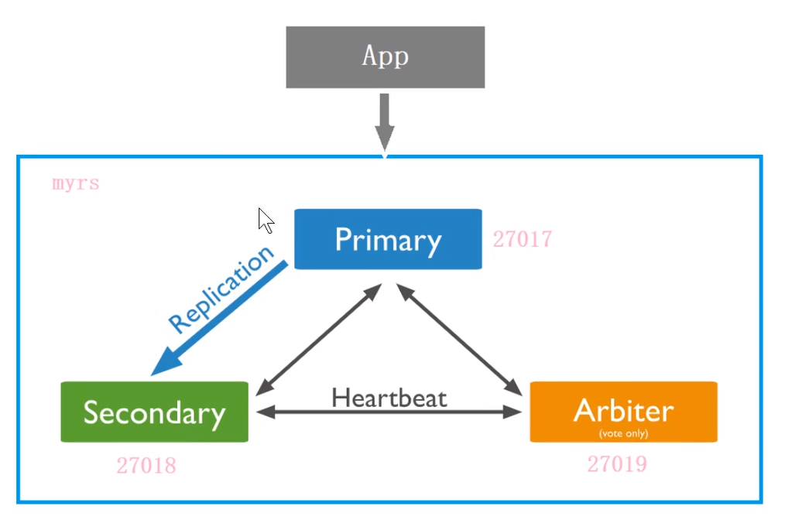

## 副本集

副本集有两种类型三种角色

两种类型

* 主节点: 数据的主要节点, 可以进行读写
* 次节点: 属于冗余备份, 可以进行读和选举

三种角色

* 主要成员: 主节点
* 副本成员: 执行备份操作, 也可以执行读操作
* 仲裁者: 不保存数据, 只作投票用



1. 需要分别为三个角色创建日志和数据库路径, 然后创建配置文件

   ```
   
   ```

2. 登录主节点, 然后将从节点和仲裁节点加入到集群

   ```
   
   ```

3. 需要登录从节点设置为slaver

   ```
   rs.slaverOK()
   ```

## 选举

选举的触发条件

1. 主节点故障
2. 主节点不可达
3. 人工干预`rs.stepDown(600)`

选举规则

1. 票数最高且获得$\frac{N}{2}+1$票及以上

   > 怎么获得投票?以及投票优先级是什么?

2. 票数相同则根据log选择数据最新的节点

> 如果arbiter和primary都挂了, 则整个数据库服务都坏了

## 分片集群

mongodb分片集群包含

* 分片: 集存储信息的子集
* mongos: 实现分片之间的路由
* config servers: 分片集群的配置

