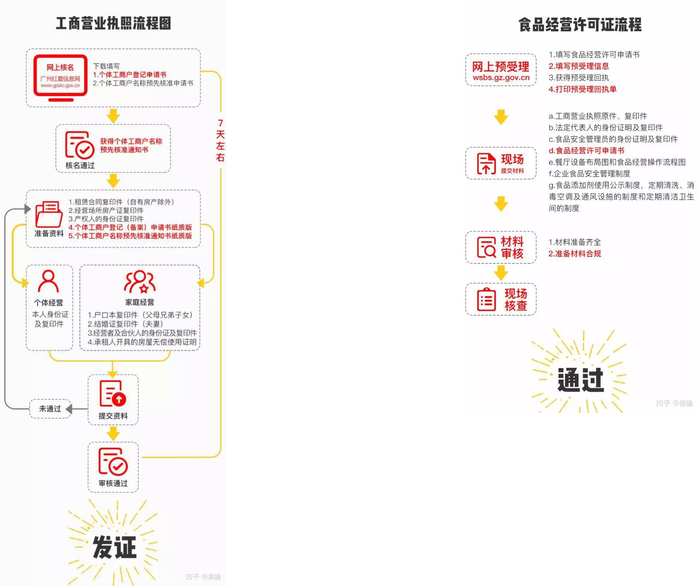

## 确定项目

首选项目: 烧鹅

备选项目: 肉骨茶, 花甲米线, 骨头饭

### 需要考察的内容

市场需求

消费能力及饮食习惯

同行竞争状况

找准定位(注重翻台率还是注重服务)

### 项目利润

成本

* 鹅: 15/斤(加盟商提供的应该更低)
* 煤炭成本>煤气, 但煤炭味道更好

## 确定加盟商

1. 合法性: 向餐饮连锁特许商索要并审查其备案资料,以确定其合法性.

2. 考察店铺: 亲儿子店和干儿子店越多越好, 开的时间越长越好. 要确保收入要稳定, 对干儿子照顾有佳.
3. 标准化是否到位: 制销流程, 价格, 口味, 装修
4. 大众点评的分数: 7分以上还行, 8分以上很好
5. 运营是否完善: 是否有人能指导处理问题
6. 仓储物流是否完善: 供货的关键

## 确定地点

1. 地点只需不太偏僻即可

2. 不能相信租房人(转让人)的话, 需自行考察

## 开业前期准备

### 办证

必要证书: "工商营业执照"和"食品经营许可证 "

1. 先照后证, 具体见流程图
2. 取得"食品经营许可证"后到工商局备案

> 1. 确定房产税、城镇土地使用税、营业税等房东是否已经缴纳(如果没有则自己缴纳), 不然会影响办证
>
> 2. 装修施工前，最好拿着图纸让食药监局负责的专员审核一遍, 以免需要改动
> 3. 办证总共大约要一个月的时间

### 厨师

> 根据制作的复杂程度, 若复杂度低且标准化做的好,则无需担心厨师. 如果较为复杂且标准化不好则需想办法留住厨师, 例如分给厨师股份等.所以选择加盟应优先选择复杂度低且标准化好的来加盟.

如何找厨师?

* 通过"朋友圈"发布招聘信息
* 通过"临沧生活圈"发布招聘信息

### 装修

前期主打客人带走及外送, 所以装修从简, 主要要让客人觉得干净整洁.

### 推广

朋友圈, 临沧生活圈, 传单, 电梯广告

> 问一下电梯广告价格, 问一下广告设计价格

## 运营

运营模式: 主打客户带走(外送), 在店消费为次

管理模式: 一人主管, 一人查账

### 税务

一般的饭馆都是个体户, 税务局是给核定税收的，先核定营业额，再按照5%的税率征收营业税，随营业税再征收7%城建税、3%教育费附加等，另外还要按照营业额征收2%个人所得税，整体税率是7.5%。

## 待选加盟商

### 椿记烧鹅

公司名称: 桂林市椿记餐饮有限公司

总店地址: 广西省桂冉冉44444林市临桂区金水路2号

大众点评: 3.5-5

加盟及自营数: >15

预估投入产出:15万 : 17.52万/年

### 肥仔烧鹅

公司名称: 贺州市肥仔烧鹅王饮也有限公司

总店地址: 广西省贺州市建安街2号向阳花园

大众点评: 3-4.5

加盟及自营数: >15

投入产出:20.45万 : 32.4万/年

### 皇鹏烧鹅

公司名称: 广州皇鹏烧鹅仔投资管理有限公司

总店地址: 广东省广州市荔湾路小梅大街17号三楼

大众点评: 3.5-4.5

加盟及自营数: >15

投入产出:8.8万 : 17.88万/年

联系电话: 86-020-81267661

### 金陵烧鹅

公司名称: 上海世福食品有限公司

总店地址: 上海市虹口区海拉尔路36号

大众点评: 3-4

加盟及自营数: >15

投入产出: 5.13万 : 10.68万/年

[参见](<https://www.jiamengfei.com/byb?xm=19998_19195_18892_4418>)

## 其他

人员: 2厨师2服务员1经理: $2\times3500+2000+2\times3000=14000$

店铺租金: 50平=5000

水电: 500

一份利润: 10