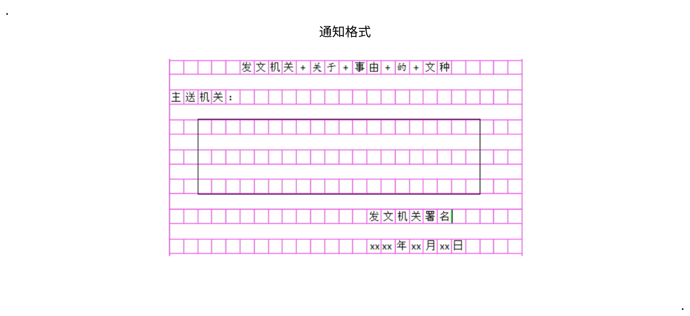

#  行测

## 数量关系

### 技巧方法

#### 带入排除法

适用: 年龄问题, 余数问题, 多位数问题, 不定方程, 多元方程

### 工程问题

$工作量=工作效率\times工作时间$

方程法

赋值法

* 公倍数赋值: 已知完成时间, 设工作总量
* 比例赋值: 已知工作效率比值

双工程问题: 让效率比($\frac{A工程}{B工程}$)大的全力做A工程, 效率比低的先做B工程, 然后再去做A

### 经济利润问题

$利润率=利润\div成本$

合并折扣问题将小的接在大的后面

### 行程问题

等距离平局速度 $\overline{v}=\frac{2v_1v_2}{v_1+v_2}$

各种行程

* 火车运动: $总长=桥长+车长$
* 相遇问题: $路程和=速度和\times时间$
* 往返相遇: 相遇n次路程和为2(n-1)倍的总路程
* 环形运动: 相遇n次路程和为n圈, 追击n次路程差为n圈

### 排列组合

捆绑法: 要求连续; 先捆绑再排列

插空法: 要求不相邻; 先排列再插空

插板法: n个东西分给m个人, 每人至少一个

错位排列: 不能回原位(3人-2种, 4人-9种, 5人-44种)

## 资料分析

### 术语

基期量

* 公式: $基期量 = 现期量 / (1 \pm 增长率)$

现期量

* 公式: $现期量 = 基期量\times(1+增长率) $

增长(减少)量

* 公式: 

  * $增长量 = 现期量 - 基期量 = 基期量 \times 增长率 $ 

  * $增长(减少)量 = \frac{现期量}{1\pm r}\times r$ (增长率化为分数)

增长率(增速, 增幅)

* 公式
  * $增长率 = (现期 - 基期)/基期 = 增长量 / 基期$
  * $间隔增长率=r_1+ r_2 + r_1r_2$

混合增长率: 两者之间, 偏向大的.

年均增长率: $(1+r)^n=\frac{现期}{基期}$

发展速度

* 公式: $发展速度 = 现期 / 基期 = 增长率 + 1$

指数

* 约定**基期指数**为 100
* $\frac{现期}{基期} = \frac{指数}{基期指数}$

比重

* $基期比重=\frac{A}{B}\times\frac{1+b}{1+a}$

  > A,B 分 别是现期的两个项目, a,b 分别是A,B 的增长率

* $两期比重差 = \frac{A}{B} \times \frac{a-b}{1+a}$

  > a > b, 则比重上升
  >
  > 比重升降百分点 < |a - b|

倍数

* 公式
  * $倍数=1+r$
  * $间隔倍数=1+r_{间}$

### 结构阅读法

文字材料: 时间, 关键词, 单位

表格资料: 时间, 关键词, 单位

柱状图: 时间, 关键词, 单位, 标题, 坐标代表什么

饼状图: 时间, 关键词, 单位, 标题

> 注意读材料时不要读数据

### 速算

加减

* 尾数法: 需要保证选项的尾数基本不重复
* 截取法: 
  * 根据选项从**左到右截取**一定的位数, 确保可以选出选项
  * 需要注意**数字位数**不同

乘除

* 截位法: 根据选项相同的位数截取2-3位, 然后再除
* 插值法: 二选一, 在选项之间插入一个值, 然后用实际值与插入值进行比较
* 化同法: 对比分数, 将分子或分母化为近似或相同, 然后再比较
  * 分子分母分别比, 一大一小
* 放缩法: 将小数放大或缩小以便计算
* 化除为乘: 如果增长率小于5%可用
* 差分法: 无法使用化同法
  * $\frac{a}{b}>\frac{A}{B} \rightarrow \frac{A+a}{B+b}> \frac{A}{B} $
  * $\frac{a}{b}<\frac{A}{B} \rightarrow \frac{A+a}{B+b}< \frac{A}{B} $
* 间隔增长率
  * $r=r_1+r_2+r_1 \times r_2$

常用分数

| 分数           | 百分数 |
| -------------- | ------ |
| $\frac{1}{6}$  | 16.7%  |
| $\frac{1}{7}$  | 14.3%  |
| $\frac{1}{9}$  | 11.1%  |
| $\frac{1}{11}$ | 9.1%   |
| $\frac{1}{12}$ | 8.3%   |
| $\frac{1}{13}$ | 7.7%   |

## 言语理解

### 主旨题

递进关系: 前轻后重, 文段的主旨在后面

转折关系: 前轻后重, 文段的主旨在后面

反面论证: 观点在前, 反面论证在后, 结果不是重点, 重点是前面的观点.

例子: 例子不是主旨, 例子可以略看

原因: 原因前面是主旨

因果: 

* 正装: 果, 果的因, 具体因导致的具体果
* 倒装: 果的因, 具体因导致的具体果

必要条件: 必须...才... 或者 ...是必需的

引用:

## 判断推理

### 图形推理

#### 位置类

动态位置

* 平移
  * 方向: 上下, 左右, 逆时针, 顺时针, 对角线
  * 步数: 常数, 等差, 周期
* 旋转
  * 方向: 逆时针, 顺时针
  * 角度: 常数, 等差, 周期
* 翻转: 方向

> 注意: 
>
> 1. 旋转和翻转经常组合在一起考
>
> 2. 区分旋转与翻转: 通过尾向头(长边向短边)画时针, 看是否都是顺时针或逆时针, 是的话就是旋转, 不是则为翻转

静态位置

* 不同图形
  * 相离: 上下, 左右, 里外
  * 相交: 相交图形与源图形相似, 相交图形边数, 相交图形直边还是曲边
  * 相切: 点相切, 线相切
* 相同图形: 相邻, 相隔

* 相连
  * 点连接
  * 线连接: 契合相连(长边相连或短边相连), 包含相连, 错位相连

### 定义判断

择优判断

快速识别有效信息

1. 找主体: 

#### 样式类

遍历

运算

# 申论

| 文种     | 标题 | 主送机关 | 发文机关 | 成文日期 |
| -------- | ---- | -------- | -------- | -------- |
| 通知     | √    | √        | √        | √        |
| 报告     | √    | √        | √        | √        |
| 请示     | √    | √        | √        | √        |
| 函       | √    | √        | √        | √        |
| 活动方案 | √    |          |          |          |
| 公开信   | √    | √        | √        | √        |

## 公文写作

### 党政机关公文

#### 通知

* 题目当中会有"通知"关键词
* 格式
  * 标题
    * 发文机关+事由+文种(e.g. 北京市政府关于调整市直单位人员工资标准的通知)
    * 通知的标题可以只写通知(只有通知可以)
    * 换行需要居中, 不能在词组中换行
  * 主送机关
    * 标题下一行顶格写
  * 发文机关
    * 与日期居中
  * 成文日期
    * 会议要时间点, 活动要时间段
    * 右空四格
    * 可以写考试日期或材料日期
* 内容
  * 开头
    * 只写"通知"两字
  * 通知事项
    * 时间(必须有),人员,地点
    * 指示, 安排, 方法, 步骤
    * 执行要求
  * 结语
    * 只写"特此通知"
* 其他
  * 条目使用中文数字, 数字后面跟钝号
  * 两个阿拉伯数字占一格, 一个中文占一格
  * 如果要引用一个文件, 第一次要写全称
  * 字数左右的要超过但不要超过10%(e.g. 400字左右, 写400-440)

#### 报告

* 格式
  * 标题:发文机关+事由+文种
  * 主送机关: 向直属上级发文(不能越级)
  * 发文机关署名
  * 时间
* 内容
  * 发文原由
  * 成绩, 存在的问题, 未来的设想
  * 结语: "特此报告"

#### 请示

* 格式
  * 标题:发文机关+事由+文种
  * 主送机关: 向直属上级发文(不能越级)
  * 发文机关署名
  * 时间
* 内容
  * 目的
  * 请示内容(一事一请)
  * 结语: 请审核批复

#### 函

判断是否用函
* 平级单位
* 不同单位

格式

- 标题:发文机关+事由+文种
- 主送机关: 向直属上级发文(不能越级)
- 发文机关署名
- 时间

内容
* 原由
* 主体视材料内容
* 结语: 当否, 请函复

### 事务性文书

#### 活动方案

格式

* 标题: [发文机关+]事由+文种
* 正文

正文

* 开头: **背景, 主题**
* 主体
  * 时间, 范围
  * **内容**
    * 回扣主题
    * 活动形式
    * 效果
  * 前期准备
  * 人员配置
  * 工作内容

#### 公开信

开头: 原由

主体: 